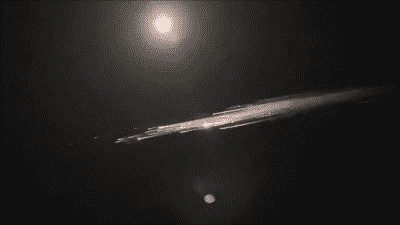

# 太空:星际飞船爆炸(再次)，乘客太空飞行，太空昆虫，宇航员骨头，火星水

> 原文：<https://hackaday.com/2021/04/05/spacing-out-starship-explodes-again-passenger-space-flight-space-bugs-astronaut-bone-and-martian-water/>

这一次，我保证我只有埃隆·马斯克公司的几个故事。SpaceX 最新的星际飞船测试发射以另一次爆炸而告终，证明太空硬件仍然很难获得成功。我们将继续关注他们的发射，他们解决所有问题的时间不会太长。与此同时，该公司的船员 Dragon 传来了更好的消息，一个前对接环被透明圆顶取代的改进型太空舱计划于 9 月发射，[号是该公司首次搭载民用乘客的航班](https://www.space.com/spacex-crew-dragon-cupola-window-inspiration4)。对于维珍银河来说，这无疑是个不受欢迎的消息，随着[第一艘宇宙飞船 III](https://twitter.com/virgingalactic/status/1376860261131427845)的亮相，他们的亚轨道客运飞行越来越接近现实。最后，猎鹰 9 号的上面级在美国西北部上空重返大气层时解体，给地面上的观测者带来了一场壮观的表演。

Spectacular view of the Falcon 9 debris. Via [Lu Jerz](https://www.youtube.com/watch?v=6IiRkOc1g4I&t=18s)

与此同时，在轨道上方的国际空间站上发现了一些地球科学家以前不知道的细菌菌株，但是现在还不是对来自太空的突变细菌恐慌的时候。这些细菌似乎是植物生长中必不可少的一种类型，所以很可能它们最初是搭上了空间站一生中进行的几个植物生长实验中的一个的便车。停留在国际空间站上，访问空间站的宇航员已经成为最近发表的一项研究[的中心](https://bjsm.bmj.com/content/early/2021/03/02/bjsports-2020-103602)，该研究着眼于长期在太空中骨密度的损失。骨骼专家发现，尽管宇航员在飞行中进行锻炼，骨密度仍然可能下降，并得出结论，未来的在轨锻炼计划应该考虑飞行前的锻炼制度。

在离地球更远的地方，欧空局的火星快车卫星已经被用来进行一项为期多年的研究，研究水从火星大气中流失到太空的情况。欧空局的科学家们确定了导致火星上层大气水分过剩的季节性机制，特别是周期性的全球沙尘暴对加速水分流失的影响，但未能解释他们估计火星在其历史上一定已经流失的水分。通过对水形成的地表特征的研究，他们可以估计出这个星球曾经有多少液体，然而大气的损耗却无法解释这一切。地下消失了吗？在我们找到答案之前，还需要更多的研究。

未来几天令人兴奋的消息无疑将是别出心裁的火星直升机，我们已经看到它在从坚忍号火星车的腹部卸载之前慢慢展开。如果一切按计划进行，这个小飞行器将会在火星车驶到安全距离之前降落，历史性的飞行将会在 4 月 8 日进行。我们会坐立不安，毫无疑问你也会。