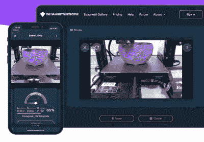

# 意大利面侦探用户被安全过失煮

> 原文：<https://hackaday.com/2021/08/20/spaghetti-detective-users-boiled-by-security-gaffe__trashed/>

对于那些可能不会在空闲时间观看 PLA 卷轴慢慢展开的读者来说，意大利面侦探(TSD)是一个开源项目，旨在使用计算机视觉和机器学习来识别何时 3D 打印失败并导致构建板上出现一堆塑料“意大利面”。一旦用户安装了 OctoPrint 插件，他们需要将它指向一个运行在相对强大的机器上的自托管服务器，或者 TSD 的付费云服务，该服务按月收费，处理所有的人工智能繁重工作。

不幸的是，当一个配置漏洞允许陌生人控制他们的打印机时，73 名云客户最终得到了比他们预想的更多的东西。在一篇坦率的博客文章中，[创始人 Kenneth Jiang 承认了 8 月 19 日的错误](https://www.thespaghettidetective.com/blog/2021/08/19/what-happened-last-night/),并解释了到底发生了什么，谁受到了影响，以及服务器端代码的更改应该如何防止类似问题的发生。

TSD allows users to remotely manage and monitor their printers.

根据记录，似乎没有造成永久性的损害，并且已经通知了所有可能受此问题影响的人。首先，任何人偶然发现这个问题的机会都相当有限，这意味着任何坏演员都必须在键盘上特别快地想出一些邪恶的阴谋来破坏任何与 TSD 有关的打印机。也就是说，一位用户[在 Reddit 上展示了他们的打印机发出的物理警告](https://www.reddit.com/r/3Dprinting/comments/p7jdhi/wake_up_this_morning_and_see_this_on_my_3d/)；一位同行客户自己发现了这个小故障，这显然是他的杰作。

据姜介绍，这个问题源于如何联系打印机和用户。当服务器看到来自同一个公共 IP 的多个连接时，它会假设这些连接实际上连接到同一个本地网络。这允许服务器将运行在 Raspberry Pi 上的 [OctoPrint 插件链接到用户的手机或电脑。但是在那个晚上，一个错误配置的负载平衡系统停止向服务器传递源 IP 地址。这让 TSD 相信*在此期间连接的所有*打印机和用户都在同一个局域网上，允许任何人连接他们想要的任何机器。](https://hackaday.com/2018/05/03/3d-printering-which-raspberry-pi-is-best-at-slicing-in-octoprint/)

New code pushed to the TSD repository limits how many devices can be associated with a single IP.

混乱只持续了大约六个小时，到目前为止，只有一个用户报告他们的打印机被外部团体远程控制。在修复了负载平衡配置后，该团队还对 TSD 代码进行了更新，该代码对服务器与给定 IP 地址相关联的打印机数量设置了上限。这似乎是一个足够合理的预防措施，尽管这一变化对希望同时向其帐户添加多台打印机的用户(例如在打印场的情况下)会产生什么影响尚不明显。

虽然意大利面侦探团队无疑是一个令人尴尬的失误，但我们至少可以欣赏他们处理问题的速度以及他们在揭露漏洞方面的透明度。这也是一个很好的例子，说明了开源如何允许社区独立地评估开发人员针对发现的缺陷所应用的修复。蒋说，该团队也将推出一个完整的安全审计，所以期待在不久的将来会有更多的变化推送到知识库。

[当我们在 2019 年](https://hackaday.com/2019/03/29/finding-plastic-spaghetti-with-machine-learning/)第一次报道 TSD 时，我们对它印象深刻，很高兴看到自我们上次入住以来，该项目蓬勃发展。信任很难获得，也很容易失去，但我们希望团队对这个问题的处理表明他们掌握了全局，并愿意为他们的社区做正确的事情，即使这意味着有时会让他们脸上有鸡蛋。