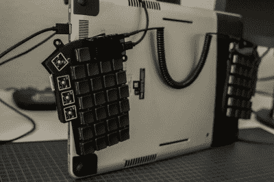

# Split Keeb 在桌面和平板电脑模式之间分配时间

> 原文：<https://hackaday.com/2020/09/29/split-keeb-splits-time-between-desk-and-tablet-modes/>

你自己制作的键盘应该是真正为你制作的，满足你的特定需求。如果你以这种方式对待它，你可能会有所突破并启发他人，仅仅因为它是个性化的。这就是 [[_GEIST_]高度定制的 lily58 的情况，它设计成两种模式——在桌子上工作，以及安装在平板电脑的背面](https://imgur.com/a/2E6r2j9)。

lily 58 是一个 58 键分裂，带有两个有机发光二极管脚印，只是这个版本的一个起点。对于平板电脑模式，键盘用粘扣带固定在平板电脑的背面，[_GEIST_]创造了定制的平板电脑，在背面增加了一倍的拇指键。

我们喜欢有一个 PSP 拇指棒，可以在一层上点击鼠标，在另一层上输入按键。但我们无法决定哪一部分是我们最喜欢的:是[_GEIST_]将它穿过 Kailh Choc 开关的底部，还是每一层都有不同波形的 Pimoroni 触觉嗡嗡声。[_GEIST_]还增加了亚克力中板层，以支持快速更换的磁性帐篷腿。

键盘 mod 不一定要参与进来才能被别人采用。[这款改良的 Dactyl 增加了定制的腕托支架，底部更深，允许不太完美的布线](https://hackaday.com/2020/05/28/bluetooth-takes-keyboard-from-diy-to-super-fly/)。

Via [reddit](https://www.reddit.com/r/ErgoMechKeyboards/comments/iwzt4d/lily58_tablet_and_tenting_mode_thumbstick_haptic/)