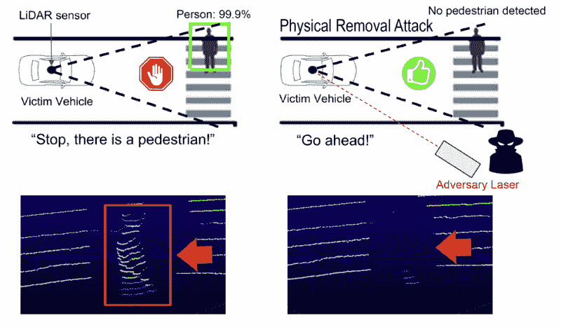
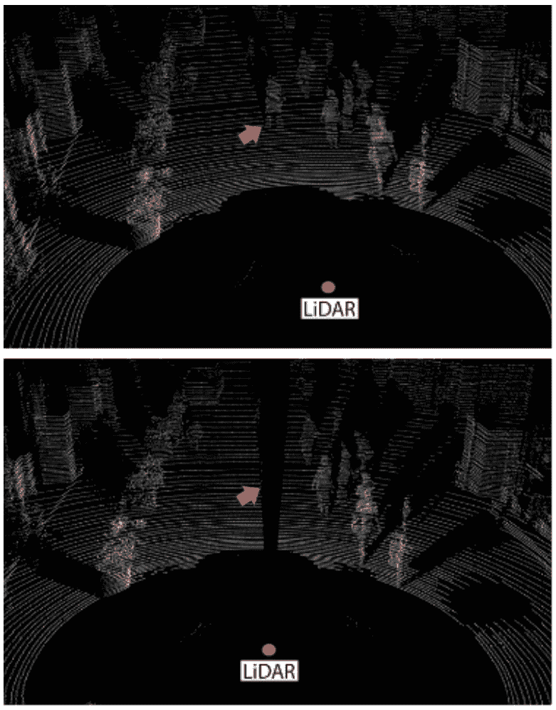

# 欺骗激光雷达可以让自动驾驶汽车看不见障碍物

> 原文：<https://hackaday.com/2022/11/22/spoofing-lidar-could-blind-autonomous-vehicles-to-obstacles/>

人类设法以一种可接受的方式驾驶，只用两只眼睛和两只耳朵来感知周围的世界。自动驾驶汽车配备了更加复杂的传感器组件。他们通常依靠雷达、激光雷达、超声波传感器或摄像机协同工作来检测前方的路况。

虽然人类相当狡猾，很难被愚弄，但我们的机器人驾驶朋友却不那么健壮。一些研究人员担心激光雷达传感器可能会被欺骗，隐藏障碍物，诱使无人驾驶汽车发生碰撞，甚至更糟。

## 它去哪里了？

Using a laser to send false echoes back to a LiDAR sensor on an autonomous vehicle can be used to hide objects from its field of view. Credit: Research paper, Cao, Yulong and Bhupathiraju, S. Hrushikesh and Naghavi, Pirouz and Sugawara, Takeshi and Mao, Z. Morley and Rampazzi, Sara

激光雷达之所以如此命名，是因为它是一种基于光的雷达技术。然而，与雷达不同，它通常仍被视为一个首字母缩写词，而不是一个独立的单词。该技术发出激光脉冲，并捕捉从环境反射回来的光。从更远的物体返回的脉冲需要更长的时间才能到达激光雷达传感器，使传感器能够确定周围物体的范围。它通常被认为是自动驾驶目的的黄金标准传感器。这是因为在汽车环境中，与雷达相比，它具有更高的准确性和可靠性。此外，它提供了非常详细的深度数据，这是普通 2D 相机无法提供的。

一篇新的研究论文展示了一种欺骗激光雷达传感器的对抗方法。该方法使用激光来选择性地隐藏某些物体，使其不被激光雷达传感器“看到”。该论文称之为“物理删除攻击”，简称 PRA。

攻击的理论依赖于激光雷达传感器的工作方式。通常，这些传感器优先考虑较强的反射，而不是较弱的反射。这意味着攻击者发出的强有力的信号将优先于环境中较弱的反射。激光雷达传感器和位于其上的自动驾驶框架通常也会丢弃距离传感器某个最小距离以下的检测。这通常在 50 毫米到 1000 毫米的量级上。

这种攻击的工作原理是发射红外激光脉冲，模拟激光雷达设备预期接收的真实回波。脉冲被同步以匹配受害者激光雷达传感器的发射时间，以便控制传感器对欺骗点的感知位置。通过发射明亮的激光脉冲来模拟传感器处的回波，传感器通常会忽略从其视野中的物体拾取的较弱的真实回波。仅这一点就足以对激光雷达传感器隐藏障碍物，但似乎会在传感器附近创建一个欺骗对象。然而，由于许多激光雷达传感器会丢弃过于接近的回波，因此传感器可能会完全丢弃它们。如果传感器不丢弃数据，在其点云输出上运行的过滤软件可能会自己丢弃数据。由此产生的效果是，激光雷达将在应该拾取障碍物的区域中显示无效的点云数据。

这种攻击需要一些知识，但是实现起来非常实际。人们只需要做一些研究来瞄准自主车辆上使用的各种类型的激光雷达，以制造出合适的欺骗设备。即使攻击者从某个角度(例如从路边)向激光雷达发射虚假回波，攻击也会起作用。

The top image shows the LiDAR scene under normal conditions. The bottom shot shows the scene with a Physical Removal Attack in progress. In a small segment of the LiDAR’s rotational travel, false echoes below the sensor’s minimum distance threshold are ignored. Thus, for a segment of the LiDAR’s rotation, no points are detected and the pedestrian in the road is hidden. Credit: Research paper, Cao, Yulong and Bhupathiraju, S. Hrushikesh and Naghavi, Pirouz and Sugawara, Takeshi and Mao, Z. Morley and Rampazzi, Sara

这对依赖激光雷达传感器数据的自动驾驶系统有着危险的影响。这项技术可以让对手隐藏自动驾驶汽车的障碍。人行横道上的行人可能会被激光雷达隐藏，就像交通灯前停下的汽车一样。如果自动驾驶汽车没有“看到”前方的障碍物，它可能会向前行驶，穿过或撞上障碍物。使用这种技术，隐藏较近的对象比隐藏较远的对象更困难。然而，即使隐藏一个物体几秒钟，当自动驾驶汽车最终检测到隐藏的障碍物时，它也可能没有足够的时间停下来。

除了从激光雷达的视野中擦除物体，其他欺骗攻击也是可能的。研究人员的早期工作涉及欺骗激光雷达传感器来看到幻影物体。[实现](https://www.csoonline.com/article/2981233/60-device-spoofs-phantom-objects-and-tricks-self-driving-cars-into-stopping.html)非常简单——只需向受害者激光雷达发射激光脉冲，指示前方有墙或其他障碍物。

研究小组注意到对这种技术有一些防御措施。这种攻击倾向于从激光雷达报告的点云中切割出一个有角度的切片。检测到这种差距可以表明可能正在发生删除攻击。或者，存在涉及将阴影与预期由在 LiDAR 点云中检测到(或没有检测到)的物体投射的阴影进行比较的方法。

总体而言，随着自动驾驶汽车变得越来越主流，防范欺骗攻击可能变得很重要。与此同时，思考什么是现实的，什么是不现实的，这一点很重要。例如，当人类司机的汽车被从天桥上扔出的鸡蛋或石头击中时，他们很容易撞车。汽车制造商没有设计出先进的防石激光和超级雨刷来清除鸡蛋的污迹。相反，法律的实施阻止了这些攻击。这可能只是一个简单的问题，将类似的执法扩展到在高速公路边带着复杂的激光设备跑来跑去的坏人。十有八九，两种方法都有一定的必要性。