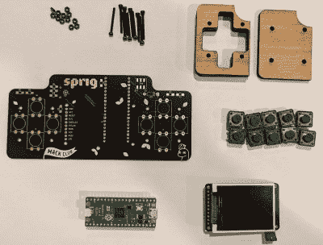

# Sprig 是一款开源掌上游戏机

> 原文：<https://hackaday.com/2022/11/10/sprig-is-an-open-source-handheld-game-console/>

[Hack Club]是一个旨在通过让青少年参与开源项目来教授他们科技知识的组织。该组织的最新成果之一是 Sprig，[一款开源掌上游戏机](https://github.com/hackclub/sprig#readme),【Hack Club】甚至一直在赠送它们！

 控制台是基于一个树莓皮微微，搭配一个 TFT7735 屏幕。船上还有一个 MAX98357A 音频放大器来提供声音。除此之外，还有整整十个按钮用于控制，一些 led 用于反馈，并且都组装在一个定制的 PCB 上，旨在方便焊接。

为了让 Sprig 成为第一次开发的人可以使用的平台，已经做了大量的工作。可以为 Sprig 创建游戏，并在设备上运行，或者在一个基于网络的在线编辑器中运行。【Hack Club】甚至正在运行一个项目，将 Sprig 硬件赠送给世界各地为该平台编写游戏的儿童和青少年，[将其提交给在线画廊](https://sprig.hackclub.com/gallery)。

如果你渴望进入游戏开发，同时了解硬件和软件方面的东西，Sprig 可能正是你正在寻找的。随着今天的微控制器变得如此便宜和强大，我们最近也看到了一些其他伟大的手持设计！