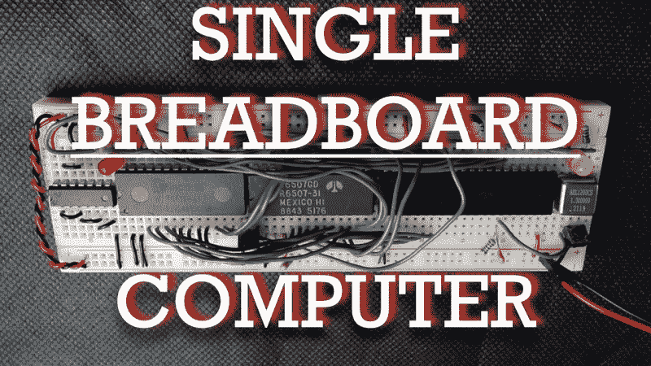

# 将一台极简的 6502 复古计算机挤在一块试验板上

> 原文：<https://hackaday.com/2023/01/04/squeezing-a-minimalist-6502-retrocomputer-onto-a-single-breadboard/>

多年来，尤其是最近，我们看到了大量的单板逆向计算机构建。我们没问题——越多越好。但是他们都开始一起跑了一点，他们之间几乎没有区别。不是这样的[这台尽可能紧凑的 6502 计算机可以安装在一个试验板上](https://github.com/AndersBNielsen/6507SBC)。

现在，当你做数学计算时，似乎没有办法[Anders Nielsen]能够在标准无焊试验板上安装哪怕是最小的芯片组。仅 40 针 6502 就占据了可用连接的近三分之二；添加同样大但必要的芯片，如 6522 接口适配器，ROM 和 RAM 芯片，以及一些支持 IC，一个试验板不会削减它。幸运的是，MOS 公司一些节俭的工程师在 70 年代发明了 6507，它是 6502 的变体，采用 28 针 DIP。这种构建的另一个关键是 6532 RAM-I/O-timer 芯片或 RIOT，它将少量 RAM 和一些 IO 线放在单个 40 引脚 DIP 上。连同一个 28 针的 ROM，一个 14 针的 hex 反相器，和一个小的晶体振荡器，整个芯片组勉强适合在一个单一的试验板上。

但是这个极简 6502 实际上能做什么呢？正如你在下面的视频中看到的，一个 555 定时器可以做的任何事情，也许还不止这些。当然，这不是挖苦——[Anders]实际上称他最初的 blinkenlight 应用程序比美化的 555 多一点，并且实际上提出了一个稍微复杂一点的应用程序来证明这一点。这里有趣的部分是处理这台机器上有限的可用资源所带来的约束。

我们期待着这个聪明的构建的下一步。不过，很难看出[Anders]的一些计划如何仍然适合单个试验板——这些东西[往往会随着它们的发展而分散开来。](https://hackaday.com/2019/04/04/a-6502-computer-with-acres-of-breadboard-and-dozens-of-chips/)

