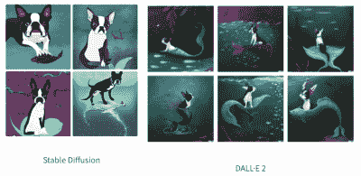
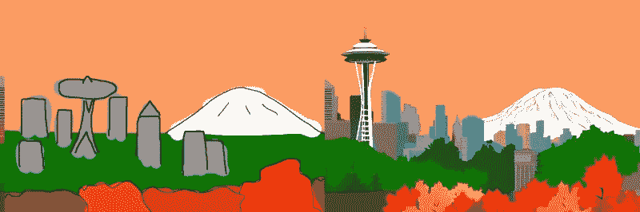
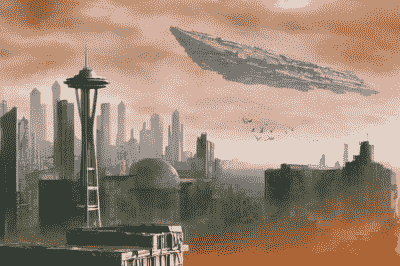

# 稳定扩散及其重要性

> 原文：<https://hackaday.com/2022/09/06/stable-diffusion-and-why-it-matters/>

你可能没听说过稳定扩散。写这篇文章的时候，还不到几个星期。也许你已经听说过它和它周围的一些喧嚣。它是一个人工智能模型，可以根据文本提示或输入图像生成图像。它为什么重要，你如何使用它，你为什么要关心它？

今年我们已经看到了几款图像生成 ai，比如 [Dall-e 2](https://openai.com/dall-e-2/) 、 [Imagen](https://imagen.research.google/) ，甚至还有 [Craiyon](https://www.craiyon.com/) 。Nvidia 的 Canvas AI 允许某人创建一个用各种颜色代表不同元素的原始图像，例如山或水。画布可以把它变成美丽的风景。稳定扩散的特别之处是什么？首先，[是在](https://github.com/CompVis/stable-diffusion)[Creative ML open rail-M license](https://github.com/CompVis/stable-diffusion/blob/main/LICENSE)下的开源，相对宽松。此外，您可以在计算机上运行稳定扩散(SD ),而不是通过网站或 API 访问云。他们建议使用至少 6GB 内存的 3xxx 系列 NVIDIA GPU 来获得不错的结果。但由于它的开源性质，补丁和调整使它只能是 CPU，AMD 驱动的，甚至是 Mac 友好的。

这涉及到关于 SD 的更重要的事情。周围的社区和能量。有几十个具有不同功能、网络用户界面和优化的回复。人们正在训练新的模型或微调模型，以便更好地生成不同风格的内容。有 [Photoshop](https://old.reddit.com/r/StableDiffusion/comments/wyduk1/show_rstablediffusion_integrating_sd_in_photoshop/) 和 [Krita](https://github.com/sddebz/stable-diffusion-krita-plugin) 的插件。其他模型被合并到流程中，例如图像放大或面部校正。这种情况出现的速度令人眩晕。现在，这有点像狂野的西部。

## 你如何使用它？

在我们的家用桌面上玩了 SD 并摆弄了几个 repos 之后，我们可以自信地说，在生成抽象概念方面，SD 不如 Dall-E 2。

Boston Terrier with a mermaid tail, at the bottom of the ocean, dramatic, digital art.
Images generated by Nir Barazida

这并没有降低它的不可思议性。你在网上看到的许多令人难以置信的例子都是精心挑选的，但你可以用低端的 RTX 3060 启动你的桌面，每 13 秒钟就生成一幅新图像，这一事实令人震惊。走开喝杯水，当你回来的时候，你有大约 15 张图片需要筛选。它们中的许多都很不错，可以迭代(后面会有更多)。

如果你有兴趣玩玩它，去 [huggingface](https://huggingface.co/spaces/stabilityai/stable-diffusion) 、 [dreamstudio.ai](https://beta.dreamstudio.ai/) 或 [Google collab](https://colab.research.google.com/github/huggingface/notebooks/blob/main/diffusers/stable_diffusion.ipynb) 并使用他们基于网络的界面(目前都是免费的)。或者按照指南在你的机器上安装它(我们在这里写的任何指南都会在几周内过时)。

SD 和其他图像生成的真正神奇之处在于人机交互。不要把这个想成“放进一个东西，拿出一个新东西”；系统可以自行循环。[Andrew]最近做了这件事，[从一幅非常简单的西雅图图开始](https://andys.page/posts/how-to-draw/)。他把这个图像输入 SD，要求“西雅图城市天际线的数字幻想画”。前景中充满活力的秋天树木。太空针可见。背景是瑞尼尔山。非常详细。”

希望你能分辨出哪个是安德鲁画的，哪个是 SD 生成的。他把这个图像反馈回来，把它改变成一个后世界末日的氛围。然后他在天上画了一个简单的宇宙飞船，并要求 SD 将它变成一个漂亮的宇宙飞船，经过几次处理后，它美丽地融入了场景。加上鸟和一个低强度的传球把它聚集在一个华丽的场景中。

SD 努力保持两代人之间的一致性，正如[Karen Cheng]在试图[改变某人走路的视频以获得不同的服装](https://twitter.com/karenxcheng/status/1564629076266160130)中所展示的那样。她将 Dalle 的输出(SD 在这里应该很好)与 EBSynth 结合起来，EBSynth 是一种擅长拍摄一幅修改后的图像并推断它应该如何应用于后续帧的人工智能。结果令人难以置信。

> 事实证明，它对衣服确实有效！
> 
> 它并不完美，如果你仔细观察，会发现有很多艺术品，但对我来说，对于这个项目来说已经足够好了[pic.twitter.com/Scl2as7lhJ](https://t.co/Scl2as7lhJ)
> 
> —Karen x . Cheng(@ karenxcheng)[2022 年 8 月 30 日](https://twitter.com/karenxcheng/status/1564633511578939395?ref_src=twsrc%5Etfw)