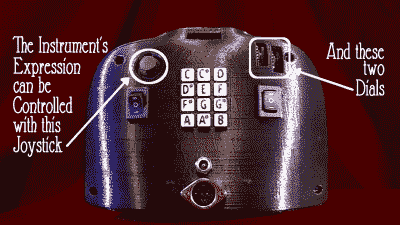

# Starshine 是音乐害羞者的 MIDI 控制器

> 原文：<https://hackaday.com/2020/10/10/starshine-is-a-midi-controller-for-the-musically-shy/>

是什么让人们不去玩音乐？首先，这很难。但是为什么很难呢？理论上是因为理论很混乱。实际上，这很大程度上是因为临时记号，或者与其他音符相比听起来酸酸的音符，因为它们不是来自同一个调或互补调。

 如果没有临时记号呢？像口琴和自动竖琴这样的乐器是存在的。但是[它们看起来都没有【Bardable】的 Starshine 好玩，这是一种每个人都可以演奏的乐器](https://www.reddit.com/r/arduino/comments/j4284p/the_music_controller_a_new_type_of_musical/)。外面的音符按钮被设计成不会走音。

我们喜欢游戏控制器的外形，这也是一个功能选择。在面向玩家的一侧，有一个 PSP 操纵杆和两个电位计，用于用拇指添加表情。这一侧的 12 个按钮有多种功能，如根据翘板开关的位置选择按键和音阶类型。第二个摇杆让[Bardable]在飞行中上升或下降一个八度。还有一个有机发光二极管来显示从正在播放的音符到电位计位置的所有内容。如果你想了解更多，[【Bardable】为这个和其他未来的乐器制作了一个 subreddit](https://www.reddit.com/r/Bardable/) ，休息后有完整的巡演视频。

如果这个初学者友好的 MIDI 控制器对你来说不够大，[看看 Harmonicade 的街机按钮区](https://hackaday.com/2020/01/29/harmonicade-is-a-high-scoring-midi-controller/)。

 [https://www.youtube.com/embed/l5EivVT0UzA?version=3&rel=1&showsearch=0&showinfo=1&iv_load_policy=1&fs=1&hl=en-US&autohide=2&wmode=transparent](https://www.youtube.com/embed/l5EivVT0UzA?version=3&rel=1&showsearch=0&showinfo=1&iv_load_policy=1&fs=1&hl=en-US&autohide=2&wmode=transparent)

