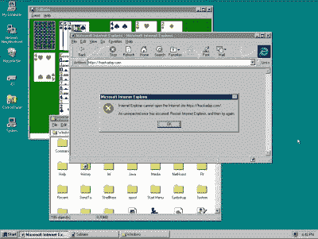
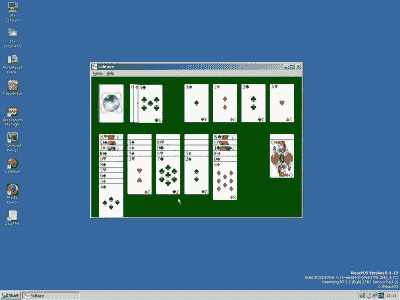

# 启动我:25 年后，Windows 95 桌面给了我们什么？

> 原文：<https://hackaday.com/2020/08/31/start-me-up-what-has-the-windows-95-desktop-given-us-25-years-later/>

我们最近有一个周年纪念，这无疑会引起我们社区的各种反应。现在是 25 年前，Windows 95 推出了，这个操作系统让大多数 90 年代的 PC 用户第一次尝到了基于桌面的 GUI 和 32 位操作系统的滋味。

在滚石乐队*的 Start me up 的*的音乐声中，包括比尔·盖茨本人[在内的微软高管们在可能成为该公司标志性产品的发布会上兴高采烈地在舞台上跳舞](https://www.youtube.com/watch?v=lAkuJXGldrM)，也许他们没有注意到“*你让一个成年人哭了”*这句台词，当面对软件的一些缺点时，这句台词可能无意中偏离了用户体验。

以今天的标准来看，它的安全性似乎是可笑的，支撑 32 位 Windows 操作系统的 16 位 DOS 的不稳定结合即使在其全盛时期也是笨拙的，但也许现在是不受技术偏见影响评估它的最佳时机。在我们今天使用的操作系统中，我们能看到什么样的 Windows 95？由此我们可以问这样一个问题:Windows 95 在哪些方面做对了？

## 对大多数人来说，这是一切开始的地方

A test of the legacy of Windows 95’s desktop comes in how intuitive it still is for users of a 2020-era GUI OS.

Windows 95 绝不是第一个使用基于桌面的 GUI 的操作系统。虽然早期的 Windows 图形用户界面更类似于图形启动程序，但自施乐 PARC 的祖先以来，已经有了一系列其他基于图形用户界面的计算机，所以 Macintosh 和 Amiga 等用户想知道为什么 Redmond 花了这么长时间才赶上来是情有可原的。但是，尽管 68k 的粉丝们吵吵嚷嚷，工业界和大学的 UNIX 工作站上的 X window 用户露出宽容的微笑，1995 年 GNU/Linux 用户中尚未实现的桌面幻想，事实仍然是，对当时世界上大多数桌面计算机用户来说，是微软的声音预示了他们对现代 GUI 操作系统的第一次体验。

在 2020 年，我们很幸运，我们的指尖拥有如此强大的计算能力，我们可以运行浏览器内模拟，甚至直接模拟运行 20 世纪 90 年代大多数台式机的真实代码。 [Windows 95](https://copy.sh/v86/?profile=windows95) 可以直接和[它的前身](https://www.pcjs.org/software/pcx86/sys/windows/3.10/)对比，然后和它同时代的如 [Macintosh System 7](http://jamesfriend.com.au/pce-js/) 和 [Amiga Workbench 3.1](https://www.taws.ch/WB.html) 对比。当时很少有人同时拥有四台必要的机器来完成这项工作，所以在选项卡之间分页，它们的差异和相对缺点会很快变得明显。特别是 Mac 和 Amiga 台式机的菜单和窗口系统，当我们面前摆着它们时，它们看起来是如此先进，但现在却开始感觉笨重和冗长，而 Windows 95 的界面尽管有着 90 年代中期微软的美感，却不是这样的。

时隔 25 年后再次使用 Amiga Workbench 让我想起了当年 Workbench 磁盘的一个重要附件，它是一个小工具，可以将窗口焦点放在鼠标位置，在鼠标指针位置显示右键菜单，并将聚焦窗口放在最前面。好的图形用户界面不需要用一个实用程序来修复它们的缺点，让它们不再令人讨厌，借用苹果自己的一句话，它们只是工作。鼠标指针位置的右键上下文菜单,“开始”菜单将所有内容集中到一个地方，任务栏提供了多任务的简单概述，它们都不是惊天动地的，但它们一起将 Windows GUI 设置为一个成为用户自然环境的环境。

## 今天寻找 95 年长长的影子

If you miss ’95, [ReactOS](https://hackaday.com/2020/04/27/reactos-dipping-a-toe-in-a-millennium-era-open-source-dream/) is probably the closest you can get here in 2020.

回到现在，Windows 10 是 Windows 95 的精神(如果不是代码基础的话)的后代，它有一个开始菜单和任务栏，这对 25 年前的用户来说显然是熟悉的。它们如此受用户欢迎，以至于当 Windows 8 试图删除它们时，出现了一些反抗，微软将它们返回到以后的版本。相同的特性出现在许多其他操作系统的桌面环境中，包括 GNU/Linux 发行版，事实上它可以在我运行最新 Linux Mint 的笔记本电脑上找到。关于它和 NeXT、MacOS 以及许多其他 GNU/Linux 发行版上的 dock 风格界面哪个更好的争论可能会持续很长时间，但是 Windows 95 的这一遗产已经被证明是足够受欢迎的，在可预见的未来它可能会一直伴随着我们。

二十多年来，我第一次坐在 Windows 95 桌面上阅读本文，这很奇怪。它是如此的熟悉，以至于尽管我已经有十年没有拥有 Windows 桌面了，但我可以直接进入它，而不会犯我在重新访问 Amiga Workbench 时犯的错误。当我意识到它现在是一个逆向计算平台，并且在我的日常工作中几乎没有我还能在 Windows 95 机器上做的事情时，我几乎感到震惊。也许最好在我被提醒蓝屏死机、驱动程序不兼容或即插即用之前把它放下，而是在我的现代桌面上看看它的回声。也许它毕竟做对了一两件事。

标题图片:Erkaha / [CC BY-SA 4.0](https://commons.wikimedia.org/wiki/File:Windows-95-Update-wrapping-german.jpg)