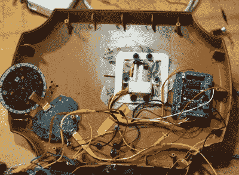

# 最先进的大嘴巴 Alexa Bass

> 原文：<https://hackaday.com/2019/02/07/state-of-the-art-big-mouth-alexa-bass/>

黑客们似乎致力于确保世界不会忘记，在短暂的闪耀时刻，每个人都认为大嘴巴比利·巴斯是一个非常好的主意。我们经常会看到一个项目，采用这种经典的家居装饰，并设法加入一些新的特性或功能，随着亚马逊和谷歌等语音控制家庭自动化产品的兴起，他们在准备填充低音时发现了一种新的成分。

 [【本·伊根】最近完成了他的电子鱼项目](https://www.cyber-omelette.com/2019/01/billy-bass-alexa.html)的进入，虽然我们不会说这个世界*需要*另一条墙上的 Alexa 启用的鱼，但我们不得不承认他做了一件巧妙的工作。他没有试图说服 Billy 的原始电子产品与其他人友好合作，而是决定将其全部拆除，从头开始。最终的结果可以说是我们遇到的最有能力的 *Billy Bass* 更新之一，如果你愿意首先考虑在墙上扑腾是一种实际能力的话。

构建过程在文章中有很详细的描述，并且[Ben]提供了许多图片，因此读者可以很容易地跟随修改。这个故事的简短版本是，他切掉了原来的控制板，并将三个电机连接到 Arduino 电机驱动器屏蔽上，当与适当的代码结合时，这使他可以完全控制 Billy 的嘴和身体运动。这省去了他想出如何与原始电子设备接口的麻烦，这可能是更好的，因为它们看起来相当粗糙。

从那以后，他只需要给鱼一些让它兴奋的东西。[Ben]决定将第二代 Echo Dot 的 3.5 毫米音频插孔连接到 Arduino 的一个模拟引脚上，并编写了一些代码，可以告诉他亚马逊的发光冰球目前是否在抱怨什么。他甚至在那里添加了一个 LM386 音频放大器模块，以帮助驱动 Billy 的原始扬声器，因为它现在将成为 Dot 的音频输出。

十年前，我们看到比利朗读推文，去年我们展示了对[的不同看法，给每个人都喜欢的电池供电鱼](https://hackaday.com/2018/04/14/big-mouth-billy-bass-channels-miley-cyrus/)添加了 Alexa“大脑”。2029 年比利会做什么？我们几乎不敢去想它。

 [https://www.youtube.com/embed/kNofsIxJrwo?version=3&rel=1&showsearch=0&showinfo=1&iv_load_policy=1&fs=1&hl=en-US&autohide=2&wmode=transparent](https://www.youtube.com/embed/kNofsIxJrwo?version=3&rel=1&showsearch=0&showinfo=1&iv_load_policy=1&fs=1&hl=en-US&autohide=2&wmode=transparent)

