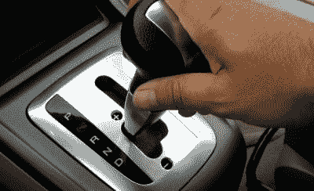
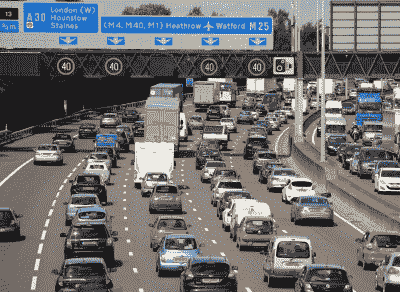

# 支持手动挡

> 原文：<https://hackaday.com/2020/05/05/sticking-up-for-the-stick-shift/>

看来手动挡已经成为一个症结，至少对美国购车者来说是这样。整个 2019 年，在美国销售的所有汽车中，只有不到 2%的汽车配有手动变速器。这张悲伤的图片包括了从可爱的双座通勤者到——令人惊讶的是——价值数百万美元的终极性能超级汽车。

但除了像我这样的爱好者，似乎没有人太在意这种从手动变速器的转变。根据美国消费者新闻与商业频道(嵌入下文)的视频报道，需求直线下降的事实表明，美国人总体上不再喜欢驾驶手动挡。显而易见，随着越来越多的人在没有学会驾驶的情况下生活，教师和支持者的数量将会减少。这是一个由鸡和蛋主演的供求问题。

但是放弃驾驶杆是放弃控制车辆的又一个例子。这不是每个人都关心的事情，而是那些非常关心的事情。让我们来研究一下手动变速器的起伏——更亲切的称呼是手动挡。

 [https://www.youtube.com/embed/_JuyDN0qzRY?version=3&rel=1&showsearch=0&showinfo=1&iv_load_policy=1&fs=1&hl=en-US&autohide=2&wmode=transparent](https://www.youtube.com/embed/_JuyDN0qzRY?version=3&rel=1&showsearch=0&showinfo=1&iv_load_policy=1&fs=1&hl=en-US&autohide=2&wmode=transparent)

## 汽车天堂

当然，在学习驾驶手动挡汽车的过程中磨砺自己的道路是艰难的。弯道很陡，在某种程度上，回报是一辈子额外的工作来操作这辆车。但我不这么看。是的，手动变速器需要不断的努力和关注，特别是在走走停停的交通中，但推动汽车的本能和身体运动很快成为第二天性。这听起来有点伤感，但是当你开手动挡的时候，你真的和汽车融为一体了。另外，你从发展这种协调中获得的肢体相互依赖会让你在移动和漂移时感觉像`{ insert: whomever you think is the best drummer of all time }`。

在我看来，加强控制的好处远远大于不方便的坏处。我不认为我们应该哄骗自己对汽车产生一种错误的安全感，并一点一点地放弃控制。我们正把自己和我们的孩子绑在两千磅重的死亡机器上——我们应该想要尽可能多的控制。

这最终关系到我的车和我的安全，对车的这种控制给了我内心的平静。我不去那里比赛或越野或做任何事情，但我住在一个冬季天气变化多样的地方，我想要一辆离合器性能良好的车。有了驾驶杆，我可以降档让车慢下来，而不是只踩防抱死刹车，然后抱最好的希望。另外，如果电池在某个地方没电了，如果有足够的坡度，我很有可能[启动汽车](https://www.youtube.com/watch?v=7Dblxll9Wi4)。

## 自动为人民服务

技术转变不仅仅是便利性与控制性的争论。自动变速器出现在 1940 年左右，起初是一种完全的奢侈品，有点像今天自动平行停放的汽车。

Image via [Car From Japan](https://carfromjapan.com/article/driving-tips/semi-automatic-transmission/)

在汽车问世的最初几十年里，人们认为自动挡汽车在机械性能上不如手动挡汽车。但是，由于普通消费者对不可否认的便利性的兴趣，人们继续购买自动挡汽车，自动变速技术继续向前发展。现在，自动变速器在很大程度上是由计算机控制的，并且没有理由说人类可以换档更快。

正如视频所指出的，有一些汽车跨越了手动和自动之间的界限，试图平衡人机之间的动力。其中一些是半自动的，这意味着你比在斜坡上从 D 档降档到 L 档有更多的控制，但只有一个离合器。我丈夫的讴歌 RSX 是半手动的——手动模式的自动，让你上下拨动换挡杆(错误的方式！)来换挡。它有两个离合器，但都是电脑控制的，所以与真正的手动完全机械控制相比，这感觉很假。

##  两大洲的故事

手动挡的衰落似乎是一个严格的美国现象，鉴于美国汽车文化的历史，这有点讽刺。尽管如此，大棒仍然在欧洲汽车市场占有一席之地。

鉴于那里也有丘陵和走走停停的交通，我认为美国手册销量的下降一定是品味问题，或者归结为生活方式的差异。

在英国，自动挡汽车仍然是一种奢侈品。如果你学的是自动挡，你的驾照会反映出来——而且你根本不允许开手动挡。很难想象相反的情况——在美国驾驶手动挡汽车需要特殊的驾照，但如果真到了那一步，我会很快拿到驾照并自豪地带着它。