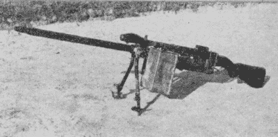
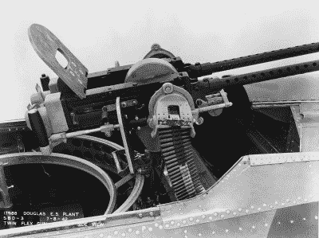
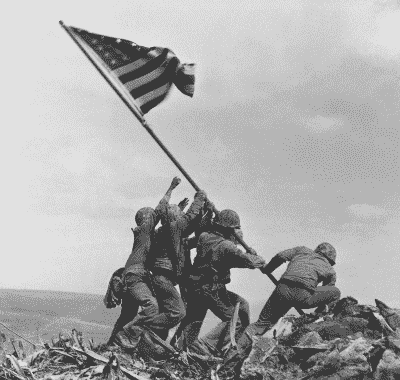

# 毒刺:被黑掉的硫磺岛机枪

> 原文：<https://hackaday.com/2020/02/03/stinger-the-hacked-machine-gun-of-iwo-jima/>

在第二次世界大战期间，美国以绝对惊人的速度生产武器、飞机和坦克。军用车辆和装备的生产以前所未有的方式实现了工业化，如果幸运的话，这种情况也不会再出现了。但即便如此，海外士兵偶尔会发现自己处于独特的情况，需要国内工厂无法提供的硬件。

A Stinger machine gun in WWII

这正是少数美国海军陆战队在 1945 年入侵硫磺岛之前设计和建造“毒刺”轻机枪(LMG)的方式。毒刺是一把勃朗宁. 30 口径的安/M2，从一架坠毁的或不能工作的飞机上抢救回来，被改装成步兵用的。它有点笨拙，而且因为它被设计成在飞行中被流过它的空气冷却，所以有迅速过热的趋势。但即使有这些缺点，它也绝对是一种毁灭性的武器；射速至少是当时海军陆战队拥有的标准布朗宁机枪的两倍。

六枚毒刺被生产出来，并且至少在一个营的级别上，被正式批准用于战斗。在看到这种武器在硫磺岛的入侵中是多么成功之后，甚至有一些谈论将毒刺投入更大规模的生产和销售。但是战争在这样的计划实施之前就结束了。

因此,“毒刺”是一种极其罕见的野战改良武器，不仅被大量生产，而且被官方认可，甚至被军方考虑采用。但这个被黑掉的机枪的故事实际上开始于几年前，几千公里之外，当时盟军正在争夺所罗门群岛的控制权。

## 战场即兴表演

寻找任何可能的优势来战胜顽强和根深蒂固的对手，士兵们试图将 AN/M2 重新用于步兵的事实并不令人惊讶。毕竟，这些高性能武器是不会短缺的。安/M2 作为防御性武器装备安装在许多美国海军飞机上，用于太平洋战区，如 SBD 无畏，PBY 卡特琳娜和格鲁曼复仇者。每当其中一架飞机损坏严重无法飞行时，就会有几架 AN/M2s 投入使用。

Twin .30 AN/M2 guns mounted in a SBD Dauntless

这种武器也有一些非常引人注目的特点。因为它是为在飞机上使用而开发的，所以它被建造得尽可能轻，同时仍能提供空对空战斗所需的高射速。与步兵使用的标准 M1919 布朗宁相比，安/M2 似乎是一个相当大的升级。

不幸的是，虽然这种枪足够轻，便于携带，但对于士兵来说，以其标准配置可靠地操作是不切实际的。安/M2 从未打算在飞机的防御炮塔外使用，它没有自己的瞄准镜、枪托，甚至没有传统的扳机。它有所有的功能部件，但没有一个能让人操作它的特征。

但这并没有阻止列兵威廉“比尔”科尔比在 1943 年保卫布干维尔岛时将一架投入使用。通过匆忙地在安/M2 的前部安装一个两脚架，他能够很好地装配武器，从防御位置提供火力。额外的火力使科尔比成功地击退了日军的突袭，证明了这个概念有足够的价值来保证进一步的发展。

## 为入侵做准备

一年后，米兰·格雷维奇中士和一等兵约翰·利特尔提出了他们对安/M2 改装的看法。虽然二等兵科尔比增加了一个两脚架，允许武器从固定位置发射，但海军陆战队需要一些他们可以从硫磺岛海滩前进并深入岛屿的东西。为了达到他们的目的，AN/M2 需要更大的机动性，甚至可以由一个士兵站着使用。

Firearms researcher Ian McCollum [holds a replica Stinger](https://www.youtube.com/watch?v=YgecTgbz3ik)

M1 加兰步枪的备用枪托被削减尺寸，挖空以接受机枪后缓冲管的独特形状，并用螺栓固定在枪的后部。扳机组件由金属片碎片制成，并制造了一个适配器，以便可以安装更小的勃朗宁自动步枪(BAR)的两脚架和手柄。

还设计了简单的前后瞄准镜(或者在某些情况下，从酒吧拍摄的)，这样操作者就能知道他们的镜头会落在哪里。但是由于毒刺是用来作为近距离压制武器的，精确打击从来就不是目标。

毒刺诞生了，来得正是时候。据推测，当海军陆战队驶向硫磺岛时，火炮仍在进行最后的润色。格维奇自己携带六件武器中的一件进入战斗，四件在连队的步枪排中分发，最后一件给了下士托尼·斯坦。

## 毒刺传说

由于斯坦下士和格维奇或利特尔不是一个连的，关于他为什么会收到自己的毒刺还有一些争论。但作为一名机械师的贸易，有可能他协助组装武器的理解，他会得到一个一旦他们到达硫磺岛。无论如何，史坦下士和他的毒刺的功绩在他死后的荣誉勋章中永垂不朽:

> 他的部队中第一个在第一次袭击中到达海滩后就位的人是斯坦下士，他配备了一种个人自制的飞机型武器，在他排的其他人试图进入位置时提供了快速的火力掩护。
> 
> ….
> 
> 在爆炸的炮弹和落在四面八方的子弹的无情冰雹下，他冷静而勇敢，继续以惊人的速度发射他那巧妙的简易武器的火力，很快耗尽了他的弹药。

虽然毒刺这个绰号本身可能被认为不适合列入正式的引文中，但这种武器及其简易性被多次特别提及的事实表明了它在战斗中的有效性。如果战争持续更长时间，随着士兵们听到他们在硫磺岛的表现，几乎可以肯定会生产出更多的毒刺(官方批准与否)。

## 短暂的一瞬间

尽管“毒刺”在硫磺岛取得了成功，故事到此为止。美国军队在折钵山升起国旗六个月后，裕仁天皇正式宣布日本将同意《波茨坦宣言》中概述的无条件投降。

Raising the American flag on Iwo Jima

不管对大规模生产毒刺或类似的 LMG 有什么兴趣，战争的结束使它变得没有必要。像许多在第二次世界大战最后的阵痛中被提出或测试的其他可怕武器一样，它在战后被认为是过度的。

那么毒刺现在在哪里？实际上没人知道。因为它们是用废弃零件建造的，所以不会出现在任何官方清单上。一旦战争结束，武器装备往往被随意丢弃。他们完全有可能从未离开硫磺岛，最终被埋在岛上的黑沙下。或者，如果它们真的被移除，它们可能会和所有其他战时硬件一起被扔进海里，这些硬件突然变得更像是一种负担，而不是一种资产。甚至可能在某人的阁楼上有一根收集灰尘的刺；一位坚忍的海军陆战队员从战争中带回家的纪念品中的一部分，现在由他的孙子或曾孙们尽职尽责地保存着。

虽然毒刺本身可能已经失传，但建造它们的人的故事仍在继续。75 年前，几名有事业心的年轻海军陆战队队员决定看看他们能否拼凑出一种比政府批准的库存中的任何武器都更强大的机枪，人们不禁被他们的独创性所鼓舞，因为他们为他们知道可能是他们生命的最后几天做准备。