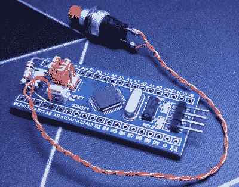

# STM32 蓝色药丸变成了 GPG 安全令牌

> 原文：<https://hackaday.com/2020/06/10/stm32-blue-pill-turned-gpg-security-token/>

感觉像 YubiKey 和 Nitrokey 这样的商业选择成本太高，[TheStaticTurtle]开始研究 DIY 替代品。他发现一个开源项目允许 STM32F103 作为 GNU Privacy Guard 的 USB 加密令牌，这是一个开始。他所要做的就是[建造一个合适的设备，把它安装在](https://blog.thestaticturtle.fr/lets-make-a-diy-gpg-usb-key/)上。

Blue Pill proof of concept

第一步是在流行的“Blue Pill”开发板上测试该软件，如果有人想亲自尝试的话，[TheStaticTurtle]会在文章中记录该软件。ST-Link V2 已经是一个受支持的目标，所以只需要做一些相对较小的调整就可以运行，并为一个简单的按钮添加支持。`gpg --card-status`的输出显示设备正在按预期工作，所以软件排序后，是时候仔细看看硬件了。

为了创建他的“TurtleAuth”加密狗，[TheStaticTurtle]从蓝色药丸的基本布局开始，并添加到 TTP223E 触摸控制 ic 中。原来的微型 USB 端口也被换成了公 USB-A 连接器，这样设备就可以直接插入计算机。然后设计了一个包含状态 led 和触摸板的上部 PCB，以便它可以作为一种外壳安装在主板上。虽然两侧仍然是开放的，但该设备看起来足够坚固，至少可以在笔记本电脑包中使用。

虽然这不完全是一个普通的项目，但这不是我们第一次看到有人开发自己的硬件令牌。越来越多的证据表明，如今有奉献精神的个人可以用相对有限的预算完成很多事情。