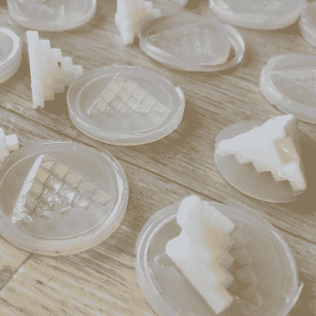

# 停止硅酮固化抑制，不需要昂贵的产品

> 原文：<https://hackaday.com/2022/10/30/stop-silicone-cure-inhibition-no-fancy-or-expensive-products-required/>

用硅树脂铸造零件是很棒的，而用树脂 3D 打印制造干净的形状是很棒的，所以对于一个有事业心的黑客来说，想把这两者结合起来是很自然的:3D 打印模具，倒入硅树脂，接收零件！但是硅树脂的固化过程会受到杂质的抑制。什么是治愈抑制？如上图所示，这是一个严重的混乱，就是这样。可悲的是，SLA 印刷的树脂模具是臭名昭著的原因。黑客能做什么？

首先:有锡固化和铂固化硅树脂，在大多数情况下，锡固化硅树脂在树脂印刷模具中工作良好。铂固化硅酮具有更好的性能，但更容易受到固化抑制。大多数解决办法都依赖于在模具上添加某种屏障涂层，但是[【Jan Mrázek】有一种廉价且可扩展的方法来避免这个问题，这是我们以前从未见过的](https://blog.honzamrazek.cz/2022/07/preventing-platinum-cure-silicone-cure-inhibition-in-resin-printed-molds/)。

A small number of the test pieces used to narrow down a working process. These pieces have loads of flat sides and corners. Many potential solutions worked only for flat mold surfaces, leaving corners problematic.

[Jan]详细介绍了这个问题和他的结果，但这里有一个简短的版本:在仔细清洁树脂印刷模具以确保表面上绝对没有未固化的树脂后，他将印刷品浸入水中。将印刷品(置于水浴中)暴露于外部紫外线固化 30 分钟，然后在水中浸泡 6 小时。之后，换水并重复这一过程。这似乎就是 SLA 印刷树脂模具不抑制硅树脂固化所需要的全部。这听起来很简单，但是到达那里却一点也不容易。

这种工艺最适用于厚壁模具；对于具有精细特征的薄壁模具，还有第二种工艺。为什么？因为树脂印花在一定程度上吸水。厚壁的印花不会太在意，但薄壁的不可能在水浴中坐 12+小时而不膨胀变形至少一点点。为了解决这个问题，[Jan]在初步清洗后用一层薄薄的丙烯酸(PMMA)密封小印刷品。

给某物涂上一层薄薄的丙烯酸比听起来容易。简单地将一小块透明丙烯酸溶解在一定量的丙酮中。丙酮是丙烯酸的不良溶剂，但它很容易获得，如果给它几个小时，它确实有效。一旦制成大约 1%的溶液，只需将清洁和干燥的树脂部件浸入溶液中，让其完全干燥，然后重复。另外，用丙烯酸浸渍处理过的模具不需要脱模剂:硅树脂就是不粘。

像往常一样，[Jan]提供了大量的照片和细节，说明当他专注于一个过程时，什么可行，什么不可行。然而，他承认仍然存在他无法识别或控制的变量。总的来说，他的方法非常成功，但是大约有 5%的时间，固化会无缘无故地受到抑制。所以现在，他总是在做任何事情之前，用少量的硅树脂测试一个新模具，以检查固化抑制；清洗固化抑制硅树脂是一件非常痛苦的事情。

[Jan] [用硅树脂铸造了很多零件](https://hackaday.com/2021/09/05/injection-molding-silicone-parts-for-under-50/)，所以这个问题是他肯定会投资的。我们总是喜欢看到[Jan]为与 SLA 树脂印刷相关的各个方面带来的不寻常的方法和对细节的精细关注，无论是解决[如何提高尺寸稳定性](https://hackaday.com/2022/07/04/fighting-all-that-can-go-wrong-with-resin/)，还是[在柔性建筑板冷却之前制作和使用它们](https://hackaday.com/2020/10/26/improved-flexible-build-plate-for-sla-is-ready-to-rock/)。