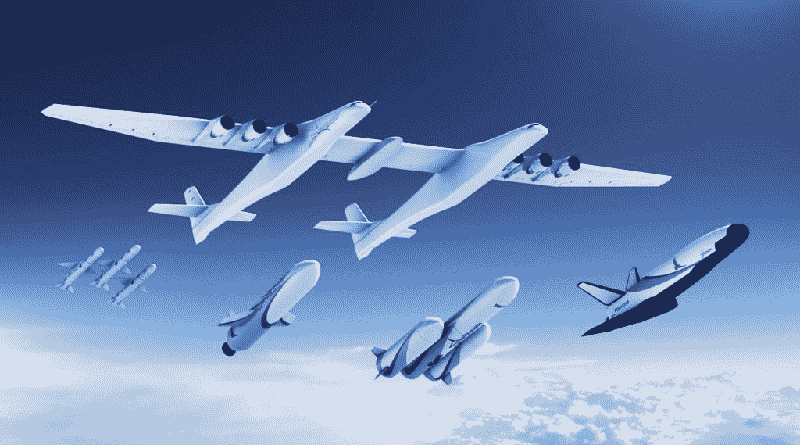
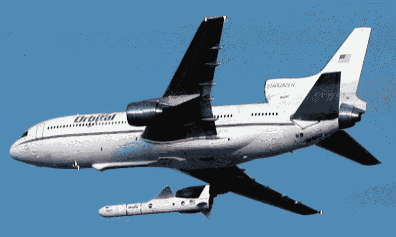
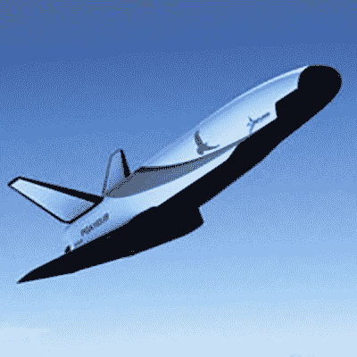

# 有史以来最大的飞机将很快向太空发射火箭

> 原文：<https://hackaday.com/2018/08/29/stratolaunch-announces-carrier-aircraft-with-largest-wingspan-ever/>

在莫哈韦深处，有史以来最大的飞机将很快进行试飞。这是 Stratolaunch，根据翼展测量，这是有史以来最大的一次飞行。Stratolaunch 由两架 747 建造而成，设计目的只有一个:作为轨道火箭的移动发射平台。

有几种方法可以测量飞机的大小。安-225 Mriya 具有最高的有效载荷能力，但只建造了一架(尽管这可能很快会改变)。云杉鹅以前是翼展最大的飞机，但它只飞了一次，而且只是在地面效应。Stratolaunch 完全是另一个类别。这是一架包含地球上最大的复合材料结构的飞机。你不仅可以把校车停在 Stratolaunch 的机身之间，你还可以把校车绑在飞机上，把它带到 30，000 英尺的高空。

但是为什么要建造这种惊人的飞机呢？原因可以追溯到十多年前，最终结果是一架空天飞机。

## 平流层发射的起源

Stratolaunch 是两个人的创意。第一位是保罗·艾伦，微软的联合创始人，他有着很长很长的鼓励航空进步的历史。他在华盛顿历史悠久的潘恩机场建立了飞行遗产和战斗装甲博物馆，也许是除国家航空航天博物馆和美国空军博物馆之外最大的飞机收藏之一。

Stratolaunch 背后的第二个人是伯特·鲁坦，他是航空界的巨人，写了几本关于复合材料结构的书。在国家航空航天博物馆展出的鲁坦设计比任何其他飞机设计师都多。

2004 年，X 奖基金会宣布了安萨里 X 奖，这是一个 1000 万美元的奖励，用于奖励第一个将载有两名乘客(或模拟人类质量)的航天器发射到太空边缘，转身，并在两周内再次发射的团队。该奖项的灵感来源于 1919 年的奥蒂格奖，该奖项向飞越大西洋的飞行员发出挑战。查尔斯·林德伯格在 1927 年获得了奥蒂格奖。

艾伦和鲁坦联手创造了太空飞船一号，这是目前唯一一艘私人建造的飞船。“太空飞船一号”的成功取决于该飞船的独特设计。这不是一架可以从跑道上起飞，点燃引擎，然后飞向太空的飞机。取而代之的是，太空飞船一号将由双机身运载飞机 WhiteKnightOne 运送到高空。与母舰分离后,“太空飞船一号”将点燃引擎，进行一次短程亚轨道太空飞行。

虽然“太空飞船一号”赢得了 XPrize,“太空飞船二号”目前正在进行飞行测试，但鲁坦几十年来一直在研究双发运载飞机。目标是携带几十万磅到高空。为了实现这一目标，Rutan 的双发设计需要先进的复合材料。然而，他找不到买家，直到艾伦决定重返太空事业。

称之为太空商业化；有了 cubesats 和 SpaceX，运载火箭的市场越来越大。艾伦在微软看到了个人电脑的民主化，电脑从巨大的大型机转向了台式机。也许卫星市场会有同样的增长曲线。不管怎样，都有钱可赚，也有机会建造世界上最大的飞机。如果你是亿万富翁，又是航空书呆子，你会怎么做？

## 为什么 Stratolaunch 存在

A Lockheed TriStar (L-1011) launching a Pegasus rocket

Stratolaunch 绝不是第一架将火箭运送到 30，000 英尺高度的飞机。以前就有人做过，最著名的是飞马座火箭。该火箭由 ATK 轨道科学公司开发，设计用于空中发射。原因很简单:气压。火箭发动机的发动机罩被设计成在特定的大气压力下工作。埃隆·马斯克在设计梅林系列火箭发动机时就意识到了这一点。SpaceX 目前版本的发动机梅林 1D 和梅林 1D 真空之间的主要区别是发动机钟的大小。在海平面上，你想要一个小的引擎钟，但是在真空中，或者至少在一半以上的大气中，你想要一个大得多的钟。当然，你可以用 aerospikes 来解决这个问题，但当你可以建造世界上最大的飞机时，为什么要这样做呢？

出于这个简单的原因，轨道 ATK 公司开发了飞马火箭，首先从 B52 发射，然后从洛克希德三星公司发射。空中发射在大气层的大部分上空进行，提高了发动机的效率。作为额外的奖励，飞机通常在天气上空飞行，因为飞机不是静止的，你可以从地球上的任何地方发射。

空中发射火箭可以让发动机效率更高，而且你不需要把钱花在发射台上。理论上，这是一个伟大的想法，但飞机只有这么大。洛克希德三星可以携带惊人的有效载荷，但质量分数很重要，飞马座火箭只能将几百磅的重量送入轨道。

理查德·布兰森，宇宙飞船一号的第三个名字，正在尝试用 Launcherone 发射空中火箭，这是一种稍加修改的 747。美国维珍轨道公司[宣布他们将使用*宇宙女孩*](https://hackaday.com/2018/08/14/virgin-orbit-readies-first-launch/) ，一架前 Quantas 747-400 运载一枚小型火箭到 35000 英尺，然后将携带 300 公斤的有效载荷进入太阳同步轨道。这种空中发射火箭方案使用 747 上的第五个发动机挂架，最初设计用于在机场之间运送发动机。这是一个聪明的想法，但同样，你只能用现有的机身提升这么多质量。考虑到将*火箭安装到飞机上的能力，你很快就会意识到需要一架专门设计的飞机将火箭送入平流层。*

## Stratolaunch 将会推出什么

通过 Stratolaunch 运载飞机发射的第一枚火箭肯定是轨道科学公司的飞马座火箭。这种火箭能够携带 370 公斤到低地球轨道，并且已经在 B-52 和洛克希德 L-1011 运载飞机上进行了空中发射的飞行验证。

然而，有了新的发射平台，就有了新的运载火箭的机会。这就是 Stratolaunch 变得有趣的地方，该公司正计划携带另外三枚火箭。

计划中的中型运载火箭(MLV)将比飞马座大得多，能够将多达 3，400 公斤的物体送入低地球轨道。这种火箭的第二种变体，MLV 重型，使用三个核心，将能够携带 6000 公斤的有效载荷进入轨道。

到目前为止，这个公告中最酷的部分是一架太空飞机。像白骑士二号和太空飞船二号一样，Stratolaunch 计划携带一架真正的轨道太空飞机。目前这只是一项设计研究，但 Stratolaunch 正在计划一种完全可回收的太空飞机。该计划是让这架航天飞机首先运载货物，随后进行载人飞行。这架空天飞机将类似于[目前正在轨道上运行的绝密 X-37](https://en.wikipedia.org/wiki/Boeing_X-37) ，事实上，飞马系列火箭背后的公司确实有空天飞机的经验。[轨道科学公司的 X-34](https://en.wikipedia.org/wiki/Orbital_Sciences_X-34) 是近 20 年前的一个测试项目，该设计仍然有希望。

## Stratolaunch 会升空吗？

目前，Stratolaunch 正忙于在莫哈韦周围滑行，第一次飞行很快就会完成，第一次发射火箭将在 2019 年的某个时候进行。这是有史以来翼展最大的飞机，部分是由有史以来最伟大的飞机设计师设计的。虽然它可能没有任何飞机的最高有效载荷，或最大的起飞重量，但它将成为有史以来最伟大的飞机之一。