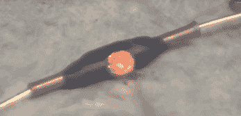

# 在敌后进行焊接

> 原文：<https://hackaday.com/2020/06/19/strike-a-solder-joint-behind-enemy-lines/>

想象一下，二战中你在敌后，设置爆破炸药，这可能会挽救你的战友的生命。我们如何在电线之间建立牢固持久的连接？美国战略情报局和英国特勤局的前身——美国战略情报局和英国特勤局使用的解决方案之一是能够像火柴一样点燃的自焊接套筒。[ElementalMaker]设法弄到了一盒这种袖子，发现它们的效果非常好，即使是在半个多世纪之后。

套管由一个铜管组成，里面有焊料和助焊剂，外面有蜡覆盖的烟火化合物。一小滴类似于火柴头的撞针化合物用于启动焊接过程，使用包装套管的超大火柴盒外部的撞针表面。[元素制造者]得到的背包是 1964 年制造的，但是据说和二战中使用的没有什么不同。

当点燃时，烟火化合物不会产生任何火焰，它只会闷烧，可能是为了使其使用更安全，并避免在夜间被发现。当套管内的焊料融化时，操作员应该将导线进一步推入管中，使它们重叠。虽然[ElementalMaker]没有把袖子剪开，但是看起来绝对是一个很好的接头，两端都有焊料渗出。休息之后请看视频！如果你想得到一包这样的袖子，看起来英国的一家军事剩余商店设法找到了一些。

尽管战争很可怕，但不可否认的是它激发了一些创造性的创新。就像士兵们把多支枪的零件组装在一起以满足他们的紧急需求，或者让 T2 枪穿过旋转的螺旋桨而不损坏它们。

 [https://www.youtube.com/embed/Em33_LSpeko?version=3&rel=1&showsearch=0&showinfo=1&iv_load_policy=1&fs=1&hl=en-US&autohide=2&wmode=transparent](https://www.youtube.com/embed/Em33_LSpeko?version=3&rel=1&showsearch=0&showinfo=1&iv_load_policy=1&fs=1&hl=en-US&autohide=2&wmode=transparent)

