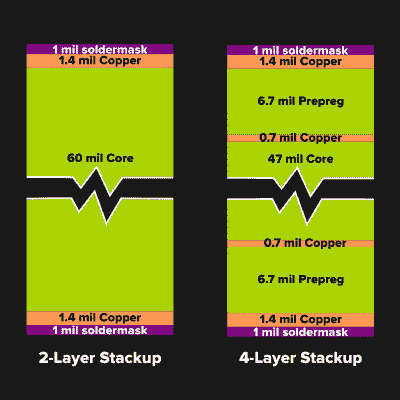
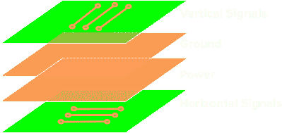
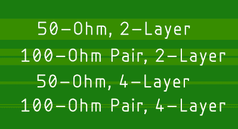
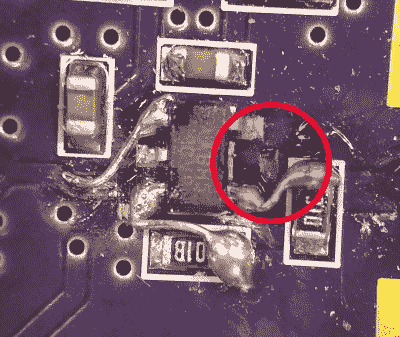

# 设计双层 PCB 时遇到困难？给四层试试！

> 原文：<https://hackaday.com/2019/03/27/stuck-designing-two-layer-pcbs-give-four-layers-a-try/>

许多读者肯定熟悉 PCB 的家庭蚀刻过程:在今天，这被认为是非常简单的，如果有点复杂的话。在我年轻时，当我第一次对电子学产生兴趣时，情况并非如此。在那个时候，蚀刻甚至单面电路板是为“高级”爱好者准备的。当我开始蚀刻自己的 PCB 时，高级爱好者已经开始使用双面家庭蚀刻板——这是唯一一种上图中没有的类型，因为我找不到我曾经创造过的一个成功的例子。后来，我看到了“裸机”制造 PCB 的兴起:专业制造的固定尺寸电路板，带有电镀通孔，但没有阻焊膜或丝网印刷。最终，这让位于聚合 PCB 服务，我们现在拥有完整的双层板，并配有阻焊和丝网印刷。

今天，“高级”爱好者可能会使用四层板，尽管四层板的采用率仍然相对较低——例如，OSH Park 生产了大约 90%的两层板和 10%的四层板。我认为这将不可避免地增加，就像所有以前的技术一样:先进的最终成为主流。以前的每一次转变都带来了更简单的设计和建造以及更好的性能，随着四层变得更加普遍，这也将是事实。

那么，让我们来看看如何设计四层 PCB。如果你从来没有为你的任何设计考虑过，你可能会惊喜地发现，你所获得的好处只需要很少的额外成本。

## 它们是如何叠加的？

Example Stackups (data from OSH Park)

两层和四层 PCB 的明显区别是多了两层铜。板内各层的特殊排列称为“层叠”两层堆叠很简单:核心材料的每一侧都有特定厚度的铜，通常是 FR4 玻璃增强环氧树脂层压板。典型的例子如图所示:1.4 密耳(又名 1 盎司)的铜和 60 密耳的核心。如果你以前从未使用过四层 PCB，你可能会认为额外的两层内层铜层间距相等，但它们通常更靠近外层。这样做有一些非常令人信服的理由，我们稍后将对此进行探讨。

如果您直接从制造商处订购大量 PCB，您可以定制叠层，改变间距和铜厚度以适合您的设计。然而，对于面向业余爱好者的服务，您得到的是标准的四层结构。幸运的是，许多服务已经很好地选择了他们的产品。例如，OSH Park 的四层服务使用优质 FR408 基板，可产生出色的射频性能。

## 什么去哪里？

 那么，现在你又多了两层铜层——你该怎么处理它们呢？有很多方法来安排你的设计，但是除非你有特殊的原因，最好坚持最常见的策略。在这种方法中，外层用于信号，两个内层用作电源层和接地层。最常见的情况是，接地层最靠近 PCB 的元件侧。然后信号被放在两个外层。一种方便的方法是在两层上以正交方向布设信号——顶层的走线可能主要是垂直的，而底层的走线可能主要是水平的。为了到达对角线上的某个地方，你走一条曼哈顿距离的路径，在各层之间交替。这增加了可实现的信号密度，是迭代设计的良好起点。

各层之间的连接通过过孔实现，就像两层堆叠一样。例如，为了给 IC 供电，可以用一条短而宽的走线将引脚断开，连接到与电源层相连的过孔。更好的方法是，您可以在元件侧创建一个小型“电源岛”,由铜浇注而成，通过几个过孔连接到该层，并在附近添加一个或多个旁路电容，以提供坚如磐石的电源。对于多层 PCB，有不同种类的过孔，虽然在业余爱好者级别的产品中，您通常会局限于更熟悉的类型，通过电路板的所有层。在更先进的电路板工艺中，也可以使用仅将外层连接到内层的盲孔，或者仅连接内层的埋孔。

## 我为什么要这么做？

Example impedance-controlled traces for 2- and 4-layer PCBs.

好了，您已经选择了四层堆叠和标准层排列。这能给你带来什么？首先，配电得到了极大的简化和改进。几乎实心的平面(仅由过孔断开)具有非常低的电感和电阻，可提高电源质量，并且无需在信号层上安装宽电源走线。只要你需要 VCC 或 GND，就往下钻。如果外层没有电源走线，信号走线的空间就会大得多。

RF 或高速数字设计的优势甚至更多。典型双层板上的 50 欧姆走线约 110 密耳宽。在上面所示的四层堆叠示例中，密度降至 14 密耳，仅从走线宽度来看，密度就提高了近八倍。差分数字信号对也可以改进，本例中尺寸缩小了四分之一。这些优势可以轻松实现更紧凑、更易于布线的设计，节省电路板面积和宝贵的设计时间。

转移到四层的一些最大优势可能不会立即显现出来，但内层铜层与其各自外层铜层之间的小距离有更多优势。保持信号走线靠近电源层或接地层可以增加它们之间的耦合，并减小包括电流返回路径在内的信号环路面积。这些因素减少了辐射，提高了信号的完整性。如果这只是一个爱好项目，你可能不会想到排放测试，但如果你想让你的设计获得销售认证，这可能是一个阻碍问题。另一方面，信号完整性的提高意味着高速设计首次成功的机会更大。

这些优势可能是戏剧性的，而且几乎是自动出现的。作为一个很好的例子，eevblog [的达夫·琼斯最近发布了一个视频](https://www.youtube.com/watch?v=crs_QLuUTyQ)，他采用了现有的两层设计，[Gigatron TTL 微型计算机](https://gigatron.io/)，并通过在现有信号层之间添加电源层和接地层，将其更改为四层。当他对 PCB 进行噪声测试时，与原始设计相比，四层版本的辐射大大降低。

## 关键在哪里？

This cut trace for rework would be too deep for a 4-layer PCB

所以，这听起来很棒，但是四层设计肯定有一些缺点。是的，但是它们相对来说是次要的。首先，按单位面积计算，四层板的成本高于两层板。典型的数字是同等质量电路板成本的 1.5 倍到 2 倍，这还不包括含铅 HASL 涂层两层原型级服务的真正便宜的“交易”。然而，这个指标可能会有点误导。四层设计可能比相应的两层设计更小，抵消了一些单位面积的成本差异。PCB 的成本也可能是总 BOM 的一小部分，因此翻倍只会增加少量的增量成本。

对于一次性的个人项目，使用四层堆叠可以节省设计布线的时间和精力。如果你计划一个生产运行，四层可能仍然有意义，即使只是一个原型，你以后可以尝试降低成本到两层。让它快速工作，然后再优化。

另一个明显的缺点是更复杂的四层工艺增加了生产时间。这在过去可能是一个更大的问题，因为时代最近变得更具可比性。例如，OSH Park 在 8 个日历日内装运 90%的双层订单，在 9 天内装运同等比例的四层订单，预计在未来几个月内时间会持平。结合现实生活中的运输时间，像这样的小差异完全无关紧要。

除了时间和成本之外，四层设计可能还有一些小的功能缺陷。返工一个四层板来纠正原型中的错误可能比修复一个两层板更困难。由于内层与外层非常接近，因此在外科手术断开信号走线时，意外切入接地层或电源层并不需要太多额外的力。这可能导致走线的任一侧与平面短路。建议用显微镜轻轻触摸并彻底检查。另一方面，如果出于某种原因，你已经在内层布线了信号走线，重新加工电路板可能几乎是不可能的:这是在那里粘电源层的另一个原因。

走线一个四层 PCB 可能涉及一些新的曲折，需要一点额外的思考。例如，在上述四层堆叠中，底层上的信号参考电源层；它们的返回电流必须流经该层，到达最近的旁路电容，才能返回地。如果经常用高速信号切换各层，可能需要在电路板上关键点的层之间增加额外的旁路电容，以缩短这些返回路径，并保持信号环路面积较小。好处是，这样做只需放置电容和几个过孔，就可以将电容连接到内部层。

最后，您最喜欢的 PCB 布局工具可能不支持四层板。Eagle 的免费版本仅限于两层，Fritzing 也是如此。如果你使用一个面向业余爱好者的包，你需要验证它能做更多的层。这可能是我听过的开始使用 KiCAD 的最有说服力的理由。

## 前进

鉴于四层设计带来的所有优势和最小的额外成本，评估一下您当前或未来的设计是否会从升级中受益可能是值得的。我个人这几天一般都是从四层设计开始。我使用双层板的唯一时间是在非常简单的电路板上，或者当我很快需要它们的时候，因为我可以在大约一周内获得紧急双层板订单(巧合的是与正常的四层板价格相同)。

也没有理由止步于四层。对于迁移到更高层的堆叠，也有类似的理由。一个特别有趣的例子是，看看 Kerry Scharfglass 在去年的 Hackaday Superconference 上的演讲，他描述了多花了 130 美元将他的 500 件订单从四层移到六层，节省了大约 20-30 个小时的设计时间。

您可能会在下一个项目中看到类似节省。试试看。

【感谢奥什公园的 Laen 和 Drew 提供的见解和数据。]