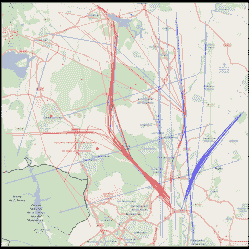

# 用软件无线电研究飞机无线电反射

> 原文：<https://hackaday.com/2018/10/11/studying-airplane-radio-reflections-with-sdr/>

无线电波的一个特性是它们容易被物体反射。特别是金属表面作为良好的反射体，通过研究这些反射是如何工作的，有可能实现各种有趣的壮举。[destevez]决定从当地的空中交通中寻找一些乐趣，并好心地分享了结果。

该项目的中心是接收来自当地业余无线电台的 2.3 GHz 信号，这些信号被从马德里巴拉哈斯机场起飞的飞机反射回来。信标是由当地的一个业余爱好者安装的，以 2 W 的功率发射连续信号和音调。

为了尝试接收附近飞机的反射光，[德斯特维兹]搭建了一个简单而巧妙的装置。

ADS-B data was plotted on a map and correlated with the received reflections.

使用 LimeSDR 无线电，连接到 9 dB 平面 2.4 GHz WiFi 天线。这是一个有意的选择，因为它有一个宽的辐射模式，这对于接收来自奇数角度的反射是有用的。一辆汽车被放置在天线和信标之间，以避免直接信号超过飞机反射的信号。

数据被记录下来，然后与 ADS-B 关于飞机位置和速度的数据进行比较，使记录的反射与事后单次飞行的飞行轨迹相匹配。这是使用 SDR 以及如何处理此类数据的智能无线电侦察的一个很好的例子。如果你想了解更多，可以看看这个项目，用 SDR 接收俄罗斯气象卫星图像。

【感谢 Adrian 的提示！]