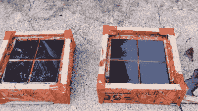

# 用 3D 打印的台面来装饰瓷砖

> 原文：<https://hackaday.com/2022/07/15/style-your-tile-with-3d-printed-countertops/>

我们都熟悉供应链问题，因为它们与芯片和蘸酱有关，但任何最近要求对家庭装修进行评估的人都知道，这些问题延伸到胶合板等产品，可能还有瓷砖、大理石和 Formica。面对改造厨房的困境， [[3DPC]决定尝试 3D 打印定制台面](https://www.youtube.com/watch?v=U-XjbNR1HXg)，而不是购买瓷砖。

Always build a testing rig first! Polyurethane looked great when wet, but resin was the clear winner.

由于灌浆在这里不是必需的，但最终是需要的，[3DPC]斜切瓷砖的边缘，以允许装饰性的“灌浆”填充片提供良好的对比。这种高光泽来自于玻璃上的印刷，层线的方向，以及[3DPC]聘请专业人士灌注的树脂密封剂。由于这些因素，瓷砖增加了透明度，使它们看起来超级酷。休息之后，请务必观看简短的构建视频。

公平地说，这并不是[3DPC]的第一次 3D 打印家庭装修竞技——他已经通过打印而不是购买节省了数万美元。对于这个特殊的项目，[3DPC]计算出的总成本不到 400 美元，只是专业安装台面成本的一小部分。我们想知道他在浴室贴瓷砖上能省下多少钱，这项工作已经在进行中。我们等不及要看了！

你还没有打印机吗？还不如做一个能利用垃圾的。或者，如果你已经有一台打印机，就用回收塑料做灯丝。一切尽在 [2022 Hackaday 奖第二轮获奖者](https://hackaday.com/2022/06/28/2022-hackaday-prize-reuse-recycle-revamp-finalists/)；让你的想象力自由驰骋。

 [https://www.youtube.com/embed/U-XjbNR1HXg?version=3&rel=1&showsearch=0&showinfo=1&iv_load_policy=1&fs=1&hl=en-US&autohide=2&wmode=transparent](https://www.youtube.com/embed/U-XjbNR1HXg?version=3&rel=1&showsearch=0&showinfo=1&iv_load_policy=1&fs=1&hl=en-US&autohide=2&wmode=transparent)

