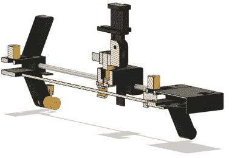

# 超级简单的相机滑块，巧妙扭转

> 原文：<https://hackaday.com/2022/02/22/super-simple-camera-slider-with-a-neat-twist/>

当你开始制作产品视频或你自己的酷黑客时，在某个时候你会开始想知道那些整洁的平移和旋转镜头是如何实现的。答案通常是某种机械滑块，它让相机沿着预定的路径移动。购买一个可能是一项昂贵的支出，所以许多人选择建立一个。[Rahel zahir Ali]也不例外，他设计并制作了一个非常简单的滑梯，但有一个巧妙的转折。

这个设计使用了一个齿轮传动 DC 电机，取自汽车挡风玻璃刮水器。这是一种经济有效的方式来获得一个漂亮的高扭矩电机与整体减速齿轮箱。额外的变化是相机支架可以绕轴旋转，并在第三个中间光滑的杆上滑动。这个导杆的两端可以在任何一端偏移，允许相机在滑动过程中从一端到另一端旋转 30 度。只需稍加调整，滑块就可以垂直安装，以拍摄向上和向上的镜头。超级简单，低技术含量，看不到 Arduino。

CAD 建模是用 Fusion 360 完成的，所有模型都可以下载源代码，以防有人需要进一步修改设计。我们只是期待一堆 STL，所以看到完整的源代码是一个很好的惊喜，考虑到许多像这样的开源项目(特别是在 [Thingiverse](https://www.thingiverse.com/thing:5249411) 上)似乎经常忽略这一点。

电子设备由一个简单的 DC 电机控制器(虽然[Rahel]没有提到具体的产品，但应该不难找到)组成，它处理速度控制，DPDT 锁定摇臂开关处理电机方向。一对微动开关用于在电机行程结束时停止电机。除了 3D 打印机，没有什么特别的东西可以让你成为一个非常有用的小滑块！

我们已经看到了一些滑块设计，因为这是内容创作者的常见问题。这里有一个[更复杂的一个](https://hackaday.com/2021/07/11/motorized-camera-slider-gives-your-shots-style/)，[还有一个](https://hackaday.com/2020/12/18/a-camera-slider-with-a-twist/)。

 [https://www.youtube.com/embed/slqCsvnURbI?version=3&rel=1&showsearch=0&showinfo=1&iv_load_policy=1&fs=1&hl=en-US&autohide=2&wmode=transparent](https://www.youtube.com/embed/slqCsvnURbI?version=3&rel=1&showsearch=0&showinfo=1&iv_load_policy=1&fs=1&hl=en-US&autohide=2&wmode=transparent)

