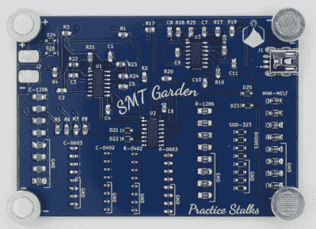

# 初学电气工程师的表面安装焊接实践

> 原文：<https://hackaday.com/2022/10/04/surface-mount-soldering-practice-for-budding-electrical-engineers/>

电子元件正稳步地从通孔部件转向专门使用表面安装技术(SMT)。虽然 SMT 元件的小尺寸可能令人生畏，但只要稍加练习，焊接就会变得非常自然。为了帮助人们克服焊接小零件的恐惧，[Alpenglow Industries]创造了一个[迷人的板子](https://www.alpenglowindustries.com/smt-garden.html#/)来练习 SMT 焊接技能。

被称为“SMT 花园”的[Alpenglow Industries]板将从 0402 到 1206 的各种 SMT 尺寸与漂亮的 PCB 艺术品结合在一起，以突出板上的各种 led。[Alpenglow Industries]提供了 SMT 焊接各方面的详细说明，包括术语和提供各种焊接技术。电路板上有表面贴装元件焊盘的练习“杆”,因此人们可以在类似尺寸的 SMT 元件柱上练习，以完善他们的技术。培训杆本身没有功能，但有提供实践时，人们感到舒适焊接发光二极管，555 定时器和逆变器芯片，使董事会的功能。

【Alpenglow Industries】已经提供了所有 KiCAD 项目文件、gerbers 和原理图[，可在线获取](https://github.com/AlpenglowIndustries/Alpenglow_SMTGarden_PCB)。SMT 焊接比以往任何时候都更容易，当你甚至可以把你的[手机当作显微镜](https://hackaday.com/2021/02/05/using-your-phone-as-a-microscope-on-the-electronics-workbench/)时，这是一个很好的尝试机会，如果你还没有。