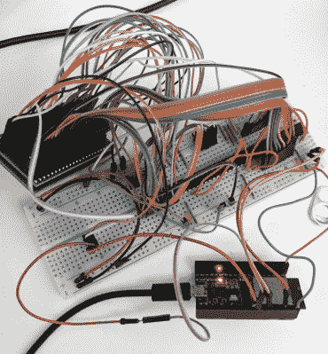

# 交换迷你拱廊橱柜中的 rom

> 原文：<https://hackaday.com/2019/12/06/swapping-the-roms-in-mini-arcade-cabinets/>

你可能在网上或大盒子零售商那里看到过一些这样的微型街机游戏:花 20 美元左右，你就可以得到一个经典街机柜的缩小版，非常适合作为桌面玩具，或者作为你游戏收藏的一部分放在架子上。像任何优秀的 Hackaday 读者一样，你可能很好奇是什么让他们这样做的。多亏了[wrongbaud]，[我们再也不用怀疑了](https://wrongbaud.github.io/MK-Teardown/)。

在几篇博文中，[wrongbaud]带领读者了解了一些微型游戏中使用的硬件和软件。例如，*横冲直撞*机柜使用所谓的“片上 NES”和 SPI 闪存芯片来容纳 ROM，而*真人快打*则使用 Genesis 仿真解决方案和并行闪存。如果他们不时不时给你扔几个弯就没意思了，对吧？

 但这些不仅仅是简单的拆解。一旦[wrongbaud]概述了硬件，下一步就是读取相应的闪存，并尝试理解转储的数据。这类游戏[通常在多个游戏](https://hackaday.com/2018/03/14/teardown-the-oregon-trail-handheld/)中重用硬件，因此通过隔离游戏 ROM 的位置并替换它，他们可以在不修改硬件的情况下玩其他游戏。这里，通过用 *Yoshi 的 Cookie* 替换*横冲直撞*的 ROM 数据来展示这种能力。自然，这是说起来容易做起来难的事情之一，但这是一个有趣的概念证明。

真人快打橱柜是该系列的新成员，所以[错误的波特]还没有那个进展得那么快。在 ESP32 和 MCP23017 I/O 扩展器的帮助下，并行闪存芯片已经被转储，一些 Genesis ROM 头在数据中是可识别的，但在完全理解固件结构之前，仍有一些筛选工作要做。

即使你不在市场上寻找小型的街机体验，这里收集的信息也是非常惊人的。从理解 I2C 和 SPI 等协议到用十六进制编辑器导航固件转储，这些帖子对于任何希望开始使用[逆向工程](https://hackaday.com/tag/reverse-engineering/)的人来说都是无价的资源。