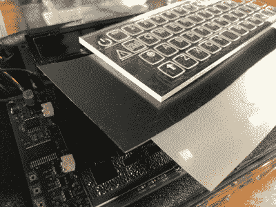

# 看看这个光学键盘

> 原文：<https://hackaday.com/2021/09/15/take-a-look-at-this-optical-keyboard/>

做键盘很简单吧？只需将一堆矩阵形式的开关连接到一个微控制器上，加上一些 QMK 和一组键帽，就可以开始工作了。嗯，是的，这可能适用于更舒适的环境，如家庭办公室和黑客地牢，但如果你需要在水下，在一个动荡的地区，或任何其他你不得不放弃密封的东西的噼啪声输入呢？机械开关只能带你走这么远——在某些时候，[你必须转向光学](https://www.instructables.com/Optical-Keyboard/)。

 这个华丽的键盘利用反射的红外光束来确定手指何时占据了给定的键位(因为你还能叫它们什么？).每个关键点都有一个红外发光二极管和一个光电晶体管，它通过中断光束工作。

[BenKoning]想要一个易于他人构建的解决方案，具有低成本的 BOM 和最低的软件处理成本。碰巧它也非常好看。

你看不到内脏的原因是黑色层——它能透过红外光，但对眼睛来说是黑色的。磨砂层扩散光束，直到手指足够近才能记录。休息之后，看看它的运行情况，然后用我们自己的[Bob Baddeley]对它们的深入探索来满足您对光学按键开关的渴望。

 [https://www.youtube.com/embed/PKKr9kTMlSs?version=3&rel=1&showsearch=0&showinfo=1&iv_load_policy=1&fs=1&hl=en-US&autohide=2&wmode=transparent](https://www.youtube.com/embed/PKKr9kTMlSs?version=3&rel=1&showsearch=0&showinfo=1&iv_load_policy=1&fs=1&hl=en-US&autohide=2&wmode=transparent)

