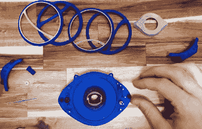

# 再次尝试 3D 打印的 Agamotto 之眼

> 原文：<https://hackaday.com/2022/06/15/taking-another-swing-at-a-3d-printed-eye-of-agamotto/>

三年前，[Enza3D]组装了一个在漫威的*奇异博士中看到的阿加莫托之眼的 3D 打印版本。这是一个好看的道具，但在屏幕精度和比例方面肯定有一些改进的空间。随着一部新的*奇怪的*电影现在在影院上映，这似乎是一个好时机让[重新审视设计并收紧一些细节](https://www.etsy.com/listing/1252137931/eye-of-agamotto-dr-strange-3d-print-prop)。*

正如你可能期望的那样，一些被认为是神奇的东西，让所有运动部件运转起来所需的内部机制是相当复杂的。不仅虹膜需要打开和关闭，而且环需要以不同的速度旋转，以重现电影中看到的效果。令人印象深刻的是，这里没有一行代码或微控制器——一切都是通过精心设计的一组齿轮和一个 N20 电机完成的。

Magical relic, some assembly required.

与早期版本相比，[Enza3D]试图尽可能地简化类似发条装置的结构，并做出了一些很好的改进，如统一装配中使用的螺钉和轴的尺寸，这样就不会有使用错误零件的危险。尽管它们的大小和精细的间距，所有的齿轮都可以在标准的 FDM 桌面打印机上打印，在这种情况下是一台 Prusa Mini。

也就是说，[Enza3D]确实改用树脂印花制作了道具的外部。顺便说一句，在另一个聪明的设计决策中，外部装饰盒与内部动力机构完全分离。这样，您就可以轻松拆卸设备进行维护或修理，而不会损坏您的成品。休息之后，请观看视频，了解该设备是如何组装的，以及如何让闪亮的塑料片看起来像老化的金属的一些技巧。

说实话，如果我们在制作自己的*奇异博士*角色扮演，我们的第一选择仍然是[，这是我们在 2018 年](https://hackaday.com/2018/05/29/spellcasting-gun-uses-pov-display-not-magic/)报道过的可笑而可怕的 POV 施法枪——但这种美肯定会紧随其后。

 [https://www.youtube.com/embed/39FkzWGCgmI?version=3&rel=1&showsearch=0&showinfo=1&iv_load_policy=1&fs=1&hl=en-US&autohide=2&wmode=transparent](https://www.youtube.com/embed/39FkzWGCgmI?version=3&rel=1&showsearch=0&showinfo=1&iv_load_policy=1&fs=1&hl=en-US&autohide=2&wmode=transparent)

