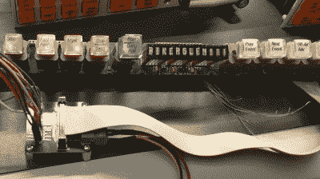

# 接管老式视频切换器的惊人控制面板

> 原文：<https://hackaday.com/2020/11/28/taking-over-the-amazing-control-panel-of-a-vintage-video-switcher/>

他从哪里得到这么棒的玩具？[格伦]从易贝窃取了草谷 Kalypso 4-M/E 视频~~混音器~~切换器控制表面的部分内容，并从[逆向工程按钮和显示模块，使其按照自己的意愿弯曲](https://bikerglen.com/blog/converting-more-vintage-hardware-to-usb/)。硬件可以追溯到世纪之交，这两个模块将与其他几十个模块一起完成视频~~混合~~切换器控制台。

[Glenn]以前的冒险深入研究了一个由十个背光按钮组成的条带，[让我们近距离观察了每个按键开关](https://bikerglen.com/blog/converting-a-vintage-button-panel-to-usb/)以及他用来将自己的引脚排列和该条带的示意图组合在一起的技术。但这一次事情变得更加棘手。上面看到的长条是一个“机器控制平面”模块，包括十几个可寻址的字符显示器，由微控制器和 FPGAs 的组合驱动。方形面板是一个“交叉点开关矩阵”模块，包括八个单独 32×32 液晶显示器，由三个专用集成电路驱动，可以显示红色、绿色或琥珀色。

 【格伦】用一个 STM8 Nucleo 64 与面板接口，写了一点代码来帮助绘制每个机器控制平面连接器上的每个引脚可能做什么。他能够从飞机上流出一些数据包，当他按下按钮时，这些数据包会发生变化，并最终反馈回该数据包格式的暴力，以找出 LED 显示协议。

但是交叉点开关上的液晶显示器是一个更难攻克的难题。他最终回到了设备的原始来源(易贝)，以获得一个他可以嗅出来的工作控制单元。他设计了一个中间人电路板，电路板两侧各有一个连接器，中间有一个引脚接头，用于逻辑分析仪。和大多数液晶显示器一样，秘方是初始化序列——暴力破解几乎不可能，但当你有一个正常工作的系统时，闻起来非常简单。到目前为止，他让它们在 USB 控制下运行，如果你足够幸运，在你的零件箱里有一些这样的设备，[Glen]已经煞费苦心地记录了你需要让它们运行起来的所有细节。