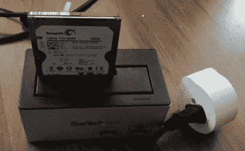

# 来自系统管理员的故事:即将到来的硬盘末日

> 原文：<https://hackaday.com/2020/07/14/tales-from-the-sysadmin-impending-hard-drive-doom/>

这应该是另一个晴朗的日子，但天堂里并不是一切都好。很少有东西能像一台电脑那样带来一种令人毛骨悚然的厄运感。从塔上传来的咔哒声可能也不是一个好兆头。那些备份是最新的，对吗？对吗？

有一些关于硬盘维修的传说和老故事。我最喜欢的一个方法是官方解决老硬盘的静态阻力:用木槌敲打它。我反复听说的另一个技巧是在试图从硬盘上读取数据之前先冻结硬盘。在一些情况下，这实际上是有用的。温度变化可以帮助解决静摩擦问题，冻结驱动器可能有助于过热的驱动器持续更长时间。不利的一面是硬盘内部可能会出现冷凝现象。除非你已经用尽了更安全的选择，否则不要求助于这些有问题的修复。

就本文而言，我们假设问题出在硬盘上，而不是电源或 SATA 电缆等其他组件引起的问题。真正死了的驱动器是另一个话题，但如果驱动器足够活跃，在插入时显示为块设备，那么就有希望恢复数据。您最喜爱的在线商店中提供的一种 USB 转 SATA 电缆是恢复数据的好方法。另一种选择是从 Linux DVD 或闪存驱动器启动，并就地访问该驱动器。如果你幸运的话，你可以复制你的文件，然后收工。如果文件传输因为驱动器快死了而失败，或者您需要一个完整的磁盘映像，那么是时候拿出一些工具开始工作了。

随着硬盘性能下降，个别扇区可能变得无法读取。这是一个预期的过程，现代驱动器都有备用扇区，以避免不可避免的情况。当扇区开始变得不可靠时，它们就被淘汰，取而代之的是备用扇区。当备用扇区用完时，磁盘开始累积不可读的扇区。文件中间不可读的扇区会终止文件传输，甚至可能使设备不可挂载。具有讽刺意味的是，通常只有一小部分磁盘是不可读的。如果有办法管理那些不可读的扇区就好了。

## 转到 DDRescue

业余系统管理员的工具箱中有一个强大的工具:`ddrescue`。它是古老的`dd`磁盘拷贝工具的后代，但是有一个重要的不同。当`dd`遇到读取错误时，它停止传输并显示错误。`ddrescue`记录错误，在输出文件中留下空白处，并继续传输它能传输的数据。因为有丢失块的记录，我们可以继续尝试读取丢失的部分，也许可以恢复更多的数据。

为了让 ddrescue 运行，我们给它一个输入、一个输出和一个映射文件。
`ddrescue /dev/sda diskimage.img mapfile.log`
默认情况下，ddrescue 会经历三个阶段的营救。首先，它一次复制一个扇区，直到遇到错误。对于工作正常的驱动器，此操作顺利完成，整个驱动器被复制。如果一个部门不能被复制，或者甚至反应特别慢，`ddrescue`就跳到前面，有希望超越问题。

第二阶段是修整。简单地说，`ddrescue`从每个跳过的部分的末尾开始，向后工作，直到遇到一个坏扇区。目的是尽可能快地恢复最大量的数据，并准确地确定哪些扇区是有问题的扇区。最后一个阶段是擦除，即单独检查每个未读扇区，尝试读取其中包含的数据。每次读取一个扇区时，都会修改映射文件以保持跟踪。

一个扇区可能连续 15 次读取失败，在第 16 次尝试时，最终读取成功。因此，`ddrescue`支持在交替方向上进行多次刮削。该理论的一部分是，当从不同位置接近扇区时，读取头对准可能略有不同，这种差异可能足以最终获得成功的读取。

## 当事情没那么简单的时候

虽然 ddrescue 的理想操作非常简单，但还是有一些潜在的问题需要注意。首先是热度。试图从已经损坏的驱动器中恢复数据的过程会很快使其过热，并使进一步的读取变得不可能。最好也是最简单的解决方案是用风扇将冷空气吹过硬盘。我遇到的另一个常见问题有点难以解释，但它可以通过一个特定的错误消息来识别:`ddrescue: Input file disappeared: No such file or directory.`当试图从驱动器中读取数据时，出现了严重的问题，以至于驱动器已经从系统中消失了。在这种情况下，我的理论是驱动器本身的固件已经崩溃和停止。无论如何，断开和重新接通硬盘电源通常足以让您恢复工作。



This could have worked better.

这意味着对于一个特别顽固的驱动器，恢复位的过程感觉很像保姆。一旦硬盘崩溃，重启硬盘，然后重启`ddrescue`——一遍又一遍。由于崩溃导致读取失败，该扇区被标记为坏扇区，救援尝试跳过该扇区。状况良好的扇区可能不会引发崩溃，因此会读取一些数据。

如果你认为花几个小时对硬盘进行循环供电听起来不像是一件有趣的任务，而是应该自动化的事情，那么你是对的。很容易将我们的`ddrescue`命令包装成一个循环，理想情况下还有五秒钟的睡眠。这解决了一半的问题，但是重启驱动器不是软件问题。我过去曾使用 Adafruit 的电源开关尾部，连接到一个 Raspberry Pi GPIO 引脚，每 30 秒切断一次驱动器的电源。不是很理想，但是很管用。不幸的是，该设备已经停产，我不知道有直接的替代品。

上次碰到这个问题，用的是 WiFi 电源开关，如上图。每当设备消失时，脚本就会触发插件来重启驱动器。这很有效，在一个 500 GB 的驱动器上，我恢复了除最后 1.5 兆以外的所有数据。唯一的缺点是智能插头只能通过云工作，所以每次供电都需要向 IFTTT 云发送请求。让硬盘通宵运行导致了太多的请求，我的账户被冻结了。下一次，我将不得不使用支持开源软件的设备，比如 [Tasmota](https://github.com/arendst/Tasmota) 。不管怎样，脚本很简单:

```

while true; do
    sudo ddrescue /dev/sda diskimage.img mapfile.log
    if [ -a /dev/sdc ]; then
        sudo ddrescue /dev/sda diskimage.img mapfile.log -M
    else
        curl -X POST https://maker.ifttt.com/trigger/switch_off/with/key/REDACTED
        sleep 10
        curl -X POST https://maker.ifttt.com/trigger/switch_on/with/key/REDACTED
        sleep 10
    fi
done

```

如果设备消失，请使用开关关闭并重新打开驱动器。如果 ddrescue 完成，并且设备仍然存在，则使用`-M`开关将所有坏扇区标记为未试过。

在许多情况下，这不是一个真正结束的过程，但是恢复率最终会下降到太低，不值得继续下去。一旦您从驱动器上复制了尽可能多的原始数据，使用`fsck` / `chkdsk`来修复现在被挽救的文件系统是一个好主意。如果它是一个系统驱动器，在你把它刻录到一个新的磁盘上之后，你需要使用你的操作系统的工具来验证系统文件。对于 Windows，我在`SFC`和`DISM`上取得了很好的成功。在 Linux 上，使用系统的软件包管理器来验证已安装的软件包。在 Fedora/Red Hat 系统上，`rpm -Va`将显示任何包含意外内容的已安装二进制文件。

这些年来，我用`ddrescue`拯救了一些其他技术无法触及的硬盘。不错，一个好的备份是理想的解决方案，但是如果你发现自己真的需要从一个快死的驱动器上获取数据，`ddrescue`可能就是你的救命恩人。祝你好运！

横幅图片:尼克·佩拉的《闪亮的 T1》