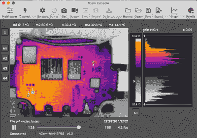

# TCam-Mini:为 Flir 轻子热成像传感器增加无线

> 原文：<https://hackaday.com/2021/04/05/tcam-mini-adding-wireless-to-flir-lepton-thermal-imaging-sensors/>

热感相机这么贵，为什么不自己造呢？这是[Dan Julio]不久前设定的目标，详细介绍了项目。虽然最终目标是创建一个独立的解决方案，拥有自己的屏幕、存储和处理，但 TCam-Mini 是一个有趣的平台。使用 160×120 像素 [FLIR Lepton 3.5](https://www.digikey.com/en/products/detail/flir-lepton/500-0771-01/7606616) 热传感器，并将其与定制的 PCB 和 ESP32 无线模块相结合，他创建了一个名为 TCam-Mini 的无线热摄像机以及附带的软件，可以显示辐射数据。

该项目在 GitHub 上有售，同时还有一个 T2 团体众筹活动，其中 50 美元可以获得一个 TCam-Mini 板，减去 199 美元的轻子 3.5 传感器。不便宜，但相对于例如 FLIR One Pro 相机附加模块来说相当便宜。与前面提到的 FLIR One Pro 相比，拥有一个不依赖于智能手机和附带的 FLIR 应用程序的更便携的单元有明显的好处。能够将辐射数据直接加载到桌面应用程序中进行处理，使其更接近专业热感相机，[Dan]表示他希望在功能方面尽可能接近专业热感相机。

最近【Dan】也开始进一步[描述这些轻子传感器](https://hackaday.io/project/159615-lepton-35-thermal-imaging-camera/log/190984-finally-starting-to-look-at-accuracy)的特征，以查看它们的精度是否可以从额定的+/-5-10°c 提高。为此，他重新利用了一个旧的耳内温度计校准设备。除了调整 ESP32 固件，TCam-Mini 还可以做很多事情，但如果你对轻子感兴趣，它看起来肯定是一个有趣的项目。