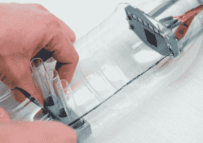

# 用空汽水瓶教科学

> 原文：<https://hackaday.com/2020/04/02/teaching-science-with-an-empty-soda-bottle/>

培养下一代科学家和工程师始于让孩子们在幼年时对 STEM 感兴趣，但这并不总是那么容易做到。娱乐当今年轻人的游戏和电影并不缺乏，只是简单地向他们扔一本教科书并不能解决问题。现代教育要想产生影响，就需要全神贯注、亲力亲为。

这正是奥地利科学技术研究所希望通过 popSCOPE 项目完成的任务。该项目由 Florian Pauler 博士]和 Robert Beattie 博士]共同创建，使用现成的硬件、3D 打印部件和开源软件来创建一个有趣的科学仪器，学生可以自己构建和使用。这个想法是让学生的体验更加个性化，这样他们就不仅仅是坐在教室里无所事事的参与者。

 这里使用的硬件相当简单，本质上只是一个树莓 Pi Zero W，一个摄像头模块，一个 Pimoroni Blinkt LED 模块，以及几根跳线。这一切都用螺栓固定在一个 3D 打印的框架上，框架上有一个内螺纹开口，可以接受标准的塑料苏打水(或汽水，取决于你在地球的哪个角落)瓶。你只需要在瓶子的侧面开一个大口子，把它拧进去，你就不用打印附件了，节省了很多时间。

那么这个小工具是做什么的呢？这显然取决于它运行的软件，但开箱后，它能够进行延时摄影，这对于观察种子发芽等生物实验来说可能很有趣。还有一组带有二维码的 3D 可打印“幻灯片”，popSCOPE 软件可以读取这些二维码，以显示真实显微镜幻灯片的图像和视频。这看起来像是作弊，但对于年轻玩家来说，这是一种让他们参与进来的安全而简单的方式。

对于年长的学生，或者任何对自制科学设备感兴趣的人来说，[波塞冬项目提供了一种功能更强大(也更复杂)的数字显微镜](https://hackaday.com/2019/02/03/open-source-biological-gear-for-the-masses/)，它由 3D 打印部件和树莓派制成。