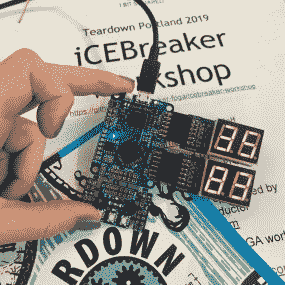
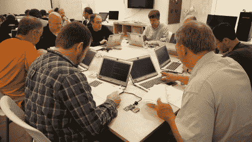
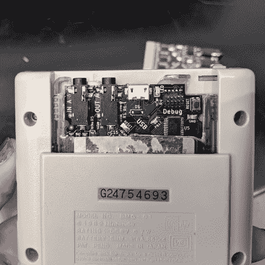
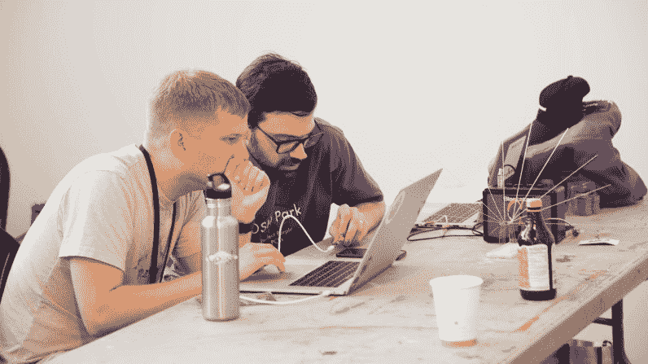
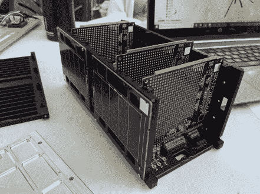
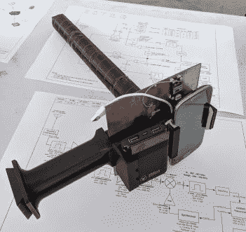
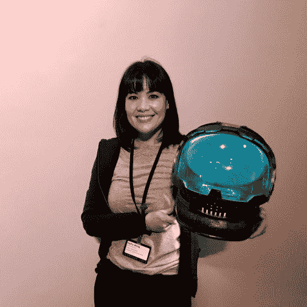
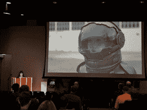
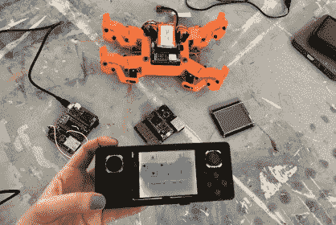
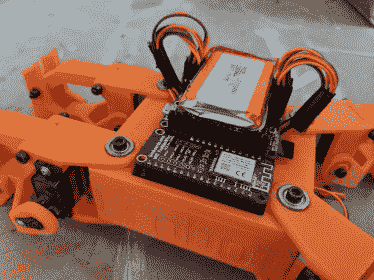

# 拆解 2019:黑客、艺术和 FPGAs 的节日

> 原文：<https://hackaday.com/2019/07/03/teardown-2019-a-festival-of-hacking-art-and-fpgas/>

当黑客们走近波特兰太平洋西北艺术学院引人注目的石头入口时，一群属于机器人教会的信徒向他们招手，邀请他们尝试赢得变异救世主的称号。教会使用危险的环境、宗教灌输、1980 年代的街机游戏和一些非常有趣的低技术黑客来测试你拯救人类的能力。这种与众不同的欢迎方式是为 2019 年的[拆卸活动定下基调的一个很好的方式:这是一年一度的为热爱硬件的工程师和艺术家提供服务的活动。拆卸是一个会议和一个聚会的中间环节，周末会有很多奇怪的冒险经历。为变种人点赞！拥抱徒劳！在错误中欢欣鼓舞！](https://www.crowdsupply.com/teardown/portland-2019)

对于我们这些没能成为变种人救星的人来说，有很多安慰奖。凯特·特姆金和蜜琪拉·策克利关于可访问 USB 工具的演讲非常精彩，我喜欢跟随索菲·克拉维茨的旅程，因为她[制作了一个遥控飞艇](https://hackaday.io/project/25509-remote-control-mini-blimp/log/145013-it-flies-now-what)。在楼上的演示室里，我们玩着 tinkrmind 的[气动甜甜圈取放机](https://twitter.com/danielrolnik/status/1142609759326990336)和 Russell Senior 的黑客 [IBM daisywheel 打字机](https://github.com/RussellSenior/lqp02-teletype)玩得很开心，它打印 ASCII 艺术并运行基于文本的《星际迷航》冒险游戏。

如果会谈、演示和研讨会的结束意味着每天活动的结束，那就不算是一场硬件派对，但拆卸团队每天晚上都在不同的地方组织晚餐和后续派对:波特兰的黑客空间^H PDX、swishy AutoDesk 办公室和老式街机游戏酒吧 Ground Kontrol。全城还举行了一场喧闹而激烈的寻宝游戏，需要破解密码、撬锁、调酒师甜言蜜语地给你下一条线索(提示:提示)。

下面和我一起欣赏这个为期三天(和晚上)的节日中我最喜欢的亮点。

# 表情机器人

俄勒冈州立大学的机器人学教授 Heather Knight 博士关于设计人类和机器人之间的交互的有趣而鼓舞人心的演讲是我最难忘的经历之一。她在[魅力机器人实验室](https://www.charismarobotics.com/)(魅力是协作人类和机器人的缩写:互动、社交、机器学习和艺术，当然)的工作涉及人类-机器人互动和社交机器人。Knight 向我们介绍了她的一些作品，包括送货无人机交互设计，她的 Marilyn Monrobot 剧院公司，以及在[著名的 OK GO 视频](https://www.youtube.com/watch?v=qybUFnY7Y8w)中在巨型 Rube Goldberg 机器上工作的经验教训。

从 4:34:00 开始，观看以下 Knight 关于表情机器人的演讲:

 [https://www.youtube.com/embed/ji7Hvg2L6i0?version=3&rel=1&showsearch=0&showinfo=1&iv_load_policy=1&fs=1&hl=en-US&autohide=2&start=16440&wmode=transparent](https://www.youtube.com/embed/ji7Hvg2L6i0?version=3&rel=1&showsearch=0&showinfo=1&iv_load_policy=1&fs=1&hl=en-US&autohide=2&start=16440&wmode=transparent)

# 为所有人开放 FPGAs

今年拆机的时候到处都是 FPGAs。我们尤其喜欢 Piotr Esden-Tempski 为[破冰船 FPGA 开发套件](https://www.crowdsupply.com/1bitsquared/icebreaker-fpga)举办的精心策划的研讨会。我们已经有一段时间可以访问开源工具链了，但是 Piotr 的文档是我们见过的最清晰和最简单的。

  iCEBreaker board during the workshops  Concentrate!

我们的另一个 FPGA 亮点是与硬件传奇人物 xobs、bunnie 和 Tim Ansell 领导的小得离谱(完全适合您的 USB 端口小) [Fomu board](https://www.crowdsupply.com/sutajio-kosagi/fomu) 一起玩。几个小时后，xobs 展示了一个微型 FPGA 板，上面有一个[甚至更小的返工](https://twitter.com/bunniestudios/status/1111180438330966016)，他和 bunnie 有点难以置信地成功完成了——一个真正令人敬畏的焊接例子！

# 电路 Python 所有的东西！

  Hacked GameBoy cartridge  Adafruit + GameBoy = win  Circuit Pythoning an FPGA board

FPGAs 并不是今年拆解业的唯一趋势。要真正融入周末的精神，您需要尝试让 Circuit Python 在至少一件事情上运行。Adafruit 的 Scott Shawcroft 分享了他的定制 GameBoy 墨盒，它将 Circuit Python 引入了标志性的手持游戏系统。Shawcroft 设计了一个带有 SAMD51 微控制器的电路板，它可以紧密地安装在被黑客攻击的盒子中，让你可以访问 GameBoy 的硬件，包括从 Circuit Python 程序中即时创建复古声音的能力。

除了分享他的 GameBoy 项目，斯科特还可以看到他在周末帮助其他黑客在他们的电路板上安装 Circuit Python，包括一个多普勒(另一个 FPGA 电路板，这次用于音乐专用应用)和一个 Automat Mini 的原型，这是一个将 MIDI 信号转换为螺线管和 led 触发器的电路板。

从 1:35:38 开始，点击这里查看斯科特·肖克罗夫特的完整演讲。

# 俄勒冈州自己的开源卫星

  Inside an OreSat  The OreSat tracker and video receiver

我对来自波特兰州立航空航天学会(PSAS)的学生航空航天工程项目印象深刻，他们正在与美国宇航局一起向太空发射一颗低成本的开源卫星。我很开心[在拆卸时打开 OreSat](http://oresat.org/) 的外壳，探索像这样一个雄心勃勃的项目需要什么样的技术。波特兰州立大学电子和机械工程专业的学生在现场展示了他们建造的传感和控制系统，以及一系列令人印象深刻的开源项目，这些项目与卫星一起工作，用于科学和教育目的。

我最喜欢的与 OreSat 合作的项目之一是手持式开源卫星跟踪器，它的设计使得俄勒冈州的高中可以跟踪卫星的路径，并接收从轨道上传来的实时视频。

除了整个进入太空的部分之外，这个开源卫星项目的特别之处在于它被很好地记录了下来。尽管涉及许多不同的人、部门和技术，PSAS 已经优先确保他们的工作实际上可以在 GitHub 上获得，以供其他机构或爱好者复制、修改或学习。

# 太空可穿戴设备(或 ComiCon)

  Sophy Wong and her space helmet  Alex Glow… ing?  Sophy tears down her tech

无论你是想把人送上太空，还是令人信服地模拟登月，你可能都需要穿些衣服。Sophy Wong 关于“可穿戴设备”类别的广泛技术的演讲分享了她为人体设计技术的经验。我们知道了为什么宇航服前面的文字是镜像，所有的衣服基本上都是一系列相互连接的管子。她还分享了一些她最近的可穿戴项目的技术和技巧，包括受 2001:太空漫游和普罗米修斯启发的宇航服，捉鬼敢死队的装备，以及一件非常有趣的帽衫，T2 让你通过挥舞手臂来玩 Flappy Bird。

[从 2:05:26 开始，点击此处](https://youtu.be/0mTw9iHcj3Q?t=7526)观看黄西的完整演讲。

# 将 Linux 塞进羽毛外形

  Controlling a robot with a very smol Linux computer  Close up of the Giant board robot’s innards

Adafruit Feather 正在迅速成为黑客世界中最受欢迎的外形之一。在 Teardown 的演示室中，我们看到了一个强大的新例子:[groguard](https://www.crowdsupply.com/groboards/giant-board)的巨型电路板。这个巨大的主板通过使用紧凑但功能强大的 SAMA5D2 将一台 Linux 计算机挤入一个很小的空间，通过其内置的内存节省了宝贵的主板空间。除了运行 Linux 和体积小之外，这个巨大的主板有 20 个 GPIOs，一个 SD 卡插槽和令人印象深刻的低能耗。

使用羽毛状外形的优势之一是您可以选择与多种其他板进行交互。我们和 [groguard 可爱的四足机器人](https://twitter.com/groguard/status/1139580691522310145)一起玩，这是羽毛堆积优势的一个很好的例子。机器人本身是由一堆令人满意的整齐的巨型板、伺服羽翼和 Wifi 羽翼组成的，巨型板和 Wifi 羽翼组合构成了遥控器。如果你对经典视频游戏比对机器人竞技更感兴趣，你还可以看到这个游戏板运行着一个[手持版的末日](https://twitter.com/groguard/status/1122260413301678080)，配有真正可怕的音频。

Teardown 2019 背后的组织者——PNCA 的 Crowd Supply 和 Make+Think+Code 部门——成功举办了一场充满活力的智能硬件黑客活动，支持艺术技术和独立电子产品领域。讲座和研讨会的安排令人印象深刻，尤其是考虑到会议相对较小的规模。我们希望这一事件在未来的几年里一直留在硬件会议日历上。我们一定会回来的。