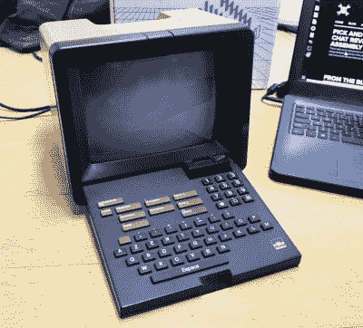
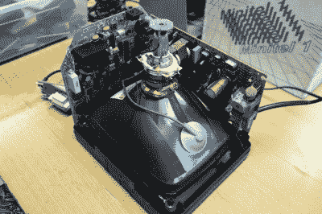
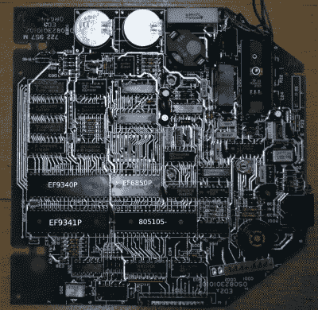
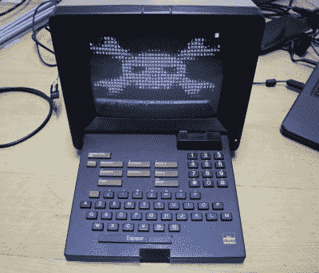

# 拆卸:Alcatel Telic 1 Minitel 终端

> 原文：<https://hackaday.com/2022/02/16/teardown-alcatel-telic-1-minitel-terminal/>

对于 20 世纪 80 年代的英国青少年来说，Sinclair Spectrum、Commodore 64 或 BBC Micro 等 8 位计算机的乐趣被严格限制在离线领域。我们会读到大西洋彼岸的 BBS 上的场景，但是如果没有便宜的本地电话，没有价格不菲的调制解调器，我们体验到这种场景的机会是零。然而，当我们参加英国学校的法国之旅仪式时，我们惊讶地发现，每个法国人不仅仅是在上网，而且他们是通过一个整洁的小型多功能终端上网的。我们刚刚被介绍给法国的 Minitel 系统，并在那一分钟分享了对未来的一瞥。

## 一个非常法国化的网络

My Alcatel Minitel terminal

在 20 世纪 70 年代和 80 年代，所谓的可视图文系统，即基于终端的电话线接入中央计算机的信息服务，被视为对有利可图的新产品感兴趣的电话网络运营商的下一个明显步骤。在大多数国家，这导致了一些服务，如英国的 Prestel，这是一种依赖昂贵硬件的订阅服务，但法国电信却走上了一条大胆的道路，将终端免费提供给用户，用户可以免费访问电话列表和黄页，但这是一种基于按使用付费的高级服务的商业模式。

因此，整个 20 世纪 80 年代，所有的法国家庭都在电话旁边有一个迷你电话终端，这项服务获得了巨大的成功。自从我以游客的身份看到 Minitel terminals 后，我就对这项服务着迷了，所以在 21 世纪 20 年代，当一个朋友去法国拜访他们的家人时，我问他是否可以帮我拿一台旧的 Minitel terminals。因此，我发现自己放弃了大约 25 美元，并得到了一个略有破损的 Minitel 纸箱，里面装有一个熟悉的棕色阿尔卡特终端。我当然没想到它会在原来的包装里。

在我面前的桌子上，它类似于一台小型 CRT 电视机，大约为 250 毫米 x 220 毫米 x 260 毫米。9 英寸的单色屏幕被键盘覆盖，按下顶部的一个按钮即可释放，并在屏幕前向下转动。在该装置的背面，一侧是用于传统电话和电源以及电话墙壁插座电缆的法国电话插座，而另一侧是用于串行端口的 DIN 插座。键盘确实感觉非常坚固，有 clicky AZERTY 布局以及数字键盘和一系列呼叫功能键。最后有一个电源按钮和一个显示器亮度滑块，当设备通电时，输入的字母会出现在屏幕上。

## 巧妙的设计让 37 年后拆除成为一件乐事

Below the CRT is the monitor and PSU board, to the left the terminal electronics.

在拆卸设备之前检查背面，很明显没有螺丝，而是所有东西都由塑料夹子固定在一起。这使得小心拆除后壳成为一个简单的过程，揭示了内部。有两个互锁的 PCB，一个包含管颈下方的电源和监视器电子设备，另一个包含左手侧上方的终端电子设备。一根扁平的软电缆将它连接到键盘上。将显示器 PCB 留在原位，拔下端子板进行近距离观察确实非常简单。

The terminal PCB, with some main chips labelled.

可以在没有任何微处理器的情况下制作串行终端，但是许多后来的终端使用 8 位微处理器来取代许多逻辑并提供一些基本的智能。在这种情况下，它是一个 8051，搭配一个 6850 UART 进行串行通信，以及 Thomson EF9340 和 EF9341 视频图形芯片组。这最后两个芯片是一对有趣的芯片，它们有自己的 16 位数据总线，需要 1 K x 16 RAM，虽然我不确定它们是否是专门为 Minitel 设计的，但很明显它们的优势更喜欢在可视图文中而不是在家用计算机中。

这个装置中的所有芯片都有 1985 年春天的日期代码，所以它很可能在那年晚些时候首次投入使用。值得注意的是，在线搜索显示这款终端的版本具有完全不同的主板，具有不同的处理器和扩展总线，显然由于该设备从未运行任何用户软件，其内部结构对服务没有任何影响。键盘被夹开，从铰链中释放出来，露出包围 PCB 的非常坚固的金属框架。这个特殊的终端的一些按键有问题，很快被发现是由于键盘电缆故障。我看到了几个适配器印刷电路板和一个更强大的现代扁平电缆在我的未来。

## 在 2022 年，你会对一个 80 年代的梦想做什么？

When your hacker friends beat you to it and write the thing you were going to do.

考虑到不得不修理我的键盘电缆的轻微烦恼，在 2022 年，我可以在这里用 Minitel 终端做什么？最初的法国电信系统[在 2012 年](https://www.bbc.com/news/magazine-18610692)被关闭，所以我几乎不能拨通任何官方服务。幸运的是，[仍然存在一个活跃的 Minitel 黑客场景](http://minitel.us/hacking)，他们通过手机为传统终端编写程序并运行他们自己的服务，比如在网络浏览器中的[。对于为 DIN 插座](http://3614hacker.fr/)构建串行电缆的次要工作，我可以从计算机与我的终端对话，并且在许多其他选项中，我可以使用[Python 库](https://github.com/64rulez/PyMoIP)或[Arduino 库](https://github.com/eserandour/Minitel1B)来做我想做的任何事情。如果我不想亲自动手，甚至有一个荷兰黑客空间的朋友为我写的黑客日阅读器。

随着我的 Minitel 终端小心翼翼地重新组装，并等待我可以修复其键盘电缆的时间，我相信我会在大量的选项中找到它的有趣用途。

对于那些想拥有自己的迷你电话终端的人来说，这是值得一提的。这些终端免费提供给每一个法国电话用户，在它最受欢迎的时候，每个法国家庭都有一个。我的朋友告诉我，虽然许多 Minitel 型号中有一些很罕见，很受欢迎，但像我这样的普通型号仍然足够多，任何读到这篇文章并想象价格上涨的供应商都可以被告知采取行动。像我一样找一个法国朋友，看他们能不能帮你找一个。