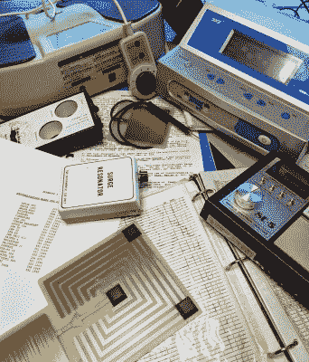
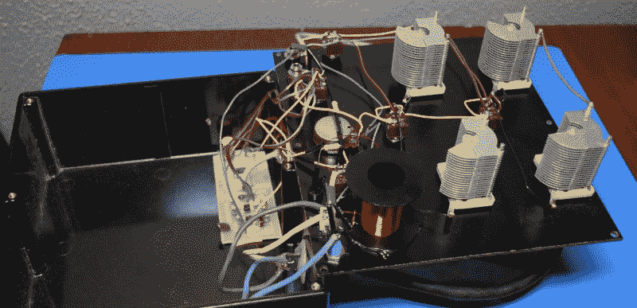
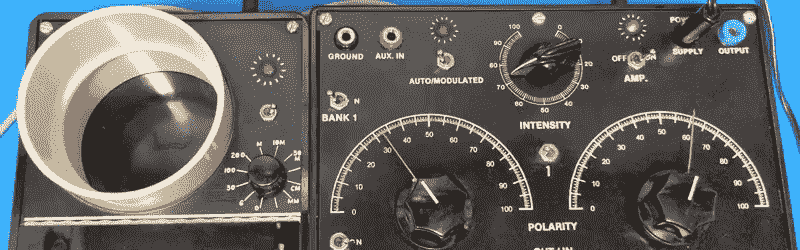
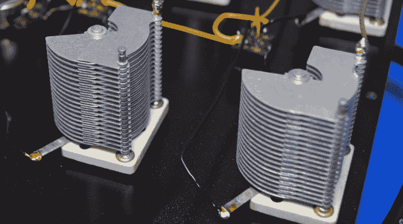
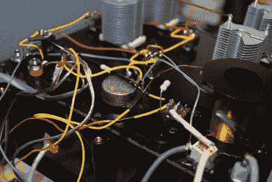
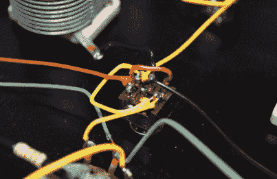
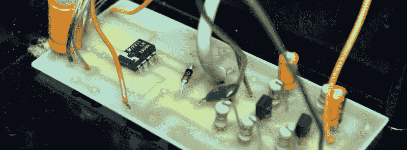
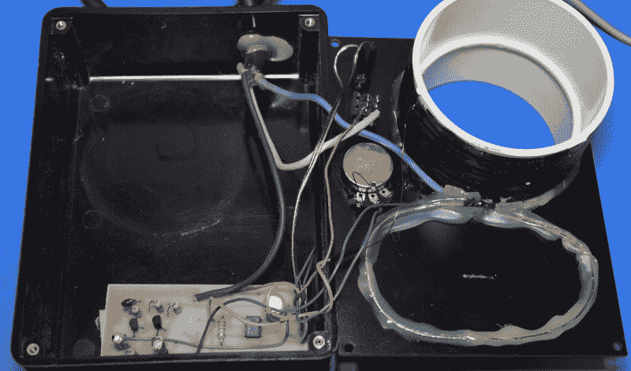

# 拆卸:模拟放射性分析仪

> 原文：<https://hackaday.com/2021/11/09/teardown-analog-radionic-analyzer/>

你有没有在网上查找食谱，在找到配料之前，你不得不翻阅某人曲折的人生故事？你只是想知道要买多少罐番茄酱，但你却在读关于在奶奶家度过舒适冬夜的书？那就是你现在的处境，朋友。除了你不想知道千层面里有什么，你只想看到一些古怪的替代医学小工具的内部。我明白，我不会责怪你跳过前面，但我会疏忽开始这个月的拆卸没有一点解释，它是如何进入我的财产。

所以，如果你允许我说一会儿，我会告诉你一个关于一个特别慷慨的资助人的故事，以及他们给黑客社区带来的不可思议的财富

## 令人烦恼的负担

想象一下，你处在一个不值得羡慕，但对我们大多数人来说不可避免的位置，必须把你父母的事情处理好。即使你消除了突然角色转换的情感因素，成为一个你一直依靠的人的照顾者，这种转变的后勤方面也令人生畏。尤其是当你的父母花费巨资，在几十年的时间里，积累了一个非常不寻常的设备收藏。

 这些装置至少可以说是神秘的。许多没有任何明显的品牌或型号标记，并且伴随它们的大量文档不同于你所见过的任何手册。这显然是某种技术数据，但没有一个有任何意义。从纸片上的手写笔记到专业装订的书籍，每一份文件都是一堆杂乱的技术术语。即使读了几页，它的意思似乎也超出了你的理解范围。你很好地理解了单个单词，但由于你从作者将它们组合起来的方式中得不到什么，它就像是用梵文写的一样。

然后有一天，当你在网上搜索一种设备的更多信息时，你偶然发现了一个你以前从未听说过的网站。这是一个看起来很奇怪的网站，黑底白字，每页顶部都有骷髅图。实际上，仔细观察，那些根本不是骨头。无论如何，这个网站的“磁波测试仪”条目看起来很有希望。与其用你在别处看到的令人钦佩的胡言乱语来描述它，不如用科学的怀疑态度来检验它。最终的结论是，它是一个无害的小玩意，甚至在一些基本层面上是有用的，但它最终是为了一个单一的目的而设计的:将天真的人与他们的钱分开。

也许，你会想，这些人正是可以被委托收藏的那种人。与其全部扔掉，你可以把所有的东西打包一起送去，这样每一件都可以被仔细分析并暴露出它的真实面目。也许到最后，这一切真的会有好的结果。

## 超凡脱俗的宝藏

当我同意从我们的匿名赞助人那里接受这些藏品时，我几乎无法想象这项事业的规模。由于它们相当大的体积和重量，每个箱子都在自己的时间内完成了穿越全国的旅程，每次有新的箱子到达，我都确信这一定是最后一个。总的来说，这里有足够的材料，即使我每个月拆一个新的伪科学小玩意，我们也要花好几年才能看完。但是我们总得从某个地方开始，所以让我们用这个放射性分析仪向未知领域发射吧。

你可能会问，什么是放射性分析仪？我们从[凯利研究技术](http://kellyresearchtech.com/ka-analyzers.html)公司得到了我们的答案，该公司制造了这种设备的现代克隆，他们富有想象力地称之为*凯利个人仪器*。他们在手册的顶部对设备的功能进行了简明的解释:

听起来很方便。我不知道你怎么想，但我总是觉得设计现实的结构有点烦人。如果这个小工具真的可以帮助在亚原子水平上烹饪东西，那么老实说，集成广播电路只是锦上添花。有了这样的功能，Kelly Research 几乎以 1500 美元一个的价格送出了这些东西。

我是说，拜托。这不像我们要打开它，发现一个大部分是空的盒子，里面有一堆乱七八糟的电线。对吗？

## 你期望什么？

说真的，还能是什么呢？有了磁波测试仪，该设备至少有机会提供某种程度的功能。但当制造商自己对该设备的描述称它可以在亚原子水平上广播现实时，所有合理的期望都落空了。

但是，这并不像设备只是装满沙子或包含一堆铝箔包裹的晶体。这里有可识别的组件，有人已经完成了所有的布线工作。那它真的有用吗？嗯，尽管手册向用户保证他们的新 radionic 分析仪是一种免费的能源设备，不需要任何外部电源来运行(说真的)，但它确实指出，将该设备的交流适配器插入墙壁确实会加快整个与宇宙事物融为一体的速度。

果不其然，如果我们打开电源，拨弄开关和拨号盘，发光二极管会以不同的速度闪烁。所以让我们仔细看看，看看引擎盖下发生了什么。

## 分析分析仪

在分析仪内部，最引人注目的显然是这四个可变电容。这些实际上是非常好的单位，虽然我找不到任何识别它们的标记，但它们给我的印象是复古的。有趣的是，手册声称该设备利用了“定制的平行板机械电容器”，虽然我真诚地怀疑它们是定制的，但毫无疑问它们很贵。旋转表盘当然感觉很好，但就价格而言，我希望如此。

仔细观察彩色编码的接线，我们可以看到它们确实连接到该装置前面板上文字描述的双刀双掷(DPDT)开关。也就是说，这四个电容被隔离成两组，它们不仅可以独立地与电路的接地端连接或断开，还可以使用极性开关在左右电容之间进行选择。

  A master class in wire management  

但是电路的其余部分在做什么呢？除了“强度”电位计、指示灯 led 和一个看起来可疑地像一卷旧电磁线的线圈，前面板上没有其他东西。从逻辑上讲，设备运行的秘密一定在安装在外壳内的小 PCB 上。

这是一个简单的小电路板，上面只有一个 IC，LM3909N。也许是某种亚原子传感器？不，远非如此。快速查看一下数据表，可以证实很多观众可能已经猜到的事情:这是一个设计用于闪烁 led 的芯片。

所以要明确的是:不仅这款设备中的合法电路是一个裸露的 PCB，除了让前面板上的 LED 指示灯闪烁之外什么也不做，而且他们甚至懒得使用 555。

## 缩小版的伙伴

我想任何有理智的人都已经知道我们会在那个小盒子里找到什么，根据手册，那个小盒子是你应该放你的水晶之类的东西的“样品井”。但是为了不让任何人指责我们偷工减料，让我们快点结束吧。

哦，看，真是个惊喜。这是另一个 LED 闪光灯，这一次他们通过一个似乎是缠绕在 PVC 耦合和灯线碎片上的线圈接地。我想已经说得够多了。

## 可耻的展示

我们真的让这个系列有了一个吉祥的开始，不是吗？虽然从来没有任何问题，这样一个荒谬的设备将是什么，但蛇油，我期待更多的努力。除了几个高质量的组件，这个设备的内部结构是糟糕的。在灯线、大量使用热胶水和混乱的布线之间，你会认为这是某人第一次使用烙铁。

就功能而言，我们最多可以说，该设备的设计方式似乎可以被认为是有史以来最奇特的可变电容器。此外，将示波器连接在单元前面的输出和接地插头之间确实显示出低振幅模拟噪声的疯狂杂音，很可能是盒子内电线和线圈的缠结产生的干扰。

当然，在我看来，这种设备可能完全按照制造商的意图工作。此外，如果追问的话，我们会被告知，我们无法推测机器内部的目的或功能是我们自己对亚原子技术的微弱理解的产物。换句话说，在处理这样的设备时，严肃的谈话是不可能的。充其量，我们可以简单地向黑暗中照射一束光，让理性的观察者做出自己的结论。