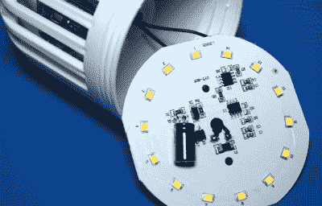
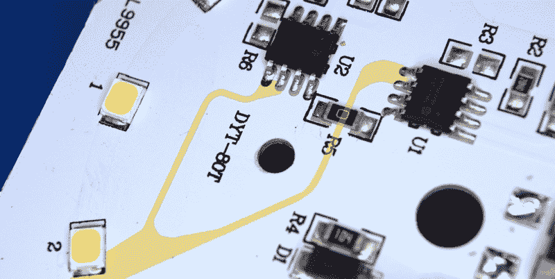
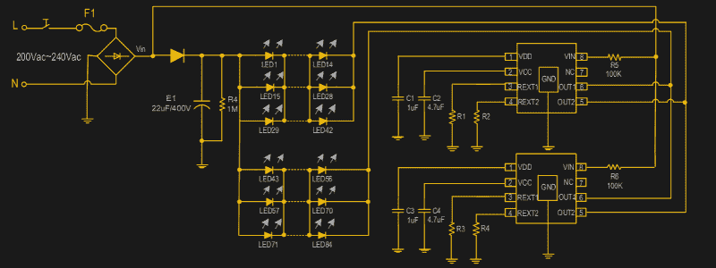
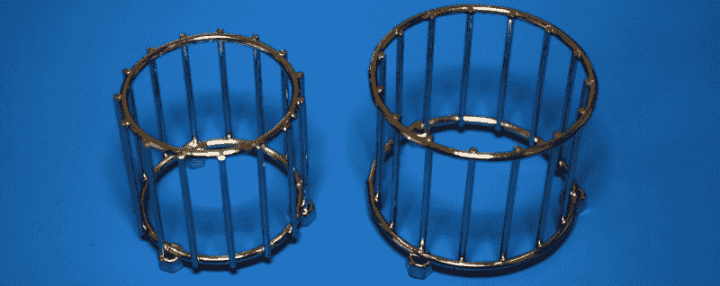
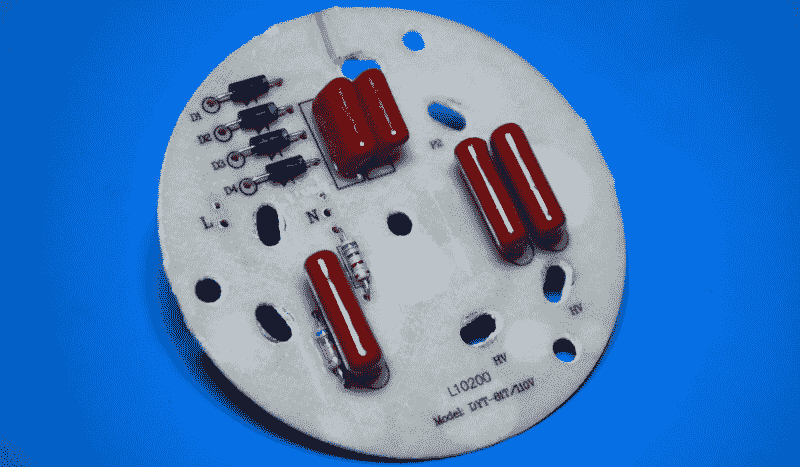
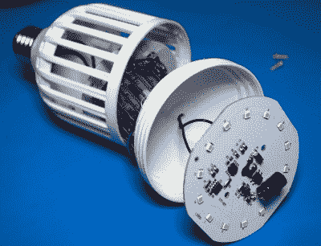

# 拆卸:灭虫灯泡

> 原文：<https://hackaday.com/2021/02/09/teardown-bug-zapper-bulb/>

在北半球这里，蚊子和其他飞行害虫是任何人现在最不关心的事情。目前阻碍聚会的唯一一种虫子名叫新冠肺炎，但即使我们没有疏远社交，昆虫在一年中的这个时候也不是问题。因此，毫不奇怪，这几个月通常是寻找大量旨在阻止或彻底消灭空中昆虫的小工具的最佳时机。

Whatever PIC stands for…it’s not that.

举个例子，我在大盒子五金店只花了几美元就买到了这个“灭虫 LED 灯泡”。这款手机由 PIC Corporation 出售，尽管一些新闻稿显示该公司在 2017 年刚刚接管了该设备的分销。在那之前，它被称为 zap drive，如果你凌晨 3 点还醒着，你可能会在电视上看到这种广告。市场上似乎也有几种异常相似的产品，它们内部很可能是相同的。

平心而论，这是个相当聪明的主意。传统的 zappers 相当大，需要吊在电源插座旁边的某个地方。但是如果你能把一个缩小到灯泡的大小，你可以很容易地用现有的插座和电线把它们点缀在门廊周围。如果你还能想出一种方法，让它在虫子没出来的时候像真正的灯泡一样工作，那就加分了。显然，由此产生的奇美拉不会在这两项任务中表现出色，但为了方便起见，肯定有一些东西要说。

让我们来看看这些通电照明器的内部，看看他们是如何设法将两种截然不同的设备挤进一个插座友好的封装中的。

## 让那里有光

在 zapper 灯泡正面的磨砂塑料圆顶下是…嗯，你会在一个便宜的 LED 灯泡里发现什么。几年前，这种事情可能是新奇的，但我们以前都见过。

 由于只有 14 个普通的二极管，这种灯泡产生的光并不特别令人印象深刻。根据手册，它输出 600 流明，这将使它比你所期望的老式 40 瓦白炽灯泡略偏北。作为一个相对低功耗的阵列，灯泡上没有外部散热器，PCB 的铝背衬似乎足以保持冷却。

有限的光输出变得更糟，因为所有的二极管都指向前方，这比任何事情都更糟糕。可以说，这可能是可取的外部，特别是如果这是放在一个高灯插座，你想把一束下来在门廊或甲板上。但在这种情况下，如果他们真的通过给灯泡一个更明显的聚光灯形状来表明这一点，那就更好了。

除了 led，唯一值得注意的元件是双 SM2212EA 驱动器 IC。我找不到这些产品的英文数据表，但 PDF 的粗略在线翻译提供了亮点:它们在 90 到 240 VAC 下运行，提供两级亮度控制，并内置热关闭功能。但是事实上有两个看起来很奇怪，仔细观察，它们的连接方式似乎没有任何意义。

With the traces highlighted, it’s clear both ICs are tied together.

答案来自数据手册，其中最后一页解释说，如果功率要求太高，单个 SM2212EA 出现热过载，您可以简单地复制单芯片应用，并将它们的输出连接在一起，以并行运行。每个芯片有两个输出引脚，因为一个是最先出现的全亮度引脚，另一个是降低电流引脚，在电源开关打开和关闭后使 led 变暗。

这是有道理的，除了一个问题:这个产品上的 led 实际上不会变暗。当你第一次轻按开关时，灯和 zapper 功能都打开，当你再次轻按开关时，led 完全熄灭，而 zapper 保持打开。这是怎么回事？

虽然数据手册不是很清楚，但似乎连接到 SM2212EA 引脚 4 的电阻用于设置二级调光引脚将通过的电流量。但仔细观察 PCB 可以发现，两个芯片都没有这个电阻(丝网印刷上的焊盘 R3 和 R6，图中的 R2 和 R4)，因此调光功能基本上被禁用。如果你愿意的话，你应该可以在这些垫子上放一对 200 欧姆的电阻来打开它，但是你会失去在没有灯的情况下使用 zapper 的能力。

## 乘风破浪

在 LED 印刷电路板的下面，在一个小塑料隔板的另一边，我们发现了带电元件，它们实际上是用来消灭虫子的。他们似乎荒谬地为这个应用程序过度构建，这使我认为更多的思想被给予闪亮的 chrome 网格的美学而不是它的 bug 破坏属性。看起来更紧密的小直径电线网格会更有效，但放在架子上或在深夜电视广告中看起来不会那么好。

有利的一面是，它们连接在高压 PCB 上，除了一些 M3 螺丝之外没有什么特别之处，因此可以很容易地拆卸下来进行潜在的修改或重复使用。在网格的中心是四个紫外线发光二极管，作为“诱饵”把虫子带进来。现在，正如我们从科维德·疫情那里了解到的那样，[并非所有的紫外线发光二极管都是一样的](https://hackaday.com/2020/04/15/buyer-beware-this-led-bulb-sold-as-germicidal-doesnt-emit-uv-c/)，它们可能只会吸引虫子。(哦等等。)

看看高压 PCB 的背面，我们可以看到我们所处理的布置是多么简单。它不涉及变压器，只是一个使用四对二极管和电容的基本电压倍增器电路。当在美国这里以 120 伏交流电压运行时，这给出了略低于 500 伏直流电的最大电势，据我所知，这对于灭虫器来说是非常差的。对亚马逊的快速浏览显示，即使相对便宜的型号也在宣传 3 到 4 千伏的电网电压。

郑重声明，我没有数不清。左边的第五个电容和一对二极管用于为电路板另一侧的 UV LEDs 供电，似乎没有连接到高压侧。

## 一无所有的主人

 所以在顶部我们有一个漂亮的 LED 灯泡，在底部，一个上镜但最终贫血的灭虫器。通过一对合法破解的调光 IC，用户可以关闭 led，但只要有电，高压 zapper 就会激活。虽然公平地说，很难想象有人会买这些东西，但*而不是*想使用 zapper 功能。

我不能说它建得很差，事实上，我对所有的东西都被组装得如此完美印象深刻。但从功能上来说，我会犹豫是否要支付全部 20 美元的 MRSP。如果你有一个 bug 问题，你最好用一个真正的 zapper，它有一个更大的紫外光源(通常是一个小的荧光灯泡)和一个更强大的高压源。也就是说，如果你看到一个这样的东西在清仓架上飘来飘去，只需一两块钱，就可能值得[回收它的内部组件，为你的高压冒险](https://hackaday.com/2017/11/25/low-end-parts-make-tesla-coil-with-a-high-end-look/)提供动力。