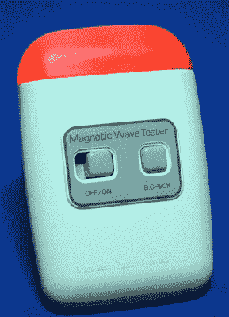
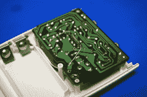
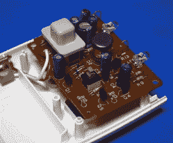
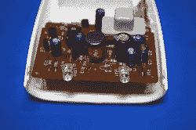
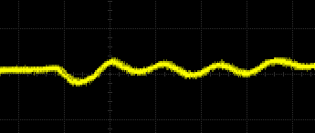

# 拆卸:日本健子磁波测试仪

> 原文：<https://hackaday.com/2019/04/15/teardown-nihon-kenko-magnetic-wave-tester/>

你永远不知道你会在易贝发现什么样的奇迹，尤其是当你有一堆配置好的警报在奇怪的电子设备弹出时响起的时候。你甚至会发现自己在竞拍某样东西，尽管并不完全确定它是什么。也许你是一个不寻常的小玩意的收集者，或者可能是因为你已经承诺每月为你工作的黑客博客做一次拆解。在任何情况下，你有时会发现自己拥有一个古怪的设备，需要仔细检查。

举个例子，这个“磁波测试仪”来自大家最喜欢的高端电子产品供应商，日本 Kenko Zou shin kenkyukaicorporation。易贝的列表上说，这个设备来自一次房产销售，卖家对此不太了解，但只要目测一下，我们就能做出一些有根据的猜测。当存在足够强的磁场时，设备的顶部可能会闪烁或发光。由于它没有明显的灵敏度调整方法，甚至没有显示具体数值的显示器，看来该装置必须像煤矿中的电磁金丝雀一样工作:如果它爆炸，就做最坏的打算。

如果你想知道这种小玩意的可能用途，你不是唯一一个。我在网上找不到太多关于这款设备的信息，但我找到的一些提及并没有让我充满信心。似乎有两类人对这种“磁波测试器”感兴趣:一类人相信强磁场有一些顺势疗法的特性，另一类人认为它能让他们与鬼魂对话。在这两种情况下，这些用户都不想看到微特斯拉读数；他们想要一盏闪亮的灯给他们的朋友看。

所以，废话不多说，让我们调整我们的脉轮，咨询灵魂，看看当你购买一个口袋大小的 hokum 探测器时，你的钱能给你带来什么。

## 奢侈骗术

 我就说这么多了，这东西感觉绝对棒极了。外壳厚实，按键反应非常令人满意。它甚至有一个很好的分量，它与 9 V 电池安装。从美学角度来看，它让我想起了 20 世纪 80 年代的女士剃须刀，但如果目标是让它看起来没有威胁，有点医疗效果，我想他们达到了目标。顶部的红色 LED 扩散器特别好，尽管我有点失望地发现，当触发时，该设备没有发出任何疯狂的嘟嘟声。

总的来说，它[让我想起了我们去年看到被拆开的山达基“电子米”](https://hackaday.com/2018/07/19/whats-inside-a-scientology-e-meter/)。这些设备旨在给用户留下深刻印象，让他们认为他们正在操作一台高科技仪器。这都是体验的一部分，我很想知道这个特殊的小玩意的原始零售价是多少。

当然，美丽只是表面的。真正的问题是，这有用吗？为此，我不得不说这场表演是我所期待的。我只能让它启动两次:一次是坐在微波炉上面，一次是离风扇几英寸远。从理论上来说，这个小玩意只能表明存在相对较高水平的电磁辐射。

为此，人们可以说，这个概念并不完全不同于旧的民防调查米。这些仪表的灵敏度非常低，指针的任何移动都意味着该区域对人类居住是不安全的。这个想法是，在核武器被引爆的情况下，用户真正需要的是[一种方法来查看从他们的避难所出来是否安全](https://hackaday.com/2016/11/09/retrotechtacular-walt-builds-a-family-fallout-shelter/)。同样，“磁波测试仪”似乎只对足够高的电磁场有反应。换句话说，如果你看到这个东西在你的床上挥舞时亮起来，你可能应该住在酒店。

## 美貌 Vs 智慧

所以它看起来很好，甚至如果你试图把它放进微波炉，它会发光，但我们真正想知道的是它是如何工作的。随着电池门的拆除，只有一个螺丝挡在我们和里面的奇迹之间。

简单说一下，是的，这是 PCB 背面的一个簧片开关。此外，在仪表*后面放置一块磁铁*会使仪表变亮。也就是说，簧片开关显然不是这个设备中的主要传感器，必须作为一些次要功能存在。老实说，我能想到的唯一一件事是，他们想确保任何通过将设备举到磁铁上进行“测试”的用户不会对它没有爆炸感到失望。

 不是说初级功能要高级得多。粗略地看了一下电路板，似乎中间的线圈被用作传感器。附近的磁场会在线圈中感应出轻微的电压，一旦达到一定的阈值，led 就会亮起并提醒用户。测试这个理论很简单:将示波器放在线圈上，将每格电压调低，当设备靠近运转中的交流风扇时，观察到一个正弦波。

这不是一种非常精确的测量电磁场的方法，但当然这从来不是我们的目标。如果你想让你的小玩意在附近的东西发出大量电磁能量时发光，这是一种便宜又简单的方法。

## 预料中的结局

许多阅读这篇拆解的人可能很早就猜到“磁波测试器”的内部会留下一些需要的东西。由于操作者可能对场强等细微差别不感兴趣，制造一种能够量化检测内容的设备没有任何优势。就科学应用而言，返回布尔响应的磁场探测器必须与占卜棒和宝石相提并论。

尽管如此，如果我们不测试这些假设，只是简单地把我们先入为主的观念当成真理，我们就会和这个小工具为之设计的人们处于同一条船上。我们现在可以高枕无忧了，因为我们的理论得到了验证，这也许比任何希望这个闪光玩具能让他们接触精神世界的人所说的都要多。