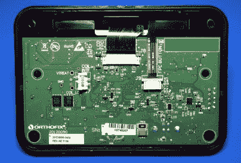
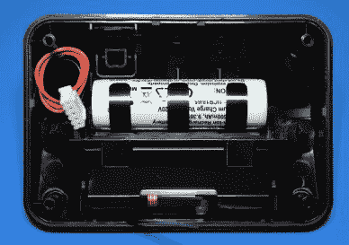
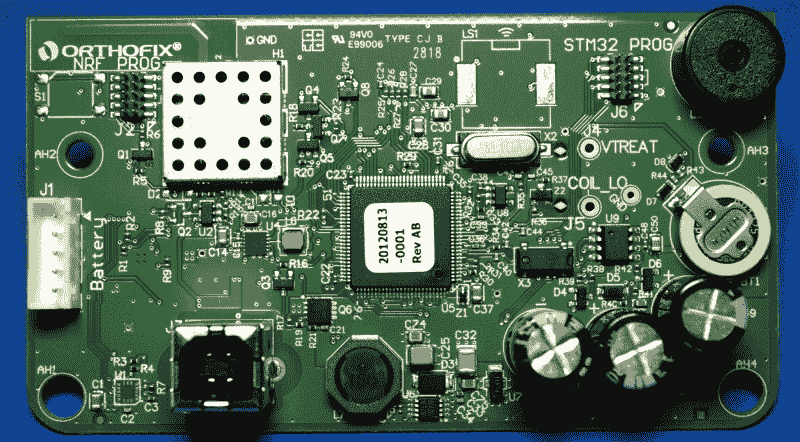
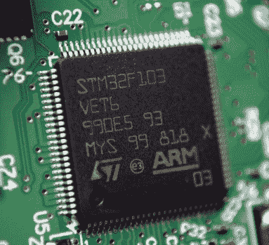
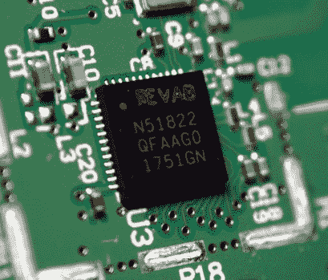

# teardown:原位脊柱侧凸

> 原文：<https://hackaday.com/2020/08/05/teardown-orthofix-spinalstim/>

如果你曾经有过特别严重的骨折，你的医生可能会开出使用电子骨生长刺激器的处方。这些可穿戴设备在骨骼周围产生脉冲电磁场(PEMF ),已被证明可以加快大量患者的自然愈合过程。这并不是说对它们的实际效果没有争议，但是研究并没有显示这种疗法有任何缺点，所以至少值得一试。

Image from SpinalStim manual.

当您收到这些设备中的一个时，它将被编程为仅在特定的时间或会话数内运行。一旦你“用完”骨刺激器，它在功能上就一文不值了。正如你可能想象的那样，这种情况没有技术上的原因。愤世嫉俗的人会说，这些设备有过期日期的唯一原因是制造商希望阻止它们进入二手市场，但这样的辩论可能超出了这些页面的范围。

你在这里看到的脊柱矫正器是一个朋友给我的，因为他们的医生说这种疗法可以缩短。这提供了一个难得的机会，在它自行关闭之前观察它，我希望这能让我更仔细地看看它实际上是如何操作的。

您很快就会看到，不幸的是，事情并没有那样发展。但这并不意味着努力是徒劳的，如果有人愿意接受挑战，或许还有希望破解这些设备。

## 保持简单

由于 SpinalStim 的设计是为了在脊柱周围产生电磁场，因此不难猜测泡沫覆盖的“背撑”包含某种线圈。但是作为一种高科技医疗设备，你可能会想象其中涉及到一些奇特的材料或技术。事实证明，没有。

从支架上切掉泡沫衬里的操作不完全像取出鱼的内脏，我们可以看到这里没什么特别的。据我所知，这只是十几圈两根绝缘导线，用油漆工的胶带粘在一起。

他们甚至没有做一个整齐的线圈。把剩下的泡沫扯下来，有些地方电线有点重叠。我本以为他们会使用某种柔性织布机来固定电线，但显然支架本身的泡沫被认为足以保持电线扁平。

仔细观察进入控制单元背面的四针连接器，我们可以看到电线实际上已经缠绕在一起，并压接到黄色电缆的两根导线上。环本身通过隐藏在将它们保持在一起的带子之一中的线连接到位于支架另一侧的另一个相同的装置。

    

## 掌握控制权

建筑技术离小学科学项目不远，我承认线圈有点令人失望。但幸运的是，控制单元更有趣一些。由于 SpinalStim 没有患者可访问的设置，这款设备非常简单:只有一个开关按钮和一个 USB-B 充电端口。然而，它有一个相当不错的 LCD 显示屏，可以显示电池电量和剩余治疗时间。屏幕甚至是背光的，这似乎有点不必要，但对于那些可能看不清显示屏的老年用户来说可能是有益的。

    

无论是内部还是外部，控制单元都非常接近我对医疗设备的期望。由于内部电池组，它的重量相当大，带 o 形密封圈的厚外壳确实令人印象深刻。在你可以从线圈中拉出的所有电线和这个结实的电子外壳之间，这个设备已经有了惊人的剩余价值。

在 PCB 的背面，我们可以看到一些有趣的细节。其中最主要的是该设备的 STM32 微控制器和 nRF 蓝牙低能耗芯片组的专用编程头。我们通常不得不寻找有用的调试或编程接口，所以看到它们不仅被贴上标签，而且实际上被管脚填充真是一种享受。我们还可以看到备用电池，即使主电池没电了，它也可以保持设备内部计时器的运行，还有一组电容器，可能用于通过线圈积累电荷。

剥去微控制器的固件发布标签，会发现它是非常常见的 STM32F103，移除电路板的 RF 屏蔽会发现另一个读者可能很熟悉的芯片 nRF51822。这些有据可查的芯片的出现无疑预示着任何潜在的逆向工程或设备的再利用。

    

## 调查中断了

此时，我希望将 Orthofix SpinalStim 连接到示波器上，看看它通过线圈传递的是什么样的信号，但这并没有实现。在将控制单元装回原位后，我马上会听到一声愤怒的哔哔声和一条错误信息。

Unblock me you coward.

就像我们去年看到的 VeriFone MX 925CTLS 支付终端一样，SpinalStim 似乎被设计成一旦打开就会“自毁”。我没有注意到像我们在 VeriFone 中看到的任何明显的触发因素，但我假设当我断开电池时，这足以让设备意识到有些不对劲。这可能是为了防止用户试图重置设备的内部计数器，[，这似乎是老骨头刺激器](https://www.instructables.com/community/Deactivated-Bone-Growth-Stimulator/)的一个问题。

虽然我很失望 SpinalStim 吞下了它的氰化物药丸，而不是接受进一步的审问，但控制单元中发现的硬件看起来肯定已经成熟，可以进行进一步的黑客攻击。我们已经看到[医疗设备在过去被逆向工程以释放新的功能](https://hackaday.com/2020/04/15/cpap-firmware-hack-enables-bipap-mode-envisions-use-as-temporary-ventilator/)，虽然对 FOSS 骨骼生长模拟器固件的需求可能不会很大，但似乎任何人都有可能将这些设备从任意限制中解放出来。