# 拆卸:Queercon 15 徽章(以及隐藏在其中的游戏)

> 原文：<https://hackaday.com/2018/08/11/teardown-queercon-15-badge-and-the-game-hidden-within/>

Queercon 是会议中的会议。Queercon 发生在 DEF CON，是一个 LGBT 黑客的社交网络，每年聚集在一起举办活动，讲座和踢球者聚会。自 2012 年以来，他们也一直在制作电子徽章作为乐趣的一部分，我可以保证他们每年都是最具创意的徽章设计的竞争者。

今年总共制作了 450 个电子徽章，我从未见过徽章的美感接近于精致的消费产品，但它们也保留了为硬件爱好者打造的独特电子产品的魅力和感觉。通过无线通信将复杂而聪明的游戏传递给徽章，设计师们鼓励人们之间的互动(不仅仅是徽章之间)。我有机会拆下这些光荣的徽章中的一个，也在周五 QC 小组的徽章谈话中收集了相当多的关于内部谜题的信息。

休息之后，请和我一起撕下 Queercon 15 硬件徽章。如果你还没有看过[我对 DC26 官方徽章](https://hackaday.com/2018/08/09/first-look-at-def-con-26-official-badge/)的评论，也来看看吧！

## 组装和拆卸都很华丽的硬件

[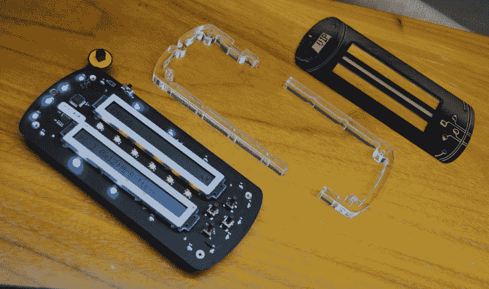](https://hackaday.com/wp-content/uploads/2018/08/queercon-badge-blowup.jpg)

每个徽章由三个不同的层组成。这里从右到左显示，顶层是 PCB 面板，中间层是丙烯酸树脂，底层是所有神奇的地方。

[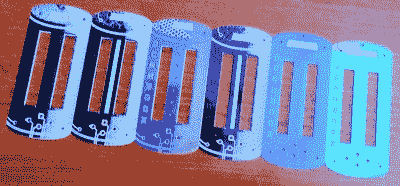](https://hackaday.com/wp-content/uploads/2018/08/queercon-faceplate-collection.jpg)

Many faceplate varieties

面板本身是印刷电路板，但讽刺的是其中没有电路。这是一个开玩笑的评论，因为我认为这个选择是明智的。印刷电路板的制作变得如此容易，它作为艺术媒介的使用如此流行，以至于它确实是完美的选择。[TwinkleTwinkie]加入徽章制作者的行列，提供顶层设计，你可能知道他是一位多产的附加设计者。

中间层是激光切割的厚丙烯酸框架。它被分成两部分，这两部分结合在一起，既作为顶层和底层之间的隔离物，又作为扩散器。多个 90 度 RGB 发光二极管围绕电路板的四周，通过这种丙烯酸树脂发光。还有 6 个朝上的 RGB 发光二极管，它们通过中心带照射到面板(通过孔或基板)来指示游戏进度。

[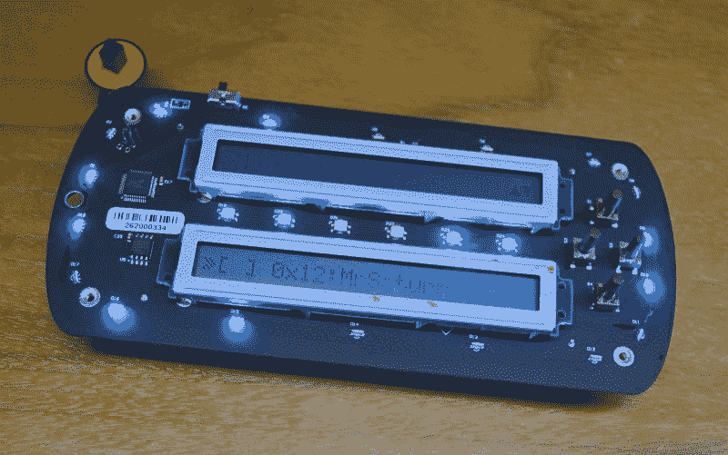](https://hackaday.com/wp-content/uploads/2018/08/queercon-badge-top-of-back.jpg)

徽章的底层是所有电子设备所在的地方。最突出的特点是两个液晶字符显示。这些非常便宜，因为它们是不知道生产日期的老货。badge talk 中的一个有趣轶事是，这些模块使用含铅焊料，但 badge fab 工艺是 ROHS(无铅)。这提出了一个有趣的问题，因为模块上的焊料在比用于将它们连接到电路板上的焊膏更低的温度下熔化。这意味着有时显示器本身的引脚连接会在回流期间受到干扰，导致一些徽章需要手工返工。

 [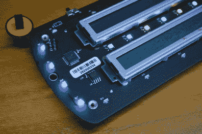](https://hackaday.com/2018/08/11/teardown-queercon-15-badge-and-the-game-hidden-within/queercon-badge-chips-and-right-angle-leds/)  [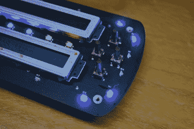](https://hackaday.com/2018/08/11/teardown-queercon-15-badge-and-the-game-hidden-within/queercon-badge-tall-buttons/) 

在这里，您可以很好地了解两种风格的 LED 以及 HT16D35B LED 驱动芯片。按钮细节还显示了超长瞬时按钮开关如何用于穿过顶部面板上的孔。铜色圆圈是一个附加的接头扩展板，与该层的下侧连接。

[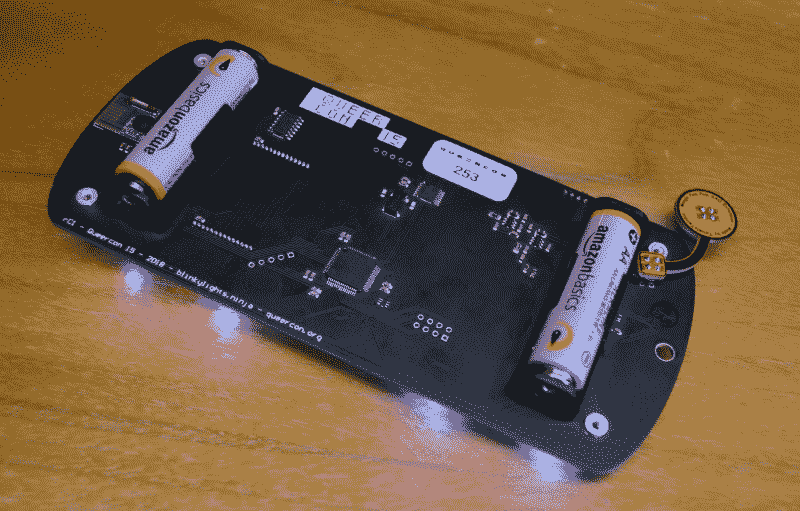](https://hackaday.com/wp-content/uploads/2018/08/queercon-badge-back.jpg)

当徽章完全组装好后，电路板的下侧仍然可见。它有一个舒适的黑色哑光阻焊膜和白色丝网。这里您会发现两个 MSP430 处理器(MSP430FR2422、MSP430FR2972IPMR)，其中一个处理主要硬件功能(按钮、屏幕、可视化和游戏)，另一个处理无线电通信(左侧的绿色电路板是 HopeRF RFM75 模块)。

徽章由两节 AA 电池供电；与官方 DEF CON 26 徽章的四节 AA 电池相比，这节省了很多重量，但代价是电池寿命缩短，这将需要在 CON 期间更换许多电池。

## 让我们来玩一个无线协作游戏

徽章让所有用户沉浸在一个互动的文本冒险游戏中。根据 Craig Alanson 的*远征军*系列改编，游戏的故事情节不在评论范围内。让我们只说徽章有一种态度，让你玩下去，因为你希望从居住在徽章上的叫做 Skippy 的角色那里得到更多尖刻的反驳。

每个徽章包含一个大文件的 1/16。通过与其他徽章通信，该文件开始自我组装。徽章会自动识别彼此的存在，但只有当徽章的所有者都从菜单中选择该选项时，才能配对。这鼓励人们互相访问，因为他们确定谁的徽章是谁的，并努力解开更多的谜题。

在 Queercon 套件中，记分板无线查询附近的徽章，以显示集体过程在解决小组难题方面取得了多大进展(正确组装我之前提到的 16 部分文件)。大板还显示了徽章的编号和股票名称列表，以及他们成功执行的徽章间链接的数量。

 [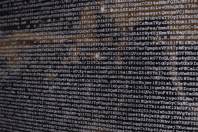](https://hackaday.com/2018/08/11/teardown-queercon-15-badge-and-the-game-hidden-within/queercon-big-board-imageblock/)  [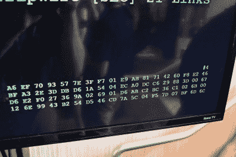](https://hackaday.com/2018/08/11/teardown-queercon-15-badge-and-the-game-hidden-within/queercon-big-board-hex/) 

对于一组字符，您可以看到一些黄色字符在大多数白色字符的映衬下非常显眼。这不是一个密码，但随着文件的解决，图像将成为视觉上可识别的。我不确定十六进制块是否有用，但我想我会抓拍一张照片以防万一。

## 一个聪明的固件开发工具

任何看过这种谜题的徽章的人都知道，一个非常紧张的国家机器在工作，守卫着所有的门，掌握着所有的钥匙。我认为管理所有这些的工具作为徽章开发过程的一部分来构建是非常有趣的。该工具被称为“Statemaker”，它是用 Python 编写的，用于接受 CSV 输入并输出可以写入徽章的二进制文件。

[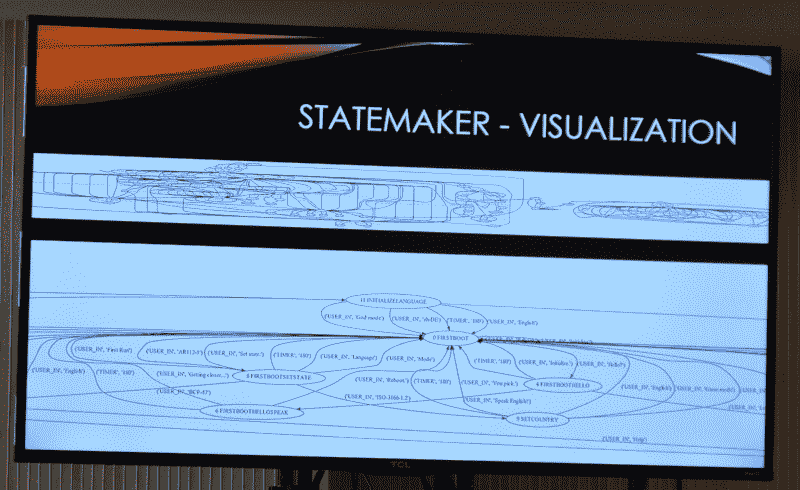](https://hackaday.com/wp-content/uploads/2018/08/queercon-statemaker-overview.jpg)

该团队使用 Google Sheets 来跟踪游戏过程中可能发生的所有选择、所有互动和所有字符串。Statemaker 使用从该电子表格导出的 CSV 来执行几个重要的操作。最值得注意的是，它确保数据输出是有效的(避免字符串缓冲区溢出和其他常见问题，然后再将它们添加到固件中)。但是一个附带的好处是能够可视化状态机。这里显示的是整个游戏的概况，你也可以[在这里](https://hackaday.com/wp-content/uploads/2018/08/queercon-statemaker-detail.jpg)看到一些更近的细节。

## 又一款硬件杰作加入 QC 行列

 [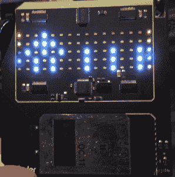](https://hackaday.com/2014/09/15/the-queercon-11-badge/qc11badge/)  [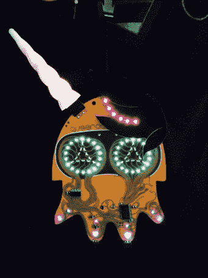](https://hackaday.com/2016/08/10/what-we-learned-from-the-2016-queercon-badge/fullsizerender/)  [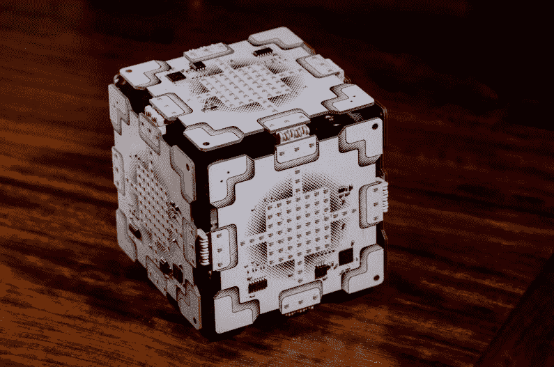](https://hackaday.com/2018/08/11/teardown-queercon-15-badge-and-the-game-hidden-within/qc20170036/) 

奎尔孔徽章队打出本垒打的能力有些令人担忧。看一看过去几年中我最喜欢的一些 QC 徽章( [2017](https://hackaday.com/2017/08/07/inside-this-years-queercon-badge/) 徽章、 [2016](https://hackaday.com/2016/08/10/what-we-learned-from-the-2016-queercon-badge/) 徽章、 [2014](https://hackaday.com/2014/09/15/the-queercon-11-badge/) 徽章)，你可以看到美学、形式和功能都经历了一个又一个辉煌的飞跃。

[Evan Mackay]、[George Louthan]和[Jonathan Nelson]是这枚徽章背后的重量级人物(我相信所有其他人也是如此)。但是就像所有伟大的事业一样，他们的成功也依赖于一个敬业的团队，这个团队不惜一切代价让这些激情项目跨越终点线。太棒了。

 [https://www.youtube.com/embed/pjia9U7Z3cQ?version=3&rel=1&showsearch=0&showinfo=1&iv_load_policy=1&fs=1&hl=en-US&autohide=2&wmode=transparent](https://www.youtube.com/embed/pjia9U7Z3cQ?version=3&rel=1&showsearch=0&showinfo=1&iv_load_policy=1&fs=1&hl=en-US&autohide=2&wmode=transparent)

