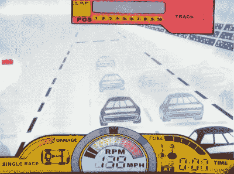
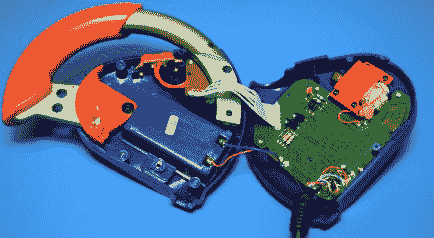
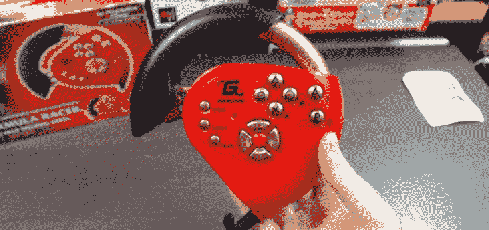
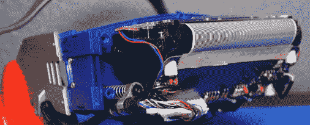
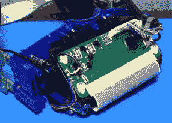
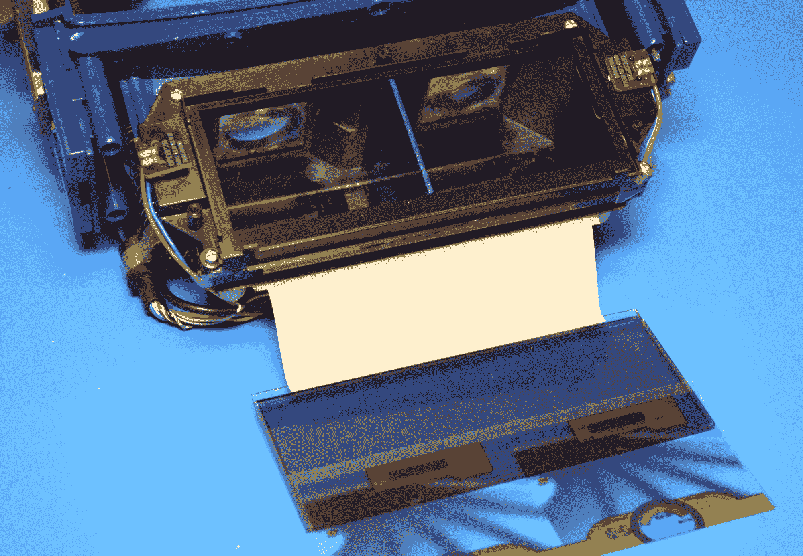
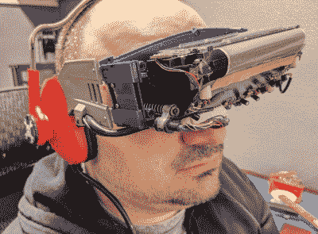

# 拆卸:RADICA I-Racer

> 原文：<https://hackaday.com/2021/05/26/teardown-radica-i-racer/>

早在 Oculus Rift 和 HTC Vive 问世之前，游戏界的一些大牌就试图开发实用的立体显示器。这些虚拟现实(VR)的早期尝试受到了当时技术限制的阻碍，大多数从未超过原型阶段。在那些进入零售货架的产品中，没有一个能坚持很长时间。最著名的例子是任天堂的虚拟男孩，这款游戏在 1995 年发布时成为一场金融灾难，被一些人视为游戏巨头最大的失误。

尽管这些公开的失败，激进主义者仍然感到不得不参加竞选。该公司以其相对简单的 LCD 手持游戏系列而闻名，在 20 世纪 90 年代末，该公司制作了几款基本的立体单机游戏，试图利用 VR 时尚赚钱。在这个系列的后期作品中有 1999 年的 NASCAR i-Racer，至少从外观上看，它有点像现代的 VR 耳机。

配备了头戴式立体显示器、手持控制器、力反馈和集成耳机，如果你认为 i-Racer 走在了时代的前面，那当然是可以原谅的。但是它对原始的 LCD 技术的依赖，加上尽可能保持游戏便宜的需要，使得这种体验在 20 世纪 90 年代根深蒂固。但是也许我们可以做些什么。

## 启动你的引擎

作为一般规则，这些拆卸并不意味着评论，但鉴于 i-Racer 的独特性质，我认为我们可以抽出几段时间来谈谈使用这款 22 岁的预算 VR 耳机的实际感受。

Turning left never felt so real.

戴上耳机时，你首先注意到的是它出奇的舒适。首先，考虑到它的大小，它比你想象的要轻得多。但更重要的是，内置了相当多的可调性。想必 Radica 想确保儿童和成人都可以玩这个游戏，所以你可以推、拉和扭转耳机的部分，使它更适合你的脸。它甚至有一个漂亮的软橡胶鼻垫，让你在长时间的会议中保持舒适。

也就是说，在 2021 年，你肯定不会玩这个游戏太久。不是说立体效果有问题，其实效果挺好的。只是 i-Racer 看起来像 20 世纪 90 年代的其他 Radica LCD 游戏，除了这款游戏真的会砸到你的脸上。一些石墨色的汽车在预定的静态位置闪烁，一些条形图闪烁显示 RPM 和车辆损坏等信息，还有大量的七段数字显示当前速度，时间，圈数等。为了传达一种速度感，赛道上的队伍向你走来，体育场看台偶尔会在右侧飞驰而过。不知什么原因，地平线上不时冒出一座山。

公平地说，Radica 确实尝试过用其他方式来增强体验。如果你撞车或撞到轨道的一边，位于你的外围视觉外面的红色发光二极管闪烁，手持控制器开始振动。称之为身临其境可能有点夸张，但它肯定会带来比 LCD 本身更吸引人的体验。

## 掌握方向盘

i-Racer 的所有按钮和开关以及电池都位于模糊的方向盘形状的控制器中。除了用来旋转带有偏置重量的小型有刷电机以提供振动的单个晶体管之外，控制器的 PCB 上只有无源元件。因此，连接耳机的粗电缆有多达十三根导线。今天，我们期望看到手机和耳机之间的某种数字通信，但 1999 年是一个更简单的时代。

    

控制器最有趣的元素可能是它如何解释方向盘输入。在打开它之前，我期望找到某种电位计，但事实上这一切都是通过 PCB 上特殊形状的焊盘完成的。轮子上有一个金属触点，这样当玩家向左转或向右转时，垫子就会以不同的组合短路在一起。虽然这是一个聪明的解决方案，但它确实说明了 i-Racer 的目标成本必须有多低。

但这并不是唯一的成本节约措施。看来 Radica 继续将控制器的注塑外壳用于他们以 *Gamester* 的名义为 PlayStation 1 和 2 销售的许多赛车轮子配件。这些控制器有更多的按钮，并从 i-Racer 版本中删除了电池盒，但整体设计在很大程度上没有变化。

Sharkie Gamer [reviews the Gamester Formula Racer](https://www.youtube.com/watch?v=fVH4MkyXGEc)

## 全神贯注于比赛

在拆除了围绕 i-Racer 目镜的五个螺钉后，耳机的前部整齐地滑下，露出了我们见过的最像赛博朋克的硬件。如果没有别的，这个东西将是一个角色扮演道具或万圣节服装的完美基础。

    

不幸的是，尽管 PCB 上的走线和巨大的带状电缆可能很华丽，但我们也面临着一些非常丑陋的事情:可怕的黑色环氧树脂斑点。我真的希望耳机里会有一些可识别的芯片，但鉴于它的血统，这总是最有可能的结果。尽管如此，看看那些弹簧加载的钢丝张紧器，确保用户调整耳机时一切都保持紧张。i-Racer 当然不是高端硬件，但不能说 Radica 没有付出一些努力。

Note the two small PCBs for the red “crash” LEDs.

卸下三颗螺丝，您就可以取下光学组件顶部的透明塑料盖，我们可以在下面找到彩色透明胶片和透明 LCD。我的研究告诉我，Radica 利用相同的硬件至少制作了另一款游戏，通过这种设计，你可以看到覆盖层和 LCD 可以多么容易地互换。顺便提一下，顶盖是透明的，因为 i-Racer 需要明亮的外部光源穿过 LCD 才能工作，[类似于我们在 2020 年看到的 VTech“神童”luggable](https://hackaday.com/2020/04/27/teardown-vtech-whiz-kid-luggable-computer/)。

## 另一个绕着跑道跑

Radica 的 NASCAR i-Racer 似乎已经结案了。毕竟，即使是最忠实的纳斯卡迷也不会因为过时的显示技术和有限的游戏性而坚持几圈以上。但是，虽然千禧虚拟现实耳机中的电子设备在 2021 年可能实际上毫无价值，但耳机本身及其相对合格的光学系统可以很容易地被重新用作廉价的头戴式显示器。

 作为概念验证，我把手机放在耳机顶部的开口处，用 YouTube 的 VR 模式播放了几个视频。它实际上看起来很好，虽然对齐有点复杂。耳机内部的 45°镜子使显示屏更靠近你的眼睛，[使整个装置比传统的谷歌纸板克隆](https://hackaday.com/2021/03/30/google-calls-it-quits-with-vr-but-cardboard-lives-on/)更加紧凑。当然，你不会仅限于使用手机，一个现代的液晶显示器可以很容易地安装在原来的面板上，成为一个更持久的解决方案。

事实上，看起来一对 ILI9341 2.2 英寸液晶显示器几乎可以完美地安装在耳机顶部大约 52 x 37 毫米的开口中。不可否认，这些面板的分辨率相当低，但应该足够开始使用了。一个有趣的第一个项目可能是将 Radica i-Racer 的尸体变成某种立体机器人，比如 8 位 Oculus。不管怎样，这就是我打算做的。