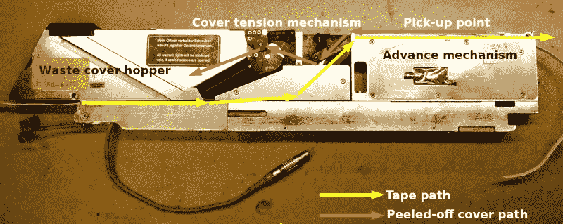
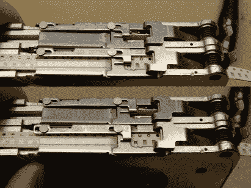
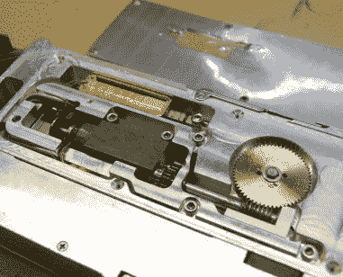
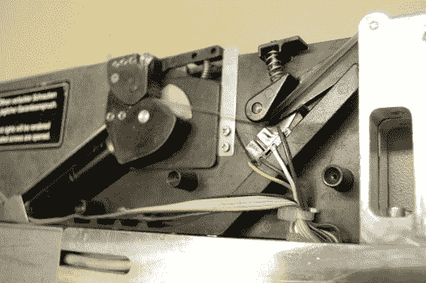
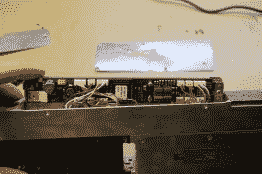
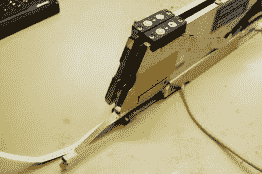

# 拆卸:西门子 8 毫米 SMD 零件送料器

> 原文：<https://hackaday.com/2020/12/16/teardown-siemens-8mm-smd-parts-feeder/>

Hackaday 的许多读者对表面贴装电子元件并不陌生，以至于你可能会很乐意构建自己的表面贴装项目。如果你曾经做过一个非常大的表面贴装项目，或者不得不做许多相同的电路板，你会希望有一台取放机。电子装配线的这些基本组件是 CNC 机器人，它们从提供组件的卷带中拾取组件，并将其以适当的方向放置在 PCB 上指定的位置。他们是硬件黑客社区的渴望对象，多年来我们已经看到了不少自制的例子。它们的工作原理很容易理解，但研究它们仍有很多收获，因此看到一个朋友从一台旧的工业取放机中获得大量多余的西门子元件进料器确实非常有趣。这是一个完美的拆卸机会，看看是什么让他们滴答作响。

## 带我去你的喂食器

首先，有必要解释一下元件进给器在取放机中扮演的角色，以及它的作用。元件由柔性胶带提供，位于其表面的凹陷处，覆盖着一层薄薄的塑料薄膜，揭下即可露出元件。进料器使用胶带边缘的链轮孔，将胶带从一个部分推进到下一个部分，同时剥开盖子露出该部分。进料器通常沿着机器工作区的边缘排成一排，这样它的头部可以在零件上移动，并在将零件放在电路板上之前将其拾起。在工业机器中，这种情况确实发生得非常快，所以进料器基本上是为数百万个零件在其使用寿命中服务而建造的。

An annotated overview of the feeder.

该装置的尺寸约为 45 毫米×20 毫米×100 毫米，带有一个非常坚固的加工铝制框架，其上安装有各种组件。它持有不是一个，而是两个 8 毫米磁带馈线，一边一个。将它翻转过来，前半部分隐藏了进料机构，拾取点位于顶部，而中间是用于剥离盖带的张紧系统。在后面是一个废盖带料斗，可通过背面的弹簧舱口进入。在后面的顶部有一对薄膜按钮，用于提前或延迟播放磁带。

元件带从后部下方进入，沿对角线向上到达顶部，在顶部与作为进料机构一部分的齿轮啮合。塑料盖带被剥离并返回到中间的张紧系统，然后消失在料斗中。拾取点上方有一个螺线管控制的快门，当拾取头经过时，快门可能会被机器打开。整个装置的设计便于拆卸，以便装入新的磁带，因此它的控制电缆连接到工业级 Neutrik 连接器。

## 盒子里面是什么？

松开固定在外部面板上的螺丝，就可以很容易地看到主要的机械装置。前端是进给机构，它采用链轮的形式，与磁带上的孔啮合。这是由一个电机的蜗轮驱动的，电机也有一个光学编码器来感应磁带前进或减速的距离。电机上方是一个操作快门的螺线管，快门是一个位于单元顶部的滑动金属片组件，用于暴露拾取点。

  The shutter closed(top) and open(bottom). The cover tape can be seen folded ove the plate in the centre.  The feed mechanism, with sprocket gear on the left, motor bottom right, and solenoid top right.

该装置的中心是盖带张紧机构。另一个电机和链轮将盖带拉过一个弹簧张紧辊，该辊有一个光学传感器来反馈其位置。用过的盖带卷绕到后面的料斗中，更换卷带时可从料斗中清空。整个机器由一个微控制器控制，该微控制器位于该单元底部的一个窄 PCB 上。猜测是它是一个旧的 Atmel 部件，但现在它仍然被贴纸覆盖着。与取放机的通信是通过 Neutrik 连接器的串行连接实现的。

  The tensioner mechansim, with the motor on the left  The PCB is hidden under the unit.  At the rear, the waste cover tape hopper.

## 你能用剩余零件送料器做什么？

看一看这个喂食器的内部是很有趣的，但是用它能做什么呢？从字面意义上来说，这有一个显而易见的答案，那就是把零件送到取放机，但真正的问题是:*如何使用*？接口本身在电气上很简单，它是一个串行端口，使用更高的电压差分信号来补偿高噪声的工业机械。接下来的问题是，如何驾驶它们，升级是什么？

令人高兴的是，这些单元在过剩市场上的可用性意味着黑客有机会对它们进行研究。我的朋友给我指了两个在 GitHub 上的 Gcode 驱动程序(T1)和替代 PCB 设计(T3)，这两个都在 GitHub 上。作为一种相对容易理解的设备，想出一种驱动它们的方法应该在准备建造自己的拾取和放置机器的人的能力范围内。

一个拾取和放置机器不一定是不可能建造的，但是可以肯定的是元件供给器是他们工程的一个重要部分。也许这看一个可能会给他们一些启示，并介绍使用一个多余的单位，而不是试图建立自己的选择。