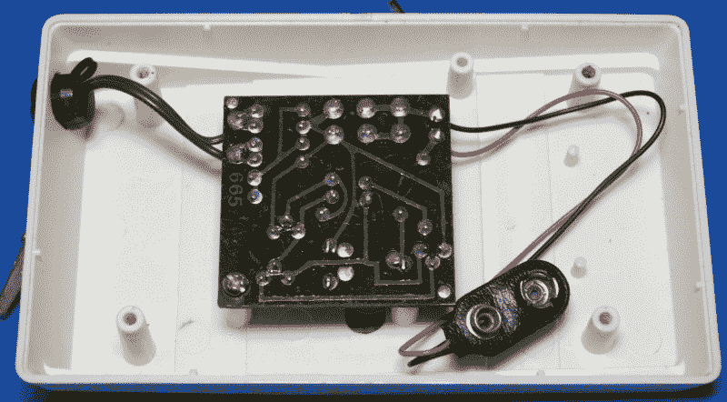
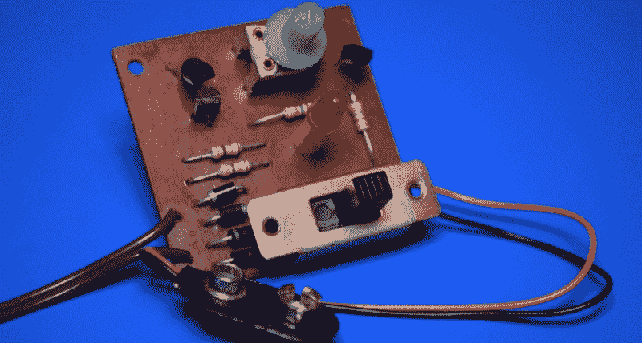

# 拆卸:轻敲捕捉器

> 原文：<https://hackaday.com/2021/01/14/teardown-tap-trapper/>

现代消费者并不太担心他们的电话通话被监听。首先，谷歌和亚马逊已经做了大量的工作，让他们相信电子设备监听他们的每一句话不仅是可以接受的，而且是 21 世纪的必需品。毕竟，如果有比把你的声音录音上传到亚马逊以便他们可以通过他们的语音分析软件来运行它更好的方式来打开厨房的灯，现在肯定有人已经想到了。

但也许更重要的是，人们普遍认为，电话的性质已经改变到了除了三家信社之外很少有人能真正拦截电话的地步。当然，我们已经看到偶尔出现的假冒 GSM 网络出现在黑客会议上，并且有令人不安的数量的黄貂鱼在那里漂浮，但这仍然与人们仍然使用插在墙上的电话时的情况相去甚远。在那些日子里，邻居只需要一对剥线钳就能听到你说的每一句话。

这正是 TA-1356 Tap Trapper 等产品问世的原因。它被宣传为能够扫描你家的电话线，当有人可能在窃听时提醒你，无论是插在电线杆上的录音机还是另一个房间的人拿起电话听筒。你只需要把它夹在电话配电盘上，偶尔给它换块新电池。

如果红灯亮了，你就知道自从安装和校准了水龙头捕捉器后发生了变化。但是这个未来的通信隐私捍卫者是如何工作的呢？让我们打开看看。

## 现实与期望

这种窃听装置看起来确实是高科技的，至少目前是这样。尽管控制简单，但你不禁会想，箱子里一定藏着某种电子魔法。这种设计让人想起 Atari 2600，它的宽度已经缩小，并带有那个时代电子设备上非常流行的装饰脊。

不幸的是，一旦案件公开，很明显我们被骗了。外壳几乎完全是空的，即使安装了 9 V 碱性电池，它也可能是它需要的两倍大。显然，制造商希望水龙头陷阱有一定的精密和复杂的空气，并认为一个更小的单位根本不行。我几乎感到惊讶的是，没有任何重量嵌入案件，使它感觉更重。

对于观众中的乐观主义者，我很抱歉地说，仔细看看 PCB 只会让事情变得更糟。这里没有技术魔法。事实上，这个设备离试验板项目只有几步之遥。我怀疑，如果你足够努力地寻找，你可能会找到一个福里斯特 M. Mims III 图，它与 Tap Trapper 所包装的东西相差不远。

## 留心听着

这块板上的东西如此之少，真的令人难以置信。我们有三个晶体管，一个 LED，一些电阻，以及一个简单的二极管整流器。那么，这怎么能告诉你是否有人在偷听你所有有趣的八卦呢？这只是一个理解[标准北美电话线](https://hackaday.com/2016/02/22/a-field-guide-to-the-north-american-utility-pole/)中存在的不同电压的问题。

首先，整流器大概是用来阻挡电话铃响时传来的 90 伏交流电信号的。除此之外，当所有电话都挂机时，线路电压应该在 48 VDC 左右。一旦设备实际连接到线路上，例如当拿起手机时，电压将下降到 9 VDC 以下。线路上每增加一个设备都会增加一点电阻，这自然会导致电压降得更低。

了解了这一点，并看到在抽头捕捉器中使用的电路，我们可以推测，我们在这里基本上是一个可调的低压指示灯。用户通过调整电位计来校准电路以适应他们家庭电话线路的特性，直到当他们的主要电话摘机时 LED *刚好*关闭。如果在你使用电话时 LED 灯亮了，这意味着线路电压进一步下降，很有可能有人在窃听。

## 过时的产品

那么我们能从窃听陷阱中学到什么呢？嗯，其实也不多。这是一种你可能在旧版本的 *2600* 或 *Phrack* 中发现的电路，被掸去灰尘，扑通一声放进一个不合适的注塑外壳中。在这方面，[与我们上个月看的 Recon Sentinel](https://hackaday.com/2020/11/16/teardown-recon-sentinel/)并不完全不同:bog 标准硬件扔在一个时髦的外壳中，盒子上有足够的广告文案，以说服用户他们购买的东西大于其部件的总和。

在越来越不可能的情况下，你仍然使用罐子，那么水龙头陷阱仍然会按照罐子上说的做。否则，如果你看到这些小玩意在一堆电子垃圾中枯萎，你也许应该把它留在那里。