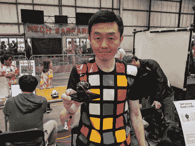
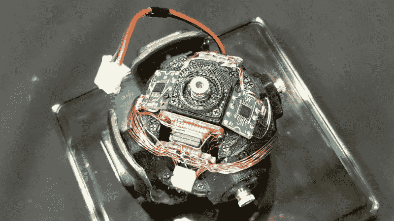

# 拆机视频:自解魔方机器人里面有什么

> 原文：<https://hackaday.com/2019/05/18/teardown-video-whats-inside-the-self-solving-rubiks-cube-robot/>

你可以在湾区创客博览会上找到各种各样的机器人，但今年最有趣的机器人无疑是由[Takashi Kaburagi]建造的自我解决魔方。轻轻地混合立方体的彩色边，把它放下一会儿，它就会活跃起来，重新整理好。

我正好在电池没电的时候来到了(Takashi 的)展位。你可以在下面看到我录制的电池更换过程的视频。立方体白色面上的中心瓷砖被磁性固定。一旦拆除，一个单独的自持螺钉(漂亮的触摸！)被松开以提离顶侧。从那里，几个较低的角落被抬起来，露出微型锂电池和连接它与机器人的电线连接器。

普通读者会记得在 9 月份我们介绍这个机器人时看到过它。当时我们很难了解到这个项目的细节，但是从那以后 [Takashi 分享了更多关于这个项目的信息](https://media.dmm-make.com/item/4462/)。追溯到 2017 年，建造始于一个更大的 3D 打印版本的立方体。有了概念证明，设计在 CAD 中建模，以确保一切都有一个精心规划的地方。结果是一个手工连线的机器人核心，感觉像科幻小说，但非常非常真实。

这个周末，我喜欢在圣马特奥县活动中心的场地上看到所有令人惊叹的机器人。有一个巨大的机甲在集市的停车场徘徊。有一整个摊位的重金属四足机器人有狗那么大。如果你走路不小心，你会踩到缩小版的火星漫游者。这些都是不可思议的，超乎这个世界的建筑，我喜欢它们。但是，将传统的立方体解算器移动到立方体内部的思维跳跃，以及成功所需的工艺，使这成为今年 Maker Faire Bay Area 最不受重视的工程。我很幸运在拆卸阶段发现了它！让我们来看看。

 [https://www.youtube.com/embed/8stu0ebOdLY?version=3&rel=1&showsearch=0&showinfo=1&iv_load_policy=1&fs=1&hl=en-US&autohide=2&wmode=transparent](https://www.youtube.com/embed/8stu0ebOdLY?version=3&rel=1&showsearch=0&showinfo=1&iv_load_policy=1&fs=1&hl=en-US&autohide=2&wmode=transparent)

