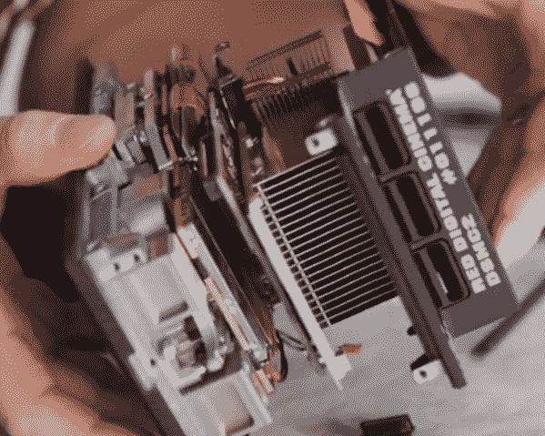
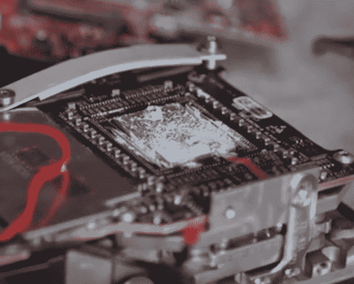

# 拆掉一台 250800 美元的摄像机

> 原文：<https://hackaday.com/2019/06/14/tearing-down-a-25k-8k-video-camera/>

大多数人购买昂贵的相机并使用它们，而不是将它们拆开，但 Linus Tech Tips 有一种不同的方法。他们决定更愿意把相机拆开，把它转换成水冷的。为什么？嗯，这可能就像问为什么要攀登珠穆朗玛峰:因为它就在那里。撇开水冷 8K 相机的实用性(或可取性)不谈，从工程的角度来看，拆卸是相当有趣的。红氦 8K 的价格约为 2.5 万美元，我们大多数人并不经常看到这样的设备内部。

正如你所料，我们放在下面的视频更多的是关于撕裂东西的恐怖，而不是真实的细节，但你确实得到了一些见解。似乎至少有五个不同的印刷电路板和一堆杂乱的带状电缆。许多相机大脑似乎是以 [Kintex FPGA 芯片](https://www.xilinx.com/products/silicon-devices/fpga/kintex-7.html)的形式出现，这是 Xilinx 系列中一些更强大的芯片。每台 1600 美元，这可能是这款相机的一大块成本。

目前相机的冷却系统看起来也有点疯狂，多个热管从多个 PCB 中吸取热量，每个 PCB 都将大型 FPGA 芯片固定在背面的导管散热器中。那里有大量的热油脂。

不过，这个巨大的散热器可能比你起初想象的更有意义:红色相机在拍摄时关闭风扇以避免噪音，因此系统必须在拍摄时吸收大量热量，然后在不得不再次切换到静音运行之前迅速消散热量。

还有一种看起来相当奇怪的冷却传感器芯片的装置。看起来好像热同步通过 PCB 上的一个孔工作，可能有一个 Peltier 或类似的从芯片背面吸热。对此还有什么见解吗？有谁是这种系统的专家，想让我们知道他们看到了什么吗？

 [https://www.youtube.com/embed/qFrK-l3VSzY?version=3&rel=1&showsearch=0&showinfo=1&iv_load_policy=1&fs=1&hl=en-US&autohide=2&wmode=transparent](https://www.youtube.com/embed/qFrK-l3VSzY?version=3&rel=1&showsearch=0&showinfo=1&iv_load_policy=1&fs=1&hl=en-US&autohide=2&wmode=transparent)

