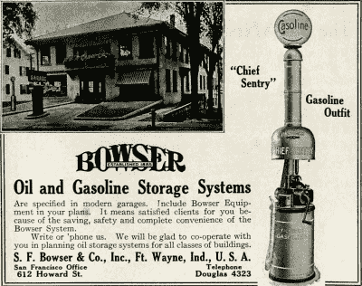
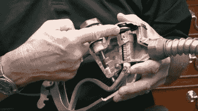

# 隐藏在众目睽睽之下的技术:气泵

> 原文：<https://hackaday.com/2020/11/12/tech-hidden-in-plain-sight-gas-pumps/>

如果你问一个对电视信号如何工作、手机如何工作、甚至是大厅灯的双向开关如何工作不太懂技术的人，你可能得到的要么是茫然的凝视，要么是极其不可能的解释。但是有些事情太普通了，以至于即使是我们中最精通技术的人也懒得去想。其中一个就是低气压泵。

汽油泵无处不在，可以肯定的是，阅读这篇文章的每个人都在某个时候使用过汽油泵，大部分都是定期使用。但是到底发生了什么呢？

大多数问题都很容易解决。顾名思义，必须有泵。有一些方法来告诉多少泵和它的成本，今天，一些方法来支付。但是自动关闭呢？它不是用一些花哨的电子设备完成的，那个机制可以追溯到几十年前。另外，我们谈论的是高度易燃的材料，除了一大罐汽油和一个泵之外，还需要更多的东西。安全是最重要的，从经验上来说，我们不会听说加油站一天爆炸两三次，所以肯定有一些非常坚固的安全设施。让我们向那些无声的安全功能致敬，并探索汽油贸易的诀窍。

## 过去的重力泵

许多老式的气泵都有手动泵，顶部有一个大玻璃箱，还有一根带旋塞的虹吸管。如果你想要，比如说，5 加仑，服务员会把气体从地下气罐中泵入上面有测量标记的大玻璃气罐中。一旦它达到了所需的量，软管就会进入你的油箱，服务员就会打开水龙头，剩下的就靠重力了。

奇怪的是，气泵先于汽车出现。早在 1885 年，希尔瓦努斯·布瑟就出售了一种泵，用来销售人们在灯具和炉子中使用的煤油。在世界上的一些地方，加油泵有时被称为加油车，尽管在美国这个词通常指的是飞机的加油车。

显然，这是一个简单的安排，但改进的时机已经成熟。但是，随着泵站和微控制器的激增，几十年后，设计师们不得不做一些巧妙的机电工作，以制造一个无需技能甚至客户自己就可以使用的功能泵。

## 中档:加油站的鸡尾酒

所有这些的核心是容纳天然气的大型地下储罐。卡车定期停下来重新装满这些油罐。有趣的事实。埃克森公司的卡车和德士古公司的卡车与壳牌公司的卡车在同一个地方加油。无论是在终点还是在输送点，特殊的添加剂都与气体混合在一起。这就是相同辛烷值的汽油与其他品牌不同的原因。

卡车通常有几个不同的车厢。一个是普通汽油，一个是高级汽油，一个是柴油。一些有更多的隔间。但是，通常没有中档气。当你购买中档汽油时，你实际上只是在油泵里将普通汽油和优质汽油混合在一起。这是通过混合阀实现的。这是两个阀门的连接方式，当一个阀门打开时，另一个阀门按比例关闭，这样总流量总是等于 100%。例如，如果一个阀门处于 100%，另一个阀门总是处于 0%。但是如果你把第一个阀门转到 60%，第二个阀门会在 40%。这允许两种燃料精确混合成一个中间等级。

 添加剂对现代发动机非常重要。2004 年，汽车制造商担心一些汽油没有足够的清洁剂来有效防止积碳。随着更高的压缩，直接喷射和其他现代发动机技术，这比以往任何时候都更重要。它们构成了天然气生产商可以认证的最高标准。美国汽车协会发现，与最低标准气体相比，使用顶级气体在发动机中产生的沉积物更少。当然，不是顶级的品牌可能是一样的或者更好，它们只是没有经过测试。

## 自动停带开关

气泵最神奇的地方在于它是如何知道油箱是满的——即使是用旧技术。下面来自[BrainStuff]的视频展示了一个很好的图表。靠近喷嘴的一端有一个小孔，喷嘴的另一端靠近一个柔性隔膜和一个文丘里管。

 [https://www.youtube.com/embed/TFKOD3KRkZs?version=3&rel=1&showsearch=0&showinfo=1&iv_load_policy=1&fs=1&hl=en-US&autohide=2&wmode=transparent](https://www.youtube.com/embed/TFKOD3KRkZs?version=3&rel=1&showsearch=0&showinfo=1&iv_load_policy=1&fs=1&hl=en-US&autohide=2&wmode=transparent)

当你压缩流动的流体时，文丘里效应会导致压力下降。例如，如果你在中间挤压一根橡胶管，无论是什么流过管子，在管子被压缩的部分之后，压力都会降低。

在离开喷嘴之前，手柄中燃料路径的狭窄部分压缩燃料，在这个瓶颈之后产生较低压力区域。手柄内部的隔膜膨胀，因为环境空气压力(通过喷嘴顶端的小“安全”管孔进入)高于文丘里效应产生的低压燃料面积。

Gas pump nozzle cutaway shows the Venturi valve diaphragm. [The demo video from Husky Corporation](https://www.youtube.com/watch?v=q3phjAQZdGg) mentions that more modern nozzles have additional safety features.

当上升的燃油液位堵塞顶端的孔时，会导致抽吸停止，膜片塌陷，燃油阀“咔嗒”一声关闭。完全没有电子设备。只是一个灵活的隔膜，一根管子，一个弹簧，以及所有部件的巧妙组合。

理查德·科尔森最初在 1939 年发明了一种自动关闭装置，并在 1942 年获得了专利。他注意到工人们不得不一次一个地往桶里装水，以免装得太满。他受到厕所操作的启发，想出了一种自动阀。

## 流量计量

汽油很难精确计量。有一个隔膜将流量限制在一个已知的速度。当你接近泵将关闭的点时(例如，如果你要价值 10 美元的汽油)，隔膜也会膨胀减速。计量本身通常是一个 4 冲程活塞流量计，将数据发送到车载控制器。在过去，它只是驱动显示价格的小表盘。活塞流量计非常精确。下面来自[Max Machinery]的视频展示了它们是如何工作的。

 [https://www.youtube.com/embed/h5UMvzf6xOI?version=3&rel=1&showsearch=0&showinfo=1&iv_load_policy=1&fs=1&hl=en-US&autohide=2&wmode=transparent](https://www.youtube.com/embed/h5UMvzf6xOI?version=3&rel=1&showsearch=0&showinfo=1&iv_load_policy=1&fs=1&hl=en-US&autohide=2&wmode=transparent)

气体在 20C 时的热膨胀系数是水的 4 倍以上。当你大量购买天然气时，数量通常会根据温度进行补偿，一些国家，如加拿大，也在零售层面这样做。

## 藏在显眼的地方

下次你加油的时候，你会有事情要考虑的。有很多技术是专家，但我们大多数人都认为这是理所当然的。你必须承认，事情可能比你想象的要复杂得多。

如果对文丘里效应感兴趣，可以制作 [3D 打印文丘里管](https://hackaday.com/2019/02/08/a-crash-course-in-3d-printed-venturi-pumps/)。如果你想过用[你旧车的燃油泵来冷却你的电脑](https://hackaday.com/tag/fuel-pump/)，你可能要再想想了。