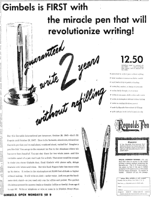
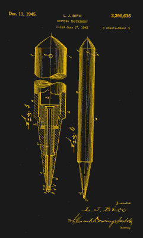
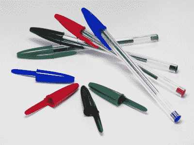

# 隐藏在众目睽睽之下的技术:圆珠笔

> 原文：<https://hackaday.com/2020/12/17/tech-hidden-in-plain-sight-the-ballpoint-pen/>

Would you pay $180 for a new type of writing instrument? Image via [The New York Times](https://www.nytimes.com/slideshow/2015/11/15/business/gimbels/s/15saks-timeline-gimbel1945.html)

1945 年 10 月下旬一个秋高气爽的早晨，大约 5000 名购物者涌向纽约市第 32 ^和街的金贝尔百货商店，就像那天是沃尔玛的黑色星期五一样。[事情失去了控制，五十名额外的 NYPD 警察被派往现场](https://archives.newyorker.com/newyorker/1951-02-17/flipbook/038/)。每个人都在叫嚣着要最热门的新技术——圆珠笔。

这支新钢笔价值 12.50 美元，相当于今天的 180 美元。对许多人来说，圆珠笔比自来水笔更好的体验是物有所值的。你可能会笑，但是如果你曾经用过自来水笔，你就会明白需要一种更耐用、更便携的东西。

这年头圆珠笔到处都是，尤其是便宜的。它们无处不在，以至于我们根本不需要带着它到处走，或者真的去想它们。除非你对笔感兴趣，否则你可能从来没有对今天存在的大量耐用、价格合理、永久的书写工具感到惊讶。在圆珠笔出现之前，钢笔是一种麻烦的东西。

## 革命性的钢笔

A ballpoint, up close and personal. Image via [Wikipedia](https://en.wikipedia.org/wiki/Ballpoint_pen)

自来水笔利用重力和毛细作用将墨水从墨盒或储墨器均匀地注入金属笔尖。笔尖分为两个尖齿，当压在纸上时，墨水可以流出。不是说自来水笔那么精致。只不过它们离将笔尖或羽毛直接浸入墨水只有一步之遥。

不可否认，自来水笔是上等的，但是如果你把一支钢笔放在口袋里，你就是在玩火。天气好的时候会有点乱，便宜的容易漏墨。不管你有多好的自来水笔，都必须经常更换笔芯，要么把墨水从瓶子里吸到笔芯里，要么插入新的笔芯。你最好尽可能经常使用它，因为一支休眠的钢笔会被干墨水堵塞。

从美学角度来说，早期的圆珠笔是模仿自来水笔的。它们有金属笔身和可重复填充的储墨器，每隔几年就需要补充一次，相比之下自来水笔大约一周一次。圆珠笔没有笔尖，而是有一个由钢、黄铜或碳化钨制成的微型滚珠轴承。这些笔依靠重力将球浸泡在墨水中，这使得它可以在插座中滑动，就像一个小小的滚动除臭剂。

Bíró’s US Patent for the ballpoint. Image via [US Patent #2390636](https://patents.google.com/patent/US2390636A/en)

## 比罗的比罗

虽然米尔顿·雷诺兹在美国市场上击败了其他人，但他并不是第一支圆珠笔。这项荣誉属于一位名叫约翰·劳德的律师，他在 1888 年[获得了一种滚动圆珠笔的专利。Loud 想要一支可以在从木头到皮革的任何东西上写字的笔。他的旋转钢珠设计正合适。唯一的问题是它对于纸张来说太粗糙了。](https://patents.google.com/patent/US392046A/en)

在接下来的几十年里，许多发明家试图改进 Loud 的设计，但没有人能把墨水做好。直到匈牙利记者 Lázló Bíró决定尝试创造一种干燥速度更快的墨水，就像报纸墨水一样。他让他的兄弟捷尔吉参与进来，开发了一种更粘稠的墨水。

1938 年，比罗在英国为这支笔申请了专利，但是第二次世界大战迫使这对犹太兄弟在 1941 年逃到了阿根廷。在另一名逃犯胡安·豪尔赫·梅恩(Juan Jorge Meyne)的帮助下，他们于 1943 年在新的祖国重新推出了这支笔，在那里它被称为 *birome，*源自这两个姓氏。在许多欧洲国家， *biro* 至今仍被用作圆珠笔的统称。

1945 年，两家美国公司联手购买了在北美和中美洲销售这种笔的权利，但他们的速度太慢了。美国商人米尔顿·雷诺兹(Milton Reynolds)在布宜诺斯艾利斯的一次商务旅行中看到了这款比罗姆酒，并买下了其中几款。他对 Lázló Bíró的设计进行了充分的修改，以避免专利侵权，并在 Eberhard Faber 和 Eversharp 将钢笔送到消费者手中之前将其推向市场。

The bestselling pen in the world. Image via [Wikipedia](https://en.wikipedia.org/wiki/Bic_Cristal)

## 塑料生活，太棒了

Lázló Bíró可能发明了第一支实用的圆珠笔，但却是 Marcel Bich 将圆珠笔变成了今天多如牛毛的商品。20 世纪 40 年代中期，他买下了巴黎附近的一家旧工厂，开始在他的新公司 Societe Bic 下生产钢笔。Bich 的 BiCs 价格只是其他圆珠笔的零头。通过增加一次性，Bich 将圆珠笔从高端产品变成了普通人的必需品。

BiC Cristal 于 1950 年首次推出。它在 2006 年卖出了第 1000 亿支，成为世界上最畅销的钢笔。设计几乎没有变化，它的特点是像铅笔一样的六边形主体，以及一个平衡钢笔内部压力的小孔，这样它就不会泄漏。在这一点上，你可能想知道费希尔太空笔如何在没有重力的情况下书写。答案就在特殊的加压墨盒里，这种墨盒允许它在任何地方从任何角度书写，甚至在水下。

钢笔的下一个重大进步是使它们可以伸缩。如今有许多不同的伸缩笔设计，从简单到复杂。在这个精彩的视频中，[engineerguy]解释了 1954 年的 Parker 笔记本的内部工作原理，这是最早的可伸缩圆珠笔之一。这是一个八步过程，包括一个柱塞，一个凸轮体，和一对固定在适当位置作为针筒一部分的止动件。

 [https://www.youtube.com/embed/MhVw-MHGv4s?version=3&rel=1&showsearch=0&showinfo=1&iv_load_policy=1&fs=1&hl=en-US&autohide=2&wmode=transparent](https://www.youtube.com/embed/MhVw-MHGv4s?version=3&rel=1&showsearch=0&showinfo=1&iv_load_policy=1&fs=1&hl=en-US&autohide=2&wmode=transparent)

我喜欢钢笔，我收集了相当多的钢笔。有趣的是，我们兜了一圈，现在有了一次性自来水笔，尤其是因为它们是我最喜欢用来写字的东西。

下次你用笔的时候，想想它们现在有多便携。在你丢失它之前，它很有可能不会漏，跳过，甚至用完墨水。