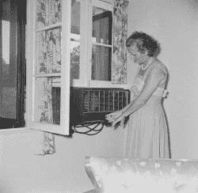
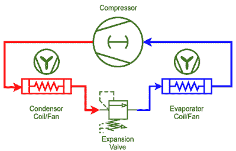

# 显而易见的技术:空调

> 原文：<https://hackaday.com/2021/10/27/tech-in-plain-sight-air-conditioning/>

我总是惊讶于技术可以彻底摧毁工业。当然，有些人以制作马蹄铁为生，但与马作为正常交通方式时相比，对马蹄铁的需求已经大幅下降。但即便如此，人们还是会做马蹄铁。但是想想采冰生意。没听说过？原来，在制冷之前，有一项庞大的业务，将冰从自然产生的地方转移到其他地方并储存起来，通常是在有很多隔热层的地下。据我所知，那种生意——包括附近的冰人——现在完全消失了，除了一些历史展览。我们认为制冷和空调是理所当然的，但就在不久前，冰还是一种奢侈品，而你自己的防暑用品是一台风扇。

## 早期冷却

故事开始的时间比你想象的要早一点。在 19 世纪 40 年代，医生约翰·高里担心“高温的危害”他在佛罗里达的医院使用上述冰块交易进口冰块，既不便宜也不是很有效。

他没有被吓倒，他开发了一种机器，用马、水车、蒸汽或风力来驱动压缩机制冰。他在 1851 年获得了一项专利，但是在他的资助人去世之前，这项专利没能流行起来。事实上，奥利弗·埃文斯早在 1805 年就有了这个想法，但他从未造出一台可以工作的机器。Jacob Perkins 在 1834 年申请了第一台压缩冷却器的专利，同样没有什么实际用途。

当美国总统加菲尔德遇刺时，海军工程师用浸泡在冰水中的布建造了一个冷却箱，使总统的病房降温 20 度。由于受了致命伤的总统在枪击后存活了 80 天，我们推测他会感激这种安慰。

## 开利和好莱坞的联系

Willis Carrier (Public domain)

我们把现代空调归功于杂志印刷业。布鲁克林的一家杂志出版商湿度太大，他们的书页都起皱了。这不仅不美观，还会给印刷过程带来问题。1902 年，一位名叫威利斯·开利的工程师——他仍然是空调行业的名人——为水牛城锻造公司工作，被要求解决这个问题。

他的发明去除了空气中的湿气，但结果也降低了空气的温度。专利接踵而至，这种装置也在纺织工业中得到应用。最终，开利和其他六名工程师将离开布法罗，成立一家名为开利的公司。

不过，那是在 20 世纪 20 年代，在普通大众开始了解空调之前，多亏了最不可能的地方:电影院。

电影院修改了他们的供暖系统来吹冷空气，这导致地板上的顾客手脚冰凉，而阳台上的顾客则过于温暖。1922 年，开利公司在洛杉矶的大都会安装了一套精心设计的系统。然而，这些早期的系统容易出现故障，所以在那年晚些时候，开利公司引进了一种离心系统，首先在纽约的里沃利使用。

剧院里的空调增加了生意，因为天气热的人会很乐意花些钱在凉爽的剧院里坐几个小时，不管在放什么电影。他们甚至可能会买一杯饮料或一些爆米花。

## 在家

这些早期的空调又大又贵。他们还使用易燃制冷剂。不管怎样，Frigidaire 在 1929 年推出了针对家庭使用的两件式装置。到了 1930 年，通用电气已经有了一体化设计。

Window unit circa 1955 (Public domain)

这大约是通用汽车公司开发氯氟烃的时候，氯氟烃是一种不可燃的冷却剂，不幸的是，后来发现它会破坏地球的臭氧层。

昂贵的窗户单元出现在 1932 年，但没有变得流行。直到 1947 年，人们才买得起窗户。今天，在美国，85%的家庭都有某种形式的空调。供暖和制冷约占美国能源消耗的 48%。

## 内幕

那么它是如何工作的呢？当液体变成气体时，它吸收热量。那么，诀窍就是把气体压缩成液体，然后让它变回气体。当然，压缩会产生热量，热量通过风扇吹过冷凝器盘管进行交换。

理想情况下，热量被排出该区域进行冷却。例如，对于窗户单元，它从后面出去。这也是为什么便携式装置有一个软管，你必须把它挂在门或窗外的一个原因。

气体流过系统到达蒸发器盘管，从周围空气中吸收热量。冷却空气也会导致冷凝，每个空调都必须以某种方式处理水。请记住，开利的原始设备是用来除湿的。

膨胀阀将高压(液体)侧和低压(气体)侧分开。阀门一次只允许少量的制冷剂通过，这阻止了阀门两侧的压力平衡。液态制冷剂在低压环境中突然膨胀成气体，这就是导致冷却的原因。

当然也有变异。风扇可能是鼓风机。一些大型机组冷却输送到别处的水，但原理是一样的。不出所料，冰箱非常相似，尽管其中一些使用不同的方法来膨胀气体，当然，只冷却很少或没有外部气流的封闭空间。

## 未来

随着空调消耗如此多的电力，不难想象人们会不断想出更有效的方法来降温。地热冷却依赖于这样一个事实，即地下相对较冷，所以你可以与地球交换热量，当你的房子温暖时使它变冷，当你的房子凉爽时使它变暖。这是热泵的一种，一些热泵和空调差不多，可以通过换向阀切换冷端和热端。这些热泵从空气中吸取热量，这意味着当外面非常冷时，它们不能像传统的加热器那样工作。

还记得加菲尔德总统的空调吗？现代社会让这一想法再次变得可行。由于需求，在低需求时期以较低的成本购买电力通常是可能的。为了利用较低的成本，办公楼可以在晚上关门时冷冻水，然后在白天用这些冰冷却大楼。这当然需要大量的水，有时还会增加传统的空调。当电价上涨时，也许像下面视频中的采冰会卷土重来。大概不会。

当然，你可以随时 DIY。我们见过一个人用他碰巧找到的东西做空调，或者你可以自己做一个 T2 小型冰冷却器。

 [https://www.youtube.com/embed/F2aYFFNs8yY?version=3&rel=1&showsearch=0&showinfo=1&iv_load_policy=1&fs=1&hl=en-US&autohide=2&wmode=transparent](https://www.youtube.com/embed/F2aYFFNs8yY?version=3&rel=1&showsearch=0&showinfo=1&iv_load_policy=1&fs=1&hl=en-US&autohide=2&wmode=transparent)

横幅图片“[空调-摘要](https://www.flickr.com/photos/29001414@N00/8035696518)”zeevveez获得 CC 2.0 授权。

jthetzel 的“[空调](https://www.flickr.com/photos/97132917@N00/5700216237)”获 CC 2.0 授权。