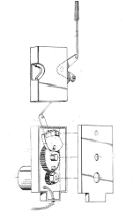
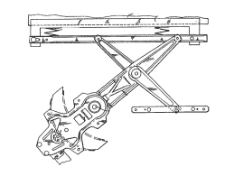

# 显而易见的技术:车门

> 原文：<https://hackaday.com/2022/03/24/tech-in-plain-sight-car-doors/>

有许多常用短语不再表示它们过去的意思。例如，你可能用过“开灯”这个词你究竟在*转什么*？这是从哪里来的？老式的煤气灯有一个阀门，你真的可以用手转动它，而这个短语只是简单地停留在周围。90 年代的孩子不知道他们为什么要“拨”一个电话号码。“摇上车窗”怎么样？你不会经常遇到带手动锁的老式车门或摇上车窗的曲柄。如今，一切都电子化了。但是你有没有想过里面发生了什么？

让我们来看看车门，它们如何保护你的安全，以及那片玻璃如何滑动到位，密封防风、防雨和隔音。当然，也有像自杀门或性感但不实用的鸥翼门这样的花哨车门。至少有一款概念车甚至有一个门，打开后就消失在车辆下面；看看下面的视频。但是即使是普通的门也是机械工程的奇迹。结构紧凑，安全可靠。让我们看看他们是如何做到这一点的。

 [https://www.youtube.com/embed/AAtkoje4-eM?version=3&rel=1&showsearch=0&showinfo=1&iv_load_policy=1&fs=1&hl=en-US&autohide=2&wmode=transparent](https://www.youtube.com/embed/AAtkoje4-eM?version=3&rel=1&showsearch=0&showinfo=1&iv_load_policy=1&fs=1&hl=en-US&autohide=2&wmode=transparent)

## 转换

当你想一想，我们建造的很多东西都是将某种东西转化为另一种东西。例如，能量转化为运动。或者从一种运动到另一种运动。车门装置也不例外。当然，锁致动器和窗户致动器都将电命令转换成某种物理运动。但是还有一个问题，就是如何在有限的空间里获得正确的身体运动。

关于大多数车门的一个有趣的事情是，锁必须是安全的，但提供许多打开它们的方法。仅有电子控制通常是不够的:通常有手动解锁汽车的方法。当然，即使没电，你也必须能够从里面开门，以免困住里面的人。有些汽车，如 Boxter 或一些 Lotuses，在没有电源的情况下，没有明显的方法来解锁汽车。这些汽车通常有一个隐藏的紧急钥匙孔或一组隐藏的终端，允许您临时启动系统以解锁车辆。

## 锁起来

汽车中控制电动锁的马达被称为执行器。你可以买到适用于大多数汽车的通用执行器，甚至是那些通常没有电动锁的汽车。因为门锁必须可以从多个来源操作，所以致动器通常驱动一个杆，而这个杆通常出现在窗户附近，所以你也可以手动操作它。杆接合和脱离闩锁机构，当脱离时，你不能打开门。事实上，通常情况下，如果门杆松开，门闩关闭，如果门是开着的，你就无法关门。

 [https://www.youtube.com/embed/P_HUKy4b35k?version=3&rel=1&showsearch=0&showinfo=1&iv_load_policy=1&fs=1&hl=en-US&autohide=2&wmode=transparent](https://www.youtube.com/embed/P_HUKy4b35k?version=3&rel=1&showsearch=0&showinfo=1&iv_load_policy=1&fs=1&hl=en-US&autohide=2&wmode=transparent)

Door lock mechanism from patent US4793640A

典型的致动器是一个简单的旋转电机。当然，我们需要一种不同的运动，所以齿轮不仅降低电机速度，增加扭矩，而且齿条和小齿轮将旋转转化为线性运动。因为你通常不希望电机和乘员争夺控制权，所以往往会有一个离合器不会将手动运动传输回电机。马达只是暂时运转。有些车有反馈，出了问题会试几次。

老式汽车使用真空泵吸入或吹出空气来操作车门，因为电动马达噪音大且容易出故障。例如，梅赛德斯一直使用气动门锁，直到 2003 年左右。

## Windows 操作系统

窗口更容易一些，因为你通常不需要手动控制。不过，还是有一些特别的问题。例如，你有没有注意到你的窗户完全保持水平？此外，出于安全原因，强行放下车窗应该几乎是不可能的。这通常通过使用蜗轮来处理。由于蜗轮和正齿轮之间的接触角，蜗轮可以转动正齿轮，但由于轮齿之间的摩擦，蜗轮不能转动正齿轮。

由于车窗必须上下移动，所以有一条类似 H 桥的线路可以使电机双向运行。对于一辆拥有复杂控制器的汽车来说，它可能确实使用了 H 桥，你的车窗按钮只是电脑的输入。但是基本的汽车可能只是简单的布线，允许司机或乘客向任一方向旋转车窗电机。

非常古老的汽车实际上使用液压系统来操作窗户。这样做的好处是可以在没有电力的情况下让窗户滚下来，但是你确实需要电力来操作水泵使其再次升起。然而，液压升降机很久以前就失宠了，取而代之的是电动马达。

Window linkage from patent US6502352B1.

实际的机械部件可以有几种不同的配置。在直接驱动的情况下，要么有一个剪式机构，要么有一个带齿的单臂。这两种配置通常使用弹簧来保持张力。

许多现代汽车使用卷轴上的细钢缆。通过放出或收起缆绳，窗户底部的滚轮可以上下移动。在一些系统中，带有链轮孔的厚塑料带具有类似的功能。总的来说，这些被称为调节器。像电动锁一样，你可以找到通用调节器，它可以修理任何电动车窗系统或在你以前没有的地方增加电动车窗。然而，正如你所料，这些比相对简单的门锁更复杂也更昂贵。

 [https://www.youtube.com/embed/Yl40Uj8kCWU?version=3&rel=1&showsearch=0&showinfo=1&iv_load_policy=1&fs=1&hl=en-US&autohide=2&wmode=transparent](https://www.youtube.com/embed/Yl40Uj8kCWU?version=3&rel=1&showsearch=0&showinfo=1&iv_load_policy=1&fs=1&hl=en-US&autohide=2&wmode=transparent)

## 那又怎样？

这是一种你可能一年要用几百次车门的东西，但是直到车门坏了，你才想到里面有什么。但是，即使你从来不需要修理门，考虑一下这个:通用电动锁驱动器为各种项目提供了优秀的线性驱动器。如果你是一次性的，你甚至可以几乎免费地从垃圾场收获一个。即使你买了新的，你也可以在网上花 5 美元或 10 美元找到它们。

电动车窗装置成本更高。虽然也有通用窗口，但它们可能更难找到用途，除非你真的需要像车窗一样可以上下弹出的东西。如果你用这些做一个项目，别忘了[让我们知道](https://hackaday.com/submit-a-tip/)，这样我们就可以和大家分享了。

当然，这些汽车零件相当结实。如果你需要更普通的东西，[你可以选择](https://hackaday.com/2009/06/30/custom-car-door-keypad/)。你甚至可以用[转换一个伺服](https://hackaday.com/2018/06/02/servo-becomes-mini-linear-actuator/)。

[横幅图片:[大卫·罗森](http://www.davidrosenphotography.com)的《[车门侧面](https://www.flickr.com/photos/91492606@N07/15990894851)》，CC BY 2.0。缩略图:[肌肉车门 47](https://www.flickr.com/photos/10710442@N08/8630266238) 由[史蒂夫·斯诺德格拉斯，](https://www.flickr.com/photos/10710442@N08) CC 由 2.0。]