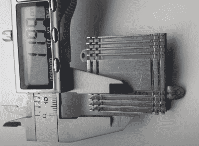

# 1 GHz 超频将 Teensy 4 推向了极限

> 原文：<https://hackaday.com/2022/01/02/teensy-4-pushed-to-the-limit-with-1-ghz-overclock/>

你需要一个主频为 1 GHz 的微控制器吗？不，可能不会。但这并没有阻止[Visual Micro]的尝试，[结果相当有趣](https://www.youtube.com/watch?v=ydzs7I-wiog)。这个勇敢的小芯片不仅不会自己烹饪，实际上它似乎运行得相当好；已经很强大的微控制器在性能上有了相当大的提高。

根据[Visual Micro]的说法，通常其 ARM Cortex-M7 主频为 600 MHz 的 Teensy 4.1 可以在没有任何额外冷却的情况下运行高达 800 MHz。但除此之外，你会想邀请一些额外的表面面积到党。从一个旧的 CPU/GPU 冷却器上切下一大块并涂上少量热化合物是很容易的，但当然也不乏这种尺寸的市售散热器，你可以便宜地买到。

Cutting a custom heatsink.

安装散热器后，[Visual Micro]显示 Teensy 在基准测试期间运行在 62°C 左右。如果你觉得有点热，他们还用一个旧的笔记本电脑冷却器做了实验，在负载下将芯片降到了令人印象深刻的 38 摄氏度。对我们来说，这看起来不像是一个特别实用的设置，但至少选项是存在的。

[Visual Micro]遗憾的是，没有详细介绍基准测试的结果，但从显示的结果来看，超频似乎获得了相当大的收益。图表显示，在一个股票少年计算 1520 万个素数的时间里，超频芯片设法突破了 2110 万个。这项测试的时间表还不清楚，但改进是显而易见的。

即使在股票 600 兆赫，[的 Teensy 4 是一个非常强大的 MCU](https://hackaday.com/2019/08/07/new-teensy-4-0-blows-away-benchmarks-implements-self-recovery-returns-to-smaller-form/) 。尤其是在 [4.1 更新带来了对额外外设和更多 RAM 的支持之后](https://hackaday.com/2020/05/11/new-teensy-4-1-arrives-with-100-mbps-ethernet-high-speed-usb-8-mb-flash/)。但是我们认为有些人永远不会满足。有没有一个项目可以从超频的 Teensy 中获益？[我们很想知道这件事](https://hackaday.com/submit-a-tip/)。

 [https://www.youtube.com/embed/ydzs7I-wiog?version=3&rel=1&showsearch=0&showinfo=1&iv_load_policy=1&fs=1&hl=en-US&autohide=2&wmode=transparent](https://www.youtube.com/embed/ydzs7I-wiog?version=3&rel=1&showsearch=0&showinfo=1&iv_load_policy=1&fs=1&hl=en-US&autohide=2&wmode=transparent)

感谢[赞]的提示。