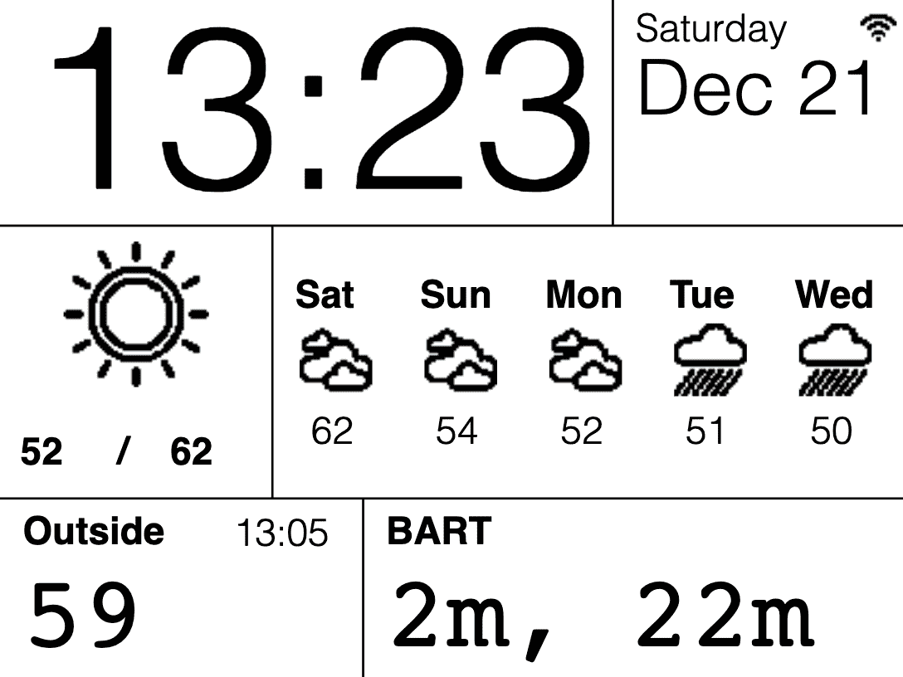

# 使用 EPaper 模板模板化您的时间表

> 原文：<https://hackaday.com/2020/12/02/templateize-your-timetable-with-epaper-templates/>

迄今为止，电子纸技术在两件事上表现出色，一是显示静态的黑白文本，二是以赏心悦目、经久耐用的承诺吸引黑客。但是裸面板的可用性差使得第二个(我们认为更重要的)目标实现缓慢。想到的第一个项目之一就是使用这样的显示屏来显示周围的信息，如每日天气摘要、火车时刻表和日历约会。通常这意味着滚动你自己的软件栈，但是【克里斯多夫·穆林斯】已经为设计和更新这样的 [参数化显示集合了一个令人震惊的完整工具集，叫做 epaper_templates](https://github.com/sidoh/epaper_templates) 。

先说清楚，没有硬件组件要`epaper_templates`。它假定您有一台 ESP32 和一台从支持的型号列表中选择的显示器。在我们最喜欢的进口网站上快速搜索一下，就可以找到各种各样的裸面板和预建设备(ESP32 和显示器，以及其他好东西)，起价约为 40 美元，所以这应该是一个很低的门槛。

一旦你有了这个装置，`epaper_templates`就提供了魔力。[ Christopher 的关键见解是，环境显示通常由显示在从不改变的布局中的多组半静态数据组成。唯一的变化是完全参数化的数据更新:温度总是整数华氏度，火车时刻表是分钟和小时的列表，等等。这样的布局不难制作，但是需要开发人员重新实现大量样板文件。为了使它们易于生成，`epaper_templates`提供了一个全功能的 web UI，让用户自由定制布局，然后将其导出为 JSON 供设备使用。

The sample layout configured in the video below

web 用户界面的能力令人震惊，尤其是对于嵌入式 web 的标准来说。(记住它是由 ESP32 本身托管的！)用户可以放置文本并配置字体和样式。一旦被放置，文本可以被设置为静态字符串或绑定到变量，如果字符串是时间戳，它可以用标准的`strftime`格式字符串格式化。

为了完善功能集，用户可以放置图像和线条来划分显示。一旦描述了显示，编程更新就变得简单了。ESP 可以被配置为订阅某些 MQTT 主题，它将从这些主题接收更新，或者如果这是太多的基础设施，有一个方便的 REST API，它接受包含变量或位图的 JSON 对象以在设备上更新。

我们完全被`epaper_templates`中的功能水平震惊了！查看回购协议，了解其功能的更多细节。完整的演示包括火车到达时间、天气、即时温度和天气预报，以及日期/时间，请在休息后观看视频。例子的来源是这里的，但是请务必查看回购中的`examples/`以获得更多例子。

 [https://www.youtube.com/embed/h0xRwF95yeg?version=3&rel=1&showsearch=0&showinfo=1&iv_load_policy=1&fs=1&hl=en-US&autohide=2&wmode=transparent](https://www.youtube.com/embed/h0xRwF95yeg?version=3&rel=1&showsearch=0&showinfo=1&iv_load_policy=1&fs=1&hl=en-US&autohide=2&wmode=transparent)

