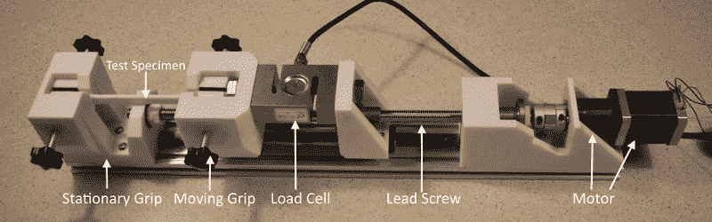

# 拉伸试验机将 3D 打印零件带到了临界点

> 原文：<https://hackaday.com/2020/08/13/tensile-testing-machine-takes-3d-printed-parts-to-the-breaking-point/>

如果你真的想设计你所建造的东西，你需要知道你所使用的材料的极限。表征材料的一个重要方法是测试拉伸强度——将样品拉至断裂点需要多大的力。谢天谢地，有了合适的硬件，这很容易测量，而且 [[CrazyBlackStone]已经建立了一个平台来做这件事](https://www.instructables.com/id/FULLY-FUNCTIONAL-Tensile-Testing-Machine-Tinkercad/)。

建立在铝挤压框架上，一套 3D 打印部件将一切固定到位。为了施加负载，使用步进电机缓慢转动丝杠，拉动被测物品。拉力是用连接到 Arduino 的测压元件测量的，Arduino 通过 USB 串行连接将数据报告给 PC。

这是构建您的第一台拉伸测试仪的简单方法，非常适合测试 3D 打印零件的强度。这个项目的 STEP 文件(13.4 MB [直接下载](https://content.instructables.com/ORIG/FLM/51XT/KD33H42P/FLM51XTKD33H42P.step))是可用的，但[CrazyBlackStone]建议等待将于今年秋天在 Thingiverse 上发布的第二版，尽管我们没有找到该用户资料的链接。

现在，我们将能够测量拉伸强度，但零件的刚度也很重要。你也可以考虑建造一个测试平台。休息后的视频。

 [https://www.youtube.com/embed/MU99hTOaAwI?version=3&rel=1&showsearch=0&showinfo=1&iv_load_policy=1&fs=1&hl=en-US&autohide=2&wmode=transparent](https://www.youtube.com/embed/MU99hTOaAwI?version=3&rel=1&showsearch=0&showinfo=1&iv_load_policy=1&fs=1&hl=en-US&autohide=2&wmode=transparent)

