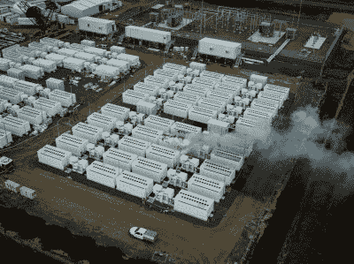
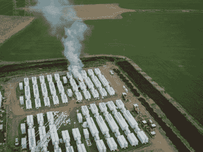
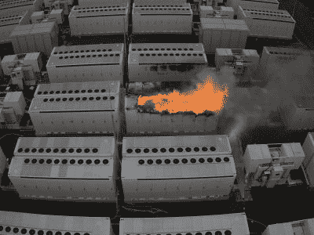

# 特斯拉的巨型电池组在电网储存火灾中燃烧了数天

> 原文：<https://hackaday.com/2021/08/12/teslas-megapack-battery-burned-for-days-in-grid-storage-fire/>

锂充电电池以其高密度的能量储存而闻名，使各种技术得以实现。从无人机到实用电动汽车，再到大规模电网储能，应用层出不穷。

The fire as seen from a drone overhead. Source: Twitter/[@FireRescueVic](https://twitter.com/FireRescueVic/status/1421040775467515904/photo/1)

然而，锂充电电池一直有一个主要缺陷——易燃性。被推到它们的工作范围之外，或者以其他方式导致热失控，结果它们会被剧烈燃烧。

这种情况在 7 月下旬发生在澳大利亚吉朗的维多利亚大电池厂，人们花了很大力气才扑灭了这场大火。让我们看看这个项目，看看这是如何发生的。

## 网格规模存储

维多利亚大电池是一个电网存储项目，在结构上类似于邻国南澳大利亚的 Hornsdale 电力储备。然而，在 Hornsdale 设施领域的 194 兆瓦时的能力和 150 兆瓦的峰值功率输送，新项目的目标是走得更远。维多利亚州的项目旨在安装 450 兆瓦时的容量，并提供 300 兆瓦的峰值功率输出。

Concerns were raised about the smoke from the blaze, though local authorities gave downwind areas the all-clear soon after. Credit: [CFA](https://news.cfa.vic.gov.au/firefighters-bring-large-battery-fire-near-geelong-under-control?fbclid=IwAR21c5U_9jAU3EHDIu9RqtfNdgB9qE4KZa0mFWNCHSR21KVilR7OSOxf02c)

该设施由 Neoen 运营，使用特斯拉 Megapacks 建造，这是一种专为电网存储目的设计的大型电池装置。每个巨型电池包内部都包含电池、逆变器和热管理系统，是一个即插即用的电网存储解决方案。

根据官方报道，电池的初始测试在 7 月 30 日进行，火灾发生在大约上午 10:15[。该网站很快与电网断开，没有中断当地的电力供应。](https://victorianbigbattery.com.au/incident-at-vbb/)

大火燃烧了几天，消防员宣布火势在 8 月 2 日下午 3 点得到控制。[锂电池往往会燃烧得非常剧烈](https://hackaday.com/2019/11/13/lessons-in-li-ion-safety/)，而且经常会在一段时间后重燃，因此工作人员被留在现场监控电池一段时间。每两个小时记录一次温度读数，以便迅速抑制任何发热或重燃。

## 用水，但不是直接在火上

这场大火是由国家消防局的成员和维多利亚消防救援队扑灭的。CFA 事故控制员 Ian Beswicke 谈到了这场大火，指出了处理这种火灾的困难。“他们很难战斗，因为你不能把水浇在扩音器上……这样做只是延长了大火燃烧的时间。”根据特斯拉的建议，贝斯维克指出“……推荐的过程是你冷却周围的一切，这样火就不会蔓延，你让它燃尽。”

Visible are the individual Tesla Megapack units, each with its own thermal management system built-in. Credit: [CFA](https://news.cfa.vic.gov.au/firefighters-bring-large-battery-fire-near-geelong-under-control?fbclid=IwAR21c5U_9jAU3EHDIu9RqtfNdgB9qE4KZa0mFWNCHSR21KVilR7OSOxf02c)

据《悉尼先驱晨报》援引消息来源称，在电池开始在电网上运行后不到 24 小时，大火就开始了。消防队员的快速行动阻止了整个设施被烧毁，限制了火焰蔓延到第二个电池组之外。

出于对周围地区人们的关心，向事故下风处的人们发出了警告。维多利亚州环境保护局在该地区部署了两个流动小组。尽管早期有人担心，并警告居民关窗留在室内，但官方报告很快解除了当地的空气污染。

显然，在电网存储设施中持续多天的大火是没有人想要的结果。然而，随后发生的事件表明，当局已做好应对这一局面的充分准备。整个事件中没有人员受伤的报道，火势被控制在设施的有限区域内。现场的许多电池组中只有两个着火(总共计划 210 个)，电气风险得到妥善管理，避免了灾难。

关于这场大火最初是如何开始的问题仍然存在。调查人员很可能会在适当的时候揭示这是安装错误还是设备或电池故障。目前，这是维多利亚新电池项目的一个污点。然而，随着时间的推移，它可以作为一个例子，说明如何通过适当的应急管理，锂电池火灾可以得到安全管理。电网的未来，甚至个人交通，可能都取决于此。