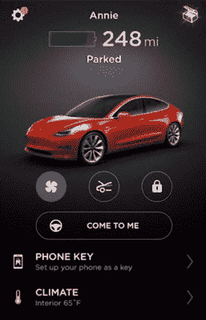
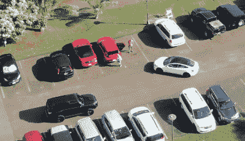
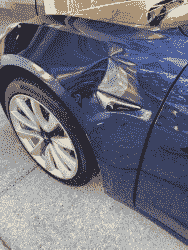
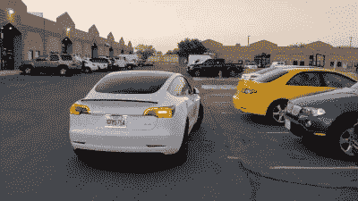
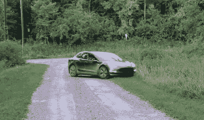

# 特斯拉的智能召唤——噱头还是伟大？

> 原文：<https://hackaday.com/2019/11/07/teslas-smart-summon-gimmick-or-greatness/>

特斯拉一直致力于将自己定位为一半是汽车制造商，一半是科技公司。他们的独特之处在于，他们的汽车采用了市场竞争对手所没有的尖端技术。该公司长期以来一直标榜其“完全自动驾驶”技术，多年来，定期的软件更新已经逐步为他们的汽车解锁了新功能。

[最新的“V10”更新带来了一项新功能](https://twitter.com/Tesla/status/1177301824128393225)——被称为智能召唤。允许司机从停车场远程召唤他们的车，这一功能有望在雨天和搬运重物时提供很大帮助。当然，承诺和现实之间的鸿沟有时会很大。

## 它是如何工作的？

Holding the “Come To Me” button summons the vehicle to the user’s location. Releasing the button stops the car immediately.

智能召唤通过特斯拉智能手机应用程序激活。用户被指示检查车辆的周围环境，并确保他们在使用该功能时能够看到车辆。这与 200 英尺(61 米)的硬限制相结合，这意味着 Smart Summon 不会从拥挤的商场停车场的后端交付您的汽车。相反，它更适合视野开阔的小型停车场。

一旦激活，汽车将退出其停车位，并开始向用户爬行。当用户按住按钮时，汽车会移动，放开时会立即停止。该车使用一套传感器来检测行人和其他障碍物，据称能够在普通停车环境中导航，并轻松搭载车主。

## 没有一个计划能在与敌人的第一次接触中幸存

随着更新的推出，特斯拉车主抓住机会尝试这一新功能。几乎同时，一系列视频开始出现在该技术的网上。其中许多都表明，在野外工作时，事情很少能像在实验室那样顺利。

任何司机都知道，肢体语言和交流是在繁忙的停车场导航的关键。无论是礼貌的点头，指示性的挥手，还是简单的直接眼神接触，人类已经在自动管理停车区的交通流量方面训练有素。当几辆车试图同时通过该区域时，一个困惑的人可以和其他人协商，轮流退出拥堵。不幸的是，无人驾驶汽车缺乏所有这些能力。

This situation proved all too much for the Tesla, and the owner was forced to intervene.

一个很好的例子是[一个 Model 3 车主在一个小型线性停车场尝试智能召唤](https://www.youtube.com/watch?v=aH4zmcn5Wbc)的无人机视频。条件接近理想状态——阳光明媚的一天，交通很少，只有少数行为良好的行人。在第一次尝试中，车辆的犹豫是显而易见的。在退出该空间后，汽车只是保持不动，因为两名人类司机也试图在该区域导航。在进一步倒车后，Model 3 再次开始缓慢前进，似乎没有能力选择向左或向右行驶。看到其他道路使用者越来越沮丧，车主被迫走向汽车并接管。在第二次尝试中，这辆车再次被一辆驶来的车弄得混乱不堪，只是简单地嘎然而止，无法继续前进。[自动驾驶汽车和人类之间的通信是一个活跃的研究课题，](https://www.motoringresearch.com/car-news/ford-is-using-lights-to-help-autonomous-cars-communicate-with-pedestrians/)并且很可能需要尽快解决，以真正推进这项技术。

> 从一个宽阔的车库直接开到一条空车道上是一个他们还没有完全掌握的死角。

An expensive repair bill, courtesy of Smart Summon.

其他司机有过更糟糕的经历。一位车主让自己的特斯拉汽车直接撞上了车库的墙壁，这是一个令人尴尬的错误，甚至大多数初学驾驶的人都不会犯。当 Telsa [号似乎没有理解其缺乏通行权时，另一艘船险些出事。](https://twitter.com/eiddor/status/1177749574976462848?ref_src=twsrc%5Etfw%7Ctwcamp%5Etweetembed%7Ctwterm%5E1177749574976462848&ref_url=https%3A%2F%2Fjalopnik.com%2Fajax%2Finset%2Fiframe%3Fid%3Dtwitter-1177749574976462848%26autosize%3D1)可以看到人类操作员识别出一辆 SUV 从车辆左侧高速驶来，但特斯拉没有屈服，只是在最后一刻停下来。智能召唤软件很可能不具备理解停车环境中通行权的能力，在停车环境中，标志很少，很大程度上取决于人类的直觉。

这就是为什么视线要求是关键的一个原因——如果用户在第一次注意到接近的车辆时放开按钮，事故就可以完全避免。就像其他自动驾驶技术一样，人们并不总是清楚人类在这个循环中仍然承担多少责任，这可能会产生可怕的结果。更重要的是，当用户不知道汽车将决定做什么时，他/她应该承担多少责任？

更有趣的是，[一名亚利桑那州男子在凤凰城](https://www.dailymail.co.uk/sciencetech/article-7541419/A-driverless-Tesla-summoned-owner-mistaken-runaway-car-onlooker.html)追逐一辆特斯拉 Model 3 时被抓，他看到这辆车在停车场里翻滚，而司机却不在方向盘后面。虽然令人尴尬的事件最终没有造成伤害，但它表明，在熟悉这项技术传播开来之前，存在误解导致问题的可能性。

## 不过，也不全是坏事

一些用户在这项功能上运气更好。虽然它的主要目的是召唤汽车到用户的 GPS 位置，但它也可以用来指引汽车到 200 英尺半径内的一个点。在这个视频中，可以看到一辆特斯拉成功地在一个人烟稀少的停车场导航，尽管有些惶恐。车辆似乎在最初理解该区域的结构时有困难，在正确地绕过路边草地区域之前，首先尝试直接路线。这一进展更类似于基本的循线机器人，而不是先进的机器人车辆。然而，它确实成功地避免了撞倒它的主人，后者试图走在行驶的车辆前面，以测试它的防撞能力。如果你重视你的四肢，大概不要在家里尝试这个。

No, not like that!

想要探索各种直截了当和古怪的情况，[【dirty Tesla】决定亲自给这项技术一个纲要](https://www.youtube.com/watch?v=TstlGLrO2q0)。在一个安静的停车场的第一次运行是成功的，尽管汽车摇晃，不必要的倒车，无视停车标志。后来的运行更加自信，汽车清楚地选择正确的车道行驶，并停下来检查交叉交通。在砾石车道上的测试也是积极的，汽车能够正确识别草地边界并绕过它们。也就是说，直到第四次尝试，当汽车轻轻地跑下道路，在杂草中停下来。进一步的测试表明，黑暗的条件和大雨并不是该系统的主要障碍，但它在运行中仍然肯定是不完善的。

## 现状核实

从根本上说，有大量的例子表明这项技术还没有成熟。与平行泊车辅助系统等其他驾驶员回路辅助系统不同，用户似乎对 Smart Summon 自身检测障碍物的能力更有信心，这导致了许多未遂事故和碰撞。

如果用户只需按住一个按钮，就能驾驶一辆 4000 磅重的汽车撞墙，也许这不是办法。这与用户在使用特斯拉的自动驾驶仪时在高速公路上睡着了类似——司机们对一个系统寄予了极大的信任，这个系统充其量只能在与人类的仔细监督相结合的情况下使用。但即便如此，用户怎么知道汽车看到了什么？特斯拉的工具似乎有一种方式来哄骗用户产生一种虚假的自信，但却几乎立即被背叛，让全球 Youtube 观众感到高兴。

虽然不可能做到真正万无一失，但特斯拉似乎还有一段路要走，才能让 Smart 鼓起勇气。结合这一事实，在 90%的视频中，对于一个身体健全的司机来说，直接走到车前自己开车会快得多，这显然更像是一个噱头，而不是一个有用的功能。如果能加以改进，可以否定视线、距离等限制，将迅速成为豪华车上的必备品。然而，这可能还需要几年的时间。看好这个空间，因为其他汽车制造商不太可能会休息很长时间！