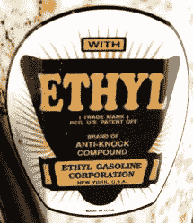

# 四乙基铅:一个问题的解决方案，也是许多新问题的起因

> 原文：<https://hackaday.com/2020/01/15/tetraethyl-lead-the-solution-to-one-and-cause-of-many-new-problems/>

从 20 世纪 20 年代到 20 世纪 70 年代，美国大多数汽油车使用的燃料中都掺有铅。这样做的原因是为了减少当时内燃机中异常燃烧的发动机爆震效应。虽然铅(以四乙基铅的形式存在)在这方面是有效的，但即使在 20 世纪 20 年代也出现了替代抗爆剂，并且人们对铅暴露的健康影响有了不舒服的认识。

我们将看看是什么推动了四乙基铅的采用，以及一旦环境和健康相关问题成为焦点，它为什么会被淘汰。但是它的抗爆效果如何呢？我们还将关注替代抗爆剂，以及这些天来如何处理发动机爆震问题。

## 这是辛烷的问题

在内燃机(ICE)中，理想情况下，喷射到气缸中的空气燃料混合物将在火焰前锋从点火点向外传播的最佳时刻点燃，每一点空气燃料混合物都完全燃烧。这将允许最大限度地利用燃料混合物中的能量，同时使活塞产生干净的冲程。

然而，实际上，这些燃料-空气混合物会在火焰前锋到达它们之前被点燃。这些所谓的“冷火焰”的出现是因为活塞的压缩加上混合物的轻微不均匀，在气缸中产生了额外的压力波。这提高了气缸压力，并导致典型的金属乒乒乓乓的噪音，表明发动机爆震。取决于这些气穴中有多少是在火花塞的火焰前沿之外点燃的，结果可能会增加部件的磨损，甚至是彻底的损坏。

因此，燃料的[辛烷值](https://en.wikipedia.org/wiki/Octane_rating)至关重要，因为它基本上决定了燃料将在哪个压缩水平点燃(没有火花)。因此，高辛烷值燃料不容易燃烧，但允许更高水平的压缩，这有效地产生更多的动力。相比之下，柴油发动机需要较低辛烷值的燃料，因为它们只压缩空气，燃料在压缩循环结束时喷射，压缩空气的热量点燃燃料。

## 该停下来了

幸运的是，有许多方法可以防止这种过早点火的影响。其中包括:

*   使用高辛烷值的燃料。
*   向空气-燃料混合物添加更多的燃料。
*   降低气缸中的压缩水平。
*   减少发动机的负荷。

你可以通过使用所谓的[抗爆剂](https://en.wikipedia.org/wiki/Antiknock_agent)来选择第一点，这是一种通过提高自燃发生时的温度和压力来提高燃料辛烷值的化学物质。[四乙基铅](https://en.wikipedia.org/wiki/Tetraethyllead) (TEL)就是这种药剂的一个例子。它的化学式是`(CH[3]CH[2])[4]Pb`。

在发动机气缸内部，TEL 的功能是通过处理热解的自由基来熄灭发生在火焰前锋外部的自燃，否则这些自由基会维持冷火焰的连锁反应。在这里，铅是实际的反应剂，而 TEL 的其余部分用于使其溶解到汽油中(由于其烷基)。

电话燃烧时，会产生二氧化碳、水和铅:

```
(CH[3]CH[2])[4]Pb + 13 O[2] → 8 CO[2] + 10 H[2]O + Pb
```

铅可以进一步与氧反应形成氧化铅(II ):

```
2 Pb + O[2] → 2 PbO
```

如果不加处理，铅和氧化铅会积聚在发动机内部并毁坏它。为了防止这种情况，添加了铅清除剂，如 [1，2-二溴乙烷](https://en.wikipedia.org/wiki/1,2-Dibromoethane)和 [1，2-二氯乙烷](https://en.wikipedia.org/wiki/1,2-Dichloroethane)，分别形成[溴化铅(II)](https://en.wikipedia.org/wiki/Lead%28II%29_bromide)和[氯化铅(II)](https://en.wikipedia.org/wiki/Lead%28II%29_chloride)(不幸的是都不如[碘化铅(II)](https://www.youtube.com/watch?v=4xSUvSGywXo))。这些化合物很容易在正常运行时从发动机中去除，并从那里释放到环境中。

## 竞争

除了铅之外，已知还有两种物质可以提高汽油燃料的辛烷值:(`C[2]H[6]O`)和[苯](https://en.wikipedia.org/wiki/Benzene) ( `C[6]H[6]`)。对于乙醇来说，这种辛烷值提高的特性是由于乙醇适合作为汽油燃料的完全(尽管更昂贵)替代品。由于乙醇默认具有比大多数汽油燃料更高的辛烷值，所以将一定百分比的乙醇混合到汽油燃料中会使后者具有更高的辛烷值，这实现了期望的抗爆效果。



When adding lead to gasoline was a plus. (Plazak, CC-BY-3.0)

苯是一种碳氢化合物，天然存在于原油中。因此，它存在于汽油中，也是加油站周围特有的甜味的原因。尽管由于苯的致癌特性，现在苯在汽油中的含量通常低于 1%，但在 20 世纪 20 年代作为燃料添加剂引入之前，苯被认为是一种良好的抗爆剂，因为它也能提高辛烷值。到 20 世纪 50 年代，TEL 实际上已经取代苯成为抗爆剂。

乙醇可以从油(乙烯)中生产，也可以从生物质(甘蔗、玉米等)中生产。).然而，这是一种自 20 世纪 70 年代以来才广泛流行的燃料类型。作为抗爆剂，TEL 比乙醇更有优势，只需要少量就能达到相同的效果，但成本相似。然而，TEL 还有一个额外的好处，它作为燃料添加剂的用途可以申请专利。

## 电话辐射

最终，历史告诉我们，TEL 将战胜苯和乙醇，乙醇只是在 20 世纪 70 年代 TEL 被淘汰期间才重新出现。正如过去几十年发现的信息所显示的那样，其原因是[乙基](https://en.wikipedia.org/wiki/Ethyl_Corporation)合作伙伴关系背后的公司(通用汽车、ESSO 和杜邦)有意掩盖关于铅的众所周知的有害影响、在汽油中添加 TEL 的预期血清铅水平以及对环境的预期影响的科学。

正如 William Kovarik 在 2005 年的论文中总结的那样，乙醇作为抗爆剂的使用在 TEL 被引入的时候已经很普遍了，但是几十年来，乙基的错误信息宣传是如此有效，以至于人们开始相信 TEL 是唯一可用的抗爆剂。最终，需要 50 年的研究，以及科学、法院和监管方面的挑战，才能证明 TEL 的有害影响是如此之大，以至于含铅汽油在 20 世纪 70 年代在美国被淘汰，尽管不是没有[乙基首先起诉环境保护局](https://h2o.law.harvard.edu/collages/15557) (EPA)。

研究人员注意到，血清中铅含量增加的影响之一是对发育中的大脑产生强烈的负面影响，导致智商下降，冲动控制能力差，在学校遇到麻烦。后来的研究引入了铅犯罪假说，该假说将 20 世纪 30 年代以来暴力犯罪的上升和 20 世纪 90 年代初的急剧下降与儿童接触高血清铅水平联系起来，高血清铅水平会损害大脑发育。

尽管乙基公司今天仍然存在，但是除了在航空燃料、古董车等中的使用之外，在汽油中的使用已经基本上减少到零。由于铅是一种催化剂毒物，所以 TEL 的使用与[催化转换器](https://en.wikipedia.org/wiki/Catalytic_converter)不兼容，20 世纪 70 年代末，美国要求在新车上安装催化转换器，这使得汽车上 TEL 的消亡成为必然。欧洲、亚洲国家等也逐步淘汰了 TEL，直到今天，世界上只有一家工厂仍然(合法地)生产含铅汽油。

## 今天的抗爆策略

尽管现代内燃机的部件已经硬化，可以承受发动机爆震而不会损坏，而且将乙醇混合到汽油燃料中变得越来越常见，但其他抗爆剂仍然存在，其中[甲基环戊二烯基三羰基锰](https://en.wikipedia.org/wiki/Methylcyclopentadienyl_manganese_tricarbonyl) (MMT，`(C[5]H[4]CH[3])Mn(CO)[3]`)已经在许多国家使用多年。

[二茂铁](https://en.wikipedia.org/wiki/Ferrocene) ( `Fe(C[5]H[5])[2]`)也用作燃料添加剂，用作 TEL 的替代品，如用于古董车。增加汽油中 2，2，4-三甲基戊烷(异辛烷，也是一种石油产品)的含量可以减少爆震，这是 Graham Edgar 在 1926 年首次发现的。异辛烷是辛烷值标度中的 100 分。

除了燃料添加剂之外，现代数字控制汽油发动机还具有通过调整点火正时和压力来检测和控制发动机爆震的内置机制。这使得发动机能够自动调整自身以适应不同辛烷值的燃料。这当然带来了自己的一系列挑战，例如[Peyton Jones 等人的这篇 2017 年论文](https://www.researchgate.net/publication/308533041_Stochastic_Simulation_and_Performance_Analysis_of_Classical_Knock_Control_Algorithms)详细介绍了“经典爆震控制算法的随机模拟和性能分析”。

## 只是历史的注脚

考虑到汽车工业从内燃机到电动机的转变，考虑这些启示和新的创新是很有趣的，电动机没有这些问题。摆脱了含铅汽油及其燃烧产物的污名，看看我们将如何看待五十年后人类历史的这一篇章将是一件有趣的事情。

到那时，没有再生制动可能会显得不可思议，每周(或每天)加油或充电的仪式也会如此。也许来自轮胎和刹车盘的微粒灰尘问题会成为下一个环境问题。

[主要图片来源:[四乙基铅](https://www.flickr.com/photos/cgull/2378882777)作者 David Brodbeck CC-BY 2.0]